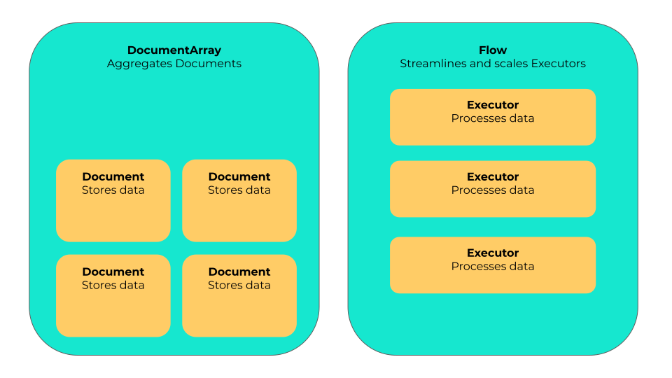
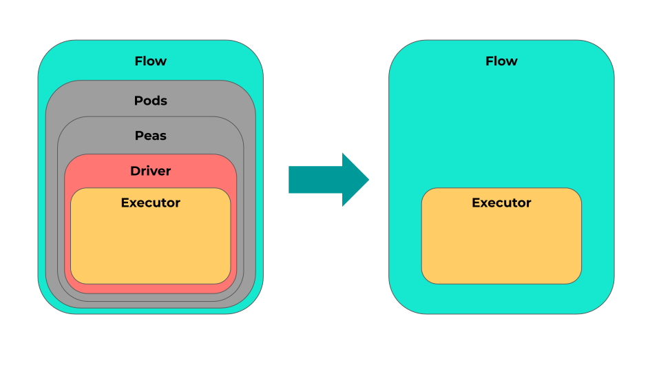

# 5 Reasons to Use Jina 2.0

## 2.0 is as Easy as 1, 2, 3

Learning Jina 2.0 is as simple as 1, 2, 3. With only three main concepts - Document, Flow, and Executor - you'll get up to speed in no time. Know them all, nothing more, and you're good to go!



## 2.0 is Faster

Compared to 1.x (`1.4.2`), 2.0 is 
- 220% faster on startup;
- 220% faster on `import`;
- 5% faster on empty Flow.

<details>
<summary>Click to see benchmark</summary>

#### `jina -v`

<table>
<tr>
<td>
<b>2.0.0rc1</b>
</td>
</tr>
<tr>
<td>

```console
Benchmark #1: jina -v
  Time (mean ± σ):     641.3 ms ±   4.7 ms    [User: 575.8 ms, System: 823.0 ms]
  Range (min … max):   635.5 ms … 650.4 ms    10 runs
```
 
</td>
</tr>
<tr>
<td>
<b>1.4.2</b>
</td>
</tr>
<tr>
<td>

```console
Benchmark #1: jina -v
  Time (mean ± σ):      1.419 s ±  0.251 s    [User: 1.294 s, System: 1.172 s]
  Range (min … max):    1.285 s …  2.040 s    10 runs     
```

</td>
</tr>
</table>

#### `python -c "from jina import Document, Flow, Executor"`

<table>
<tr>
<td>
<b>2.0.0rc1</b>
</td>
</tr>
<tr>
<td>

```console
Benchmark #1: python -c "from jina import Document, Flow, Executor"
  Time (mean ± σ):     532.0 ms ±   6.5 ms    [User: 431.3 ms, System: 543.4 ms]
  Range (min … max):   522.7 ms … 544.0 ms    10 runs
```

</td>
</tr>
<tr>
<td>
<b>1.4.2</b>
</td>
</tr>
<tr>
<td>

```console
Benchmark #1: python -c "from jina import Document, Flow, Executor"
  Time (mean ± σ):      1.209 s ±  0.021 s    [User: 1.085 s, System: 1.085 s]
  Range (min … max):    1.192 s …  1.248 s    10 runs
```

</td>
</tr>
</table>

#### Creating a Flow

```python
   from jina import Flow
   from tests import random_docs
   
   f = Flow().add().add().add().add()
   
   with f:
       f.index(random_docs(10000))
```


<table>
<tr>
<td>
<b>2.0.0rc1</b>
</td>
</tr>
<tr>
<td>

```console
✅ done in ⏱ 8 seconds 🐎 1194.1/s
```


</td>
</tr>
<tr>
<td>
<b>1.4.2</b>
</td>
</tr>
<tr>
<td>

```console
✅ done in ⏱ 8 seconds 🐎 1127.9/s
```


</td>
</tr>
</table>

</details>

## 2.0 Gives YOU the Power

Jina 1.0 was a complex beast with lots of boilerplate code and not so much transparency. In 2.0 we're putting the power back in your hands. Want to write your own `.logger`, `.save()`, or `.load()`? Now that power is yours.

## 2.0 is More Pythonic

Jina 2.0 embraces explicit above implicit: No more Drivers. You can manipulate Documents in custom Executors directly with all the power that entails:

```python
from jina import Document, DocumentArray, Executor, requests

class MyExecutor(Executor):
    @requests
    def add_world(self, docs: DocumentArray):
        for doc in docs:
            doc.text += 'world'
```

## 2.0 is Lighter

Jina has gone on a diet for 2.0. We've dramatically cut the layers of abstraction, removing Drivers and de-emphasizing Peas and Pods to give you a simpler, more elegant Flow experience. 

Instead, you can focus on the stuff you care about - the Documents you feed in and get out, the Executors that process them, and the Flow that organizes the whole thing.


