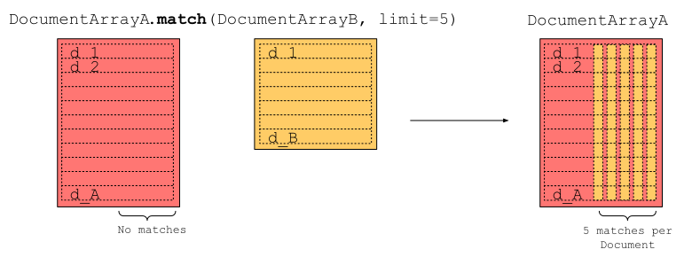

Document, Executor, and Flow are the three fundamental concepts in Jina.

- [**Document**](Document.md) is the basic data type in Jina;
- [**Executor**](Executor.md) is how Jina processes Documents;
- [**Flow**](Flow.md) is how Jina streamlines and scales Executors.

*Learn them all, nothing more, you are good to go.*

---

# Cookbook on `Document`/`DocumentArray` 2.0 API

`Document` is the basic data type that Jina operates with. Text, picture, video, audio, image or 3D mesh: They are
all `Document`s in Jina.

`DocumentArray` is a sequence container of `Document`s. It is the first-class citizen of `Executor`, serving as the
Executor's input and output.

You could say `Document` is to Jina is what `np.float` is to Numpy, and `DocumentArray` is similar to `np.ndarray`.

<!-- START doctoc generated TOC please keep comment here to allow auto update -->
<!-- DON'T EDIT THIS SECTION, INSTEAD RE-RUN doctoc TO UPDATE -->
Table of Contents

- [Minimum working example](#minimum-working-example)
- [`Document` API](#document-api)
  - [`Document` attributes](#document-attributes)
    - [Set & Unset attributes](#set--unset-attributes)
    - [Access nested attributes from tags](#access-nested-attributes-from-tags)
  - [Construct `Document`](#construct-document)
    - [Exclusivity of `doc.content`](#exclusivity-of-doccontent)
    - [Conversion between `doc.content`](#conversion-between-doccontent)
    - [Set embedding](#set-embedding)
    - [Construct with multiple attributes](#construct-with-multiple-attributes)
    - [Construct from dict or JSON string](#construct-from-dict-or-json-string)
    - [Construct from another `Document`](#construct-from-another-document)
    - [Construct from JSON, CSV, `ndarray` and files](#construct-from-json-csv-ndarray-and-files)
  - [Construct Recursive `Document`](#construct-recursive-document)
    - [Recursive attributes](#recursive-attributes)
  - [Construct `GraphDocument`](#construct-graphdocument)
    - [`GraphDocument` constructor](#graphdocument-constructor)
    - [`GraphDocument` additional attributes](#graphdocument-additional-attributes)
    - [`GraphDocument` methods](#graphdocument-methods)
  - [Add relevancy to `Document`](#add-relevancy-to-document)
    - [Relevance attributes](#relevance-attributes)
  - [Serialize `Document` to binary/`Dict`/JSON](#serialize-document-to-binarydictjson)
  - [Visualize `Document`](#visualize-document)
- [`DocumentArray` API](#documentarray-api)
  - [Construct `DocumentArray`](#construct-documentarray)
  - [Persistence via `save()`/`load()`](#persistence-via-saveload)
  - [Access element](#access-element)
  - [Traverse elements](#traverse-elements)
  - [Sort elements](#sort-elements)
  - [Filter elements](#filter-elements)
  - [Use `itertools` on `DocumentArray`](#use-itertools-on-documentarray)
  - [Get attributes in bulk](#get-attributes-in-bulk)
  - [Finding closest documents between `DocumentArray` objects](#finding-closest-documents-between-documentarray-objects)
    - [Using Sparse arrays as embeddings](#using-sparse-arrays-as-embeddings)
  - [Filter a subset of `DocumentArray` using `.find`](#filter-a-subset-of-documentarray-using-find)
  - [Sample a subset of `DocumentArray` using `sample`](#sample-a-subset-of-documentarray-using-sample)
  - [Shuffle a `DocumentArray` using `shuffle`](#shuffle-a-documentarray-using-shuffle)
  - [Visualize the embeddings of a `DocumentArray`](#visualize-the-embeddings-of-a-documentarray)
- [`DocumentArrayMemmap` API](#documentarraymemmap-api)
  - [Create `DocumentArrayMemmap`](#create-documentarraymemmap)
  - [Add Documents to `DocumentArrayMemmap`](#add-documents-to-documentarraymemmap)
  - [Buffer pool](#buffer-pool)
  - [Modifying elements of `DocumentArrayMemmap`](#modifying-elements-of-documentarraymemmap)
  - [Clear a `DocumentArrayMemmap`](#clear-a-documentarraymemmap)
    - [Pruning](#pruning)
  - [Side-by-side vs. `DocumentArray`](#side-by-side-vs-documentarray)
  - [Convert between `DocumentArray` and `DocumentArrayMemmap`](#convert-between-documentarray-and-documentarraymemmap)
  - [Maintaining consistency via `.reload()` and `.save()`](#maintaining-consistency-via-reload-and-save)

<!-- END doctoc generated TOC please keep comment here to allow auto update -->

## Minimum working example

```python
from jina import Document

d = Document() 
```

## `Document` API

### `Document` attributes

A `Document` object has the following attributes, which can be put into the following categories:

| Category | Attributes |
|---|---|
| Content attributes | `.buffer`, `.blob`, `.text`, `.uri`, `.content`, `.embedding` |
| Meta attributes | `.id`, `.parent_id`, `.weight`, `.mime_type`, `.content_type`, `.tags`, `.modality` |
| Recursive attributes | `.chunks`, `.matches`, `.granularity`, `.adjacency` |
| Relevance attributes | `.score`, `.evaluations` |

#### Set & Unset attributes

Set a attribute:

```python
from jina import Document

d = Document()
d.text = 'hello world'
```

```text
<jina.types.document.Document id=9badabb6-b9e9-11eb-993c-1e008a366d49 mime_type=text/plain text=hello world at 4444621648>
```

Unset a attribute:

```python
d.pop('text')
```

```text
<jina.types.document.Document id=cdf1dea8-b9e9-11eb-8fd8-1e008a366d49 mime_type=text/plain at 4490447504>
```

Unset multiple attributes:

```python
d.pop('text', 'id', 'mime_type')
```

```text
<jina.types.document.Document at 5668344144>
```

#### Access nested attributes from tags

`Document` contains the `tags` field that can hold a map-like structure that can map arbitrary values.

```python
from jina import Document

doc = Document(tags={'dimensions': {'height': 5.0, 'weight': 10.0}})

doc.tags['dimensions']
```

```text
{'weight': 10.0, 'height': 5.0}
```

In order to provide easy access to nested fields, the `Document` allows to access attributes by composing the attribute
qualified name with interlaced `__` symbols:

```python
from jina import Document

doc = Document(tags={'dimensions': {'height': 5.0, 'weight': 10.0}})

doc.tags__dimensions__weight
```

```text
10.0
```

This also allows to access nested metadata attributes in `bulk` from a `DocumentArray`.

```python
from jina import Document, DocumentArray

da = DocumentArray([Document(tags={'dimensions': {'height': 5.0, 'weight': 10.0}}) for _ in range(10)])

da.get_attributes('tags__dimensions__height', 'tags__dimensions__weight')
```

```text
[[5.0, 5.0, 5.0, 5.0, 5.0, 5.0, 5.0, 5.0, 5.0, 5.0], [10.0, 10.0, 10.0, 10.0, 10.0, 10.0, 10.0, 10.0, 10.0, 10.0]]
```

### Construct `Document`

##### Content attributes

| Attribute | Description |
| --- | --- |
| `doc.buffer` | The raw binary content of this Document |
| `doc.blob` | The `ndarray` of the image/audio/video Document |
| `doc.text` | The text info of the Document |
| `doc.uri` | A uri of the Document could be: a local file path, a remote url starts with http or https or data URI scheme |
| `doc.content` | One of the above non-empty field |
| `doc.embedding` | The embedding `ndarray` of this Document |

You can assign `str`, `ndarray`, `buffer` or `uri` to a `Document`.

```python
from jina import Document
import numpy as np

d1 = Document(content='hello')
d2 = Document(content=b'\f1')
d3 = Document(content=np.array([1, 2, 3]))
d4 = Document(content='https://static.jina.ai/logo/core/notext/light/logo.png')
```

```text
<jina.types.document.Document id=2ca74b98-aed9-11eb-b791-1e008a366d48 mimeType=text/plain text=hello at 6247702096>
<jina.types.document.Document id=2ca74f1c-aed9-11eb-b791-1e008a366d48 buffer=DDE= at 6247702160>
<jina.types.document.Document id=2caab594-aed9-11eb-b791-1e008a366d48 blob={'dense': {'buffer': 'AQAAAAAAAAACAAAAAAAAAAMAAAAAAAAA', 'shape': [3], 'dtype': '<i8'}} at 6247702416>
<jina.types.document.Document id=4c008c40-af9f-11eb-bb84-1e008a366d49 uri=https://static.jina.ai/logo/core/notext/light/logo.png mimeType=image/png at 6252395600>
```

The content will be automatically assigned to either the `text`, `buffer`, `blob`, or `uri` fields. `id` and `mime_type`
are auto-generated when not given.

You can get a visualization of a `Document` object in Jupyter Notebook or by calling `.plot()`.


#### Exclusivity of `doc.content`


Note that one `Document` can only contain one type of `content`: it is either `text`, `buffer`, `blob` or `uri`.
Setting `text` first and then setting `uri` will clear the `text` field.

```python
d = Document(text='hello world')
d.uri = 'https://jina.ai/'
assert not d.text  # True

d = Document(content='https://jina.ai')
assert d.uri == 'https://jina.ai'  # True
assert not d.text  # True
d.text = 'hello world'

assert d.content == 'hello world'  # True
assert not d.uri  # True
```

#### Conversion between `doc.content`

You can use the following methods to convert between `.uri`, `.text`, `.buffer` and `.blob`:

```python
doc.convert_buffer_to_blob()
doc.convert_blob_to_buffer()
doc.convert_uri_to_buffer()
doc.convert_buffer_to_uri()
doc.convert_text_to_uri()
doc.convert_uri_to_text()
```

You can use `convert_content_to_uri` to convert the content to URI. This will determine the used `content_type` and use
the appropriate conversion method.

You can convert a URI to a data URI (a data in-line URI scheme) using `doc.convert_uri_to_datauri()`. This will fetch
the resource and make it inline.

In particular, when you work with an image `Document`, there are some extra helpers that enable more conversion:

```python
doc.convert_image_buffer_to_blob()
doc.convert_image_blob_to_uri()
doc.convert_image_uri_to_blob()
doc.convert_image_datauri_to_blob()
```

#### Set embedding

An embedding is a high-dimensional representation of a `Document`. You can assign any Numpy `ndarray` as a `Document`'s
embedding.

```python
import numpy as np
from jina import Document

d1 = Document(embedding=np.array([1, 2, 3]))
d2 = Document(embedding=np.array([[1, 2, 3], [4, 5, 6]]))
```

##### Support for sparse arrays

Scipy sparse array (`coo_matrix, bsr_matrix, csr_matrix, csc_matrix`)  are supported as both `embedding` or `blob` :

```python
import scipy.sparse as sp

d1 = Document(embedding=sp.coo_matrix([0, 0, 0, 1, 0]))
d2 = Document(embedding=sp.csr_matrix([0, 0, 0, 1, 0]))
d3 = Document(embedding=sp.bsr_matrix([0, 0, 0, 1, 0]))
d4 = Document(embedding=sp.csc_matrix([0, 0, 0, 1, 0]))

d5 = Document(blob=sp.coo_matrix([0, 0, 0, 1, 0]))
d6 = Document(blob=sp.csr_matrix([0, 0, 0, 1, 0]))
d7 = Document(blob=sp.bsr_matrix([0, 0, 0, 1, 0]))
d8 = Document(blob=sp.csc_matrix([0, 0, 0, 1, 0]))
```

Tensorflow and Pytorch sparse arrays are also supported

```python
import torch
import tensorflow as tf

indices = [[0, 0], [1, 2]]
values = [1, 2]
dense_shape = [3, 4]

d1 = Document(embedding=torch.sparse_coo_tensor(indices, values, dense_shape))
d2 = Document(embedding=tf.SparseTensor(indices, values, dense_shape))
d3 = Document(blob=torch.sparse_coo_tensor(indices, values, dense_shape))
d4 = Document(blob=tf.SparseTensor(indices, values, dense_shape))
```

#### Construct with multiple attributes

##### Meta attributes

| Attribute | Description |
| --- | --- |
| `doc.tags` | A structured data value, consisting of fields which map to dynamically typed values |
| `doc.id` | A hexdigest that represents a unique Document ID |
| `doc.parent_id` | A hexdigest that represents the document's parent id |
| `doc.weight` | The weight of the Document |
| `doc.mime_type` | The mime type of the Document |
| `doc.content_type` | The content type of the Document |
| `doc.modality` | An identifier of the modality the Document belongs to|

You can assign multiple attributes in the constructor via:

```python
from jina import Document

d = Document(uri='https://jina.ai',
             mime_type='text/plain',
             granularity=1,
             adjacency=3,
             tags={'foo': 'bar'})
```

```text
<jina.types.document.Document id=e01a53bc-aedb-11eb-88e6-1e008a366d48 uri=https://jina.ai mimeType=text/plain tags={'foo': 'bar'} granularity=1 adjacency=3 at 6317309200>
```

#### Construct from dict or JSON string

You can build a `Document` from a `dict` or JSON string:

```python
from jina import Document
import json

d = {'id': 'hello123', 'content': 'world'}
d1 = Document(d)

d = json.dumps({'id': 'hello123', 'content': 'world'})
d2 = Document(d)
```

##### Parsing unrecognized fields

Unrecognized fields in a `dict`/JSON string are automatically put into the Document's `.tags` field:

```python
from jina import Document

d1 = Document({'id': 'hello123', 'foo': 'bar'})
```

```text
<jina.types.document.Document id=hello123 tags={'foo': 'bar'} at 6320791056>
```

You can use `field_resolver` to map external field names to `Document` attributes:

```python
from jina import Document

d1 = Document({'id': 'hello123', 'foo': 'bar'}, field_resolver={'foo': 'content'})
```

```text
<jina.types.document.Document id=hello123 mimeType=text/plain text=bar at 6246985488>
```

#### Construct from another `Document`

Assigning a `Document` object to another `Document` object will make a shallow copy:

```python
from jina import Document

d = Document(content='hello, world!')
d1 = d

assert id(d) == id(d1)  # True
```

To make a deep copy, use `copy=True`:

```python
d1 = Document(d, copy=True)

assert id(d) == id(d1)  # False
```

You can partially update a `Document` according to another source `Document`:

```python
from jina import Document

s = Document(
    id='🐲',
    content='hello-world',
    tags={'a': 'b'},
    chunks=[Document(id='🐢')],
)
d = Document(
    id='🐦',
    content='goodbye-world',
    tags={'c': 'd'},
    chunks=[Document(id='🐯')],
)

# only update `id` field
d.update(s, fields=['id'])

# update all fields. `tags` field as `dict` will be merged.
d.update(s)
```

#### Construct from JSON, CSV, `ndarray` and files

The `jina.types.document.generators` module let you construct `Document` from common file types such as JSON,
CSV, `ndarray` and text files. The following functions will give a generator of `Document`, where each `Document` object
corresponds to a line/row in the original format:

|     |     |
| --- | --- |
| `from_ndjson()` | Yield `Document` from a line-based JSON file. Each line is a `Document` object |
| `from_csv()` | Yield `Document` from a CSV file. Each line is a `Document` object |
| `from_files()` | Yield `Document` from a glob files. Each file is a `Document` object |
| `from_ndarray()` | Yield `Document` from a `ndarray`. Each row (depending on `axis`) is a `Document` object |
| `from_lines()` | Yield `Document` from lines, json and csv |

Using a generator is sometimes less memory-demanding, as it does not load/build all Document objects in one shot.

To convert the generator to `DocumentArray` use:

```python
from jina import DocumentArray
from jina.types.document.generators import from_files

DocumentArray(from_files('/*.png'))
```

### Construct Recursive `Document`

#### Recursive attributes

`Document` can be recursed both horizontally and vertically:

|     |     |
| --- | --- |
| `doc.chunks` | The list of sub-Documents of this Document. They have `granularity + 1` but same `adjacency` |
| `doc.matches` | The list of matched Documents of this Document. They have `adjacency + 1` but same `granularity` |
|  `doc.granularity` | The recursion "depth" of the recursive chunks structure |
|  `doc.adjacency` | The recursion "width" of the recursive match structure |

You can add **chunks** (sub-Document) and **matches** (neighbour-Document) to a `Document`:

- Add in constructor:

  ```python
  d = Document(chunks=[Document(), Document()], matches=[Document(), Document()])
  ```

- Add to existing `Document`:

  ```python
  d = Document()
  d.chunks = [Document(), Document()]
  d.matches = [Document(), Document()]
  ```

- Add to existing `doc.chunks` or `doc.matches`:

  ```python
  d = Document()
  d.chunks.append(Document())
  d.matches.append(Document())
  ```

Note that both `doc.chunks` and `doc.matches` return `ChunkArray` and `MatchArray`, which are sub-classes
of [`DocumentArray`](#documentarray-api). We will introduce `DocumentArray later.


### Construct `GraphDocument`

`GraphDocument` is a subclass of `Document`. It's a special type of `Document` that adds functionality to let you work
with a `Document` as a `directed graph`. Chunks of the document represent the nodes of the graph. `GraphDocument` adds
graph-specific attributes (`nodes`, `adjacency` list, `edge_features`,...) and operations (`add_node`, `remove_node`
, `add_edge`, `remove_edge`,...)

#### `GraphDocument` constructor

`GraphDocument`'s constructor supports the same parameters as `Document`. It mainly adds one
parameter `force_undirected`. It's a boolean flag that, when set to `True`, forces the graph document to be undirected.

#### `GraphDocument` additional attributes

`GraphDocument` adds the following attributes to `Document`:

| Attribute | Description |
|---|---|
| `edge_features` | The dictionary of edge features, indexed by `edge_id` |
| `adjacency` | Adjacency list |
| `undirected` | Type of the graph: undirected or directed |
| `num_nodes` | Number of nodes in the graph |
| `num_edges` | Number of edges in the graph |
| `nodes` | The list of nodes. Equivalent to `chunks` |

#### `GraphDocument` methods

`GraphDocument` adds the following methods to `Document`:

* `add_node`: adds a document to the graoh:

```python
from jina.types.document.graph import GraphDocument
from jina import Document

graph = GraphDocument()
graph.add_node(Document(text='hello world'))
graph.nodes[0]
```

```text
<jina.types.document.Document id=8f9a60ce-f5d7-11eb-8383-c7034ef3edd4 mime_type=text/plain text=hello world granularity=1 parent_id=7ec9087c-f5d7-11eb-8383-c7034ef3edd4 at 140287929173088>
```

* `add_edge`: Adds an edge between 2 documents. If a document does not exist in the graph, it is added. You can also add
  dict features to the edge with parameter `features`

```python
from jina import Document
from jina.types.document.graph import GraphDocument

graph = GraphDocument()
d1 = Document(id='1', text='hello world')
d2 = Document(id='2', text='goodbye world')
graph.add_edge(d1, d2, features={"text": "both documents are linked"})
graph.nodes
```

```text
<jina.types.arrays.chunk.ChunkArray length=2 at 140039698424448>
```

You access the edge features using id1-id2 as key:

```python
graph.edge_features['1-2']
```

```text
<jina.types.struct.StructView text=both documents are linked at 140132368471280>
```

* `remove_edge` and `remove_node` allows removing an edge (between 2 nodes) and removing a node respectively.

* `GraphDocument` exposes methods that return node-specific information:

| method | Description |
|---|---|
| `get_out_degree` | node outdegree  |
| `get_in_degree` | node indegree |
| `get_outgoing_nodes` | Array of outgoing nodes for a given node |
| `get_incoming_nodes` | Array of incoming nodes for a given node |

```python
from jina import Document
from jina.types.document.graph import GraphDocument

graph = GraphDocument()
d1 = Document(id='1', text='hello world')
d2 = Document(id='2', text='goodbye world')
d3 = Document(id='3')
graph.add_edge(d1, d2)
graph.add_edge(d1, d3)

assert graph.get_out_degree(d1) == 2

graph.get_outgoing_nodes(d1)
```

```text
<jina.types.arrays.chunk.ChunkArray length=2 at 140689776342112>
```

* `to_dgl_graph`: returns a `dgl.DGLGraph` from the graph document.
* `load_from_dgl_graph`: returns a `GraphDocument` from a `dgl.DGLGraph`.


### Add relevancy to `Document`

#### Relevance attributes

|     |     |
| --- | --- |
| `doc.scores` | The relevance information of this Document. A dict-like structure supporting storing different metrics |
| `doc.evaluations` | The evaluation information of this Document. A dict-like structure supporting storing different metrics |

You can add a relevance score to a `Document` object via:

```python
from jina import Document

d = Document()
d.scores['cosine similarity'] = 0.96
d.scores['cosine similarity'].description = 'cosine similarity'
d.scores['cosine similarity'].op_name = 'cosine()'
d.evaluations['recall'] = 0.56
d.evaluations['recall'].description = 'recall at 10'
d.evaluations['recall'].op_name = 'recall()'
d
```

```text
<jina.types.document.Document id=6c4db2c8-cdf1-11eb-be5d-e86a64801cb1 scores={'values': {'cosine similarity': {'value': 0.96, 'op_name': 'cosine()', 'description': 'cosine similarity'}}} evaluations={'recall': {'value': 0.56, 'op_name': 'recall()', 'description': 'recall at 10'}} at 140003211429776>```
```

Score information is often used jointly with `matches`. For example, you often see the indexer adding `matches` as
follows:

```python
from jina import Document

# some query Document
q = Document()
# get match Document `m`
m = Document()
m.scores['metric'] = 0.96
q.matches.append(m)
```

```text
<jina.types.document.Document id=1aaba345-cdf1-11eb-be5d-e86a64801cb1 adjacency=1 scores={'values': {'metric': {'value': 0.96}}} at 140001502011856>
```

These attributes (`scores` and `evaluations`) provide a dict-like interface that lets access all its elements:

```python
from jina import Document

d = Document()
d.evaluations['precision'] = 1.0
d.evaluations['precision'].description = 'precision at 10'
d.evaluations['precision'].op_name = 'precision()'
d.evaluations['recall'] = 0.5
d.evaluations['recall'].description = 'recall at 10'
d.evaluations['recall'].op_name = 'recall()'
for evaluation_key, evaluation_score in d.evaluations.items():
    print(f' {evaluation_key} => {evaluation_score.description}: {evaluation_score.value}') 
```

```text
 precision => precision at 10: 1.0
 recall => recall at 10: 0.5
```


### Serialize `Document` to binary/`Dict`/JSON

You can serialize a `Document` into JSON string or Python dict or binary string:

```python
from jina import Document

d = Document(content='hello, world')
```

```python
d.binary_str()
```

```
b'\n$6a1c7f34-aef7-11eb-b075-1e008a366d48R\ntext/plainj\x0bhello world'
```

```python
d.json()
```

```json
{
  "id": "6a1c7f34-aef7-11eb-b075-1e008a366d48",
  "mimeType": "text/plain",
  "text": "hello world"
}
```


```python
d.dict()
```

```
{'id': '6a1c7f34-aef7-11eb-b075-1e008a366d48', 'mimeType': 'text/plain', 'text': 'hello world'}
```


In order to have a nicer representation of
the `embeddings` and any `ndarray` field, you can call `dict` and `json` with the option `prettify_ndarrays=True`.

```python
import pprint
import numpy as np

from jina import Document

d0 = Document(id='🐲identifier', text='I am a Jina Document', tags={'cool': True}, embedding=np.array([0, 0]))
pprint.pprint(d0.dict(prettify_ndarrays=True))
pprint.pprint(d0.json(prettify_ndarrays=True))
```

```text
{'embedding': [0, 0],
 'id': '🐲identifier',
 'mime_type': 'text/plain',
 'tags': {'cool': True},
 'text': 'I am a Jina Document'}

('{"embedding": [0, 0], "id": "identifier", "mime_type": '
 '"text/plain", "tags": {"cool": true}, "text": "I am a Jina Document"}')
```

This can be useful to understand the contents of the `Document` and to send to backends that can process vectors
as `lists` of values.


### Visualize `Document`

To better see the Document's recursive structure, you can use `.plot()` function. If you are using JupyterLab/Notebook,
all `Document` objects will be auto-rendered:

<table>
  <tr>
    <td>

```python
import numpy as np
from jina import Document

d0 = Document(id='🐲', embedding=np.array([0, 0]))
d1 = Document(id='🐦', embedding=np.array([1, 0]))
d2 = Document(id='🐢', embedding=np.array([0, 1]))
d3 = Document(id='🐯', embedding=np.array([1, 1]))

d0.chunks.append(d1)
d0.chunks[0].chunks.append(d2)
d0.matches.append(d3)

d0.plot()  # simply `d0` on JupyterLab
```

</td>
<td>

</td>
</tr>
</table>


## `DocumentArray` API

A `DocumentArray` is a list of `Document` objects. You can construct, delete, insert, sort and traverse
a `DocumentArray`
like a Python `list`.

Methods supported by `DocumentArray`:

| | |
|--- |--- |
| Python `list`-like interface | `__getitem__`, `__setitem__`, `__delitem__`, `__len__`, `insert`, `append`, `reverse`, `extend`, `__iadd__`, `__add__`, `__iter__`, `clear`, `sort`, `shuffle`, `sample` |
| Persistence | `save`, `load` |
| Neural Search Operations | `match`, `visualize` |
| Advanced getters | `get_attributes`, `get_attributes_with_docs`, `traverse_flat`, `traverse` |

### Construct `DocumentArray`

You can construct a `DocumentArray` from an iterable of `Document`s:

```python
from jina import DocumentArray, Document

# from list
da1 = DocumentArray([Document(), Document()])

# from generator
da2 = DocumentArray((Document() for _ in range(10)))

# from another `DocumentArray`
da3 = DocumentArray(da2)
```

### Persistence via `save()`/`load()`

To save all elements in a `DocumentArray` in a JSON line format:

```python
from jina import DocumentArray, Document

da = DocumentArray([Document(), Document()])

da.save('data.json')
da1 = DocumentArray.load('data.json')
```

`DocumentArray` can be also stored in binary format, which is much faster and yields smaller file:

```python
from jina import DocumentArray, Document

da = DocumentArray([Document(), Document()])

da.save('data.bin', file_format='binary')
da1 = DocumentArray.load('data.bin', file_format='binary')
```

### Access element

You can access a `Document` in the `DocumentArray` via integer index, string `id` or `slice` indices:

```python
from jina import DocumentArray, Document

da = DocumentArray([Document(id='hello'), Document(id='world'), Document(id='goodbye')])

da[0]
# <jina.types.document.Document id=hello at 5699749904>

da['world']
# <jina.types.document.Document id=world at 5736614992>

da[1:2]
# <jina.types.arrays.document.DocumentArray length=1 at 5705863632>
```

### Traverse elements

The following graphic illustrates the recursive `Document` structure. Every `Document` can have multiple `Chunks`
and `Matches`.
`Chunks` and `Matches` are `Documents` as well.


In most of the cases, you want to iterate through a certain level of documents.
`DocumentArray.traverse` can be used for that by providing custom paths. As return value you get a generator which
generates `DocumentArrays` matching the provided traversal paths. Let's assume you have the following `Document`
structure:

```python
from jina import DocumentArray, Document

da = DocumentArray([
    Document(id='r1', chunks=[
        Document(id='c1', matches=[
            Document(id='c1c1m1'),
        ]),
        Document(id='c2', chunks=[
            Document(id='c2c1', matches=[
                Document(id='c2c1m1'),
                Document(id='c2c1m2')
            ]),
            Document(id='c2c2'),
        ]),
        Document(id='c3')
    ]),
    Document(id='r2')
])
```

When calling `da.traverse(['cm', 'ccm'])` you get a generator over two `DocumentArrays`. The first `DocumentArray`
contains the `Matches` of the `Chunks` and the second `DocumentArray` contains the `Matches` of the `Chunks` of
the `Chunks`. The following `DocumentArrays` are emitted from the generator:

```python
from jina import Document
from jina.types.arrays import MatchArray

MatchArray([Document(id='c1c1m1', adjacency=1)], reference_doc=da['r1'].chunks['c1'])
MatchArray([], reference_doc=da['r1'].chunks['c2'])
MatchArray([], reference_doc=da['r1'].chunks['c3'])
MatchArray([Document(id='c2c1m1', adjacency=1), Document(id='c2c1m2', adjacency=1)],
           reference_doc=da['r1'].chunks['c2'].chunks['c2c1'])
MatchArray([], reference_doc=da['r1'].chunks['c2'].chunks['c2c2'])
```

`DocumentArray.traverse_flat` is doing the same but flattens all `DocumentArrays` in the generator. When
calling `da.traverse_flat(['cm', 'ccm'])` the result in our example will be the following:

```python
from jina import Document, DocumentArray

assert da.traverse_flat(['cm', 'ccm']) == DocumentArray([
    Document(id='c1c1m1', adjacency=1),
    Document(id='c2c1m1', adjacency=1),
    Document(id='c2c1m2', adjacency=1)
])
```

`DocumentArray.traverse_flat_per_path` is a further method for `Document` traversal. It works
like `DocumentArray.traverse_flat` but groups the `Documents` into `DocumentArrays` based on the traversal path. When
calling `da.traverse_flat_per_path(['cm', 'ccm'])`, the resulting generator emits the following `DocumentArrays`:

```python
from jina import Document, DocumentArray

DocumentArray([
    Document(id='c1c1m1', adjacency=1),
])
DocumentArray([
    Document(id='c2c1m1', adjacency=1),
    Document(id='c2c1m2', adjacency=1)
])
```

### Sort elements

`DocumentArray` is a subclass of `MutableSequence`, therefore you can use built-in Python `sort` to sort elements in
a `DocumentArray` object, e.g.

```python
from jina import DocumentArray, Document

da = DocumentArray(
    [
        Document(tags={'id': 1}),
        Document(tags={'id': 2}),
        Document(tags={'id': 3})
    ]
)

da.sort(key=lambda d: d.tags['id'], reverse=True)
print(da)
```

To sort elements in `da` in-place, using `tags[id]` value in a descending manner:

```text
<jina.types.arrays.document.DocumentArray length=3 at 5701440528>

{'id': '6a79982a-b6b0-11eb-8a66-1e008a366d49', 'tags': {'id': 3.0}},
{'id': '6a799744-b6b0-11eb-8a66-1e008a366d49', 'tags': {'id': 2.0}},
{'id': '6a799190-b6b0-11eb-8a66-1e008a366d49', 'tags': {'id': 1.0}}
```

### Filter elements

You can use Python's [built-in `filter()`](https://docs.python.org/3/library/functions.html#filter) to filter elements
in a `DocumentArray` object:

```python
from jina import DocumentArray, Document

da = DocumentArray([Document() for _ in range(6)])

for j in range(6):
    da[j].scores['metric'] = j

for d in filter(lambda d: d.scores['metric'].value > 2, da):
    print(d)
```

```text
{'id': 'b5fa4871-cdf1-11eb-be5d-e86a64801cb1', 'scores': {'values': {'metric': {'value': 3.0}}}}
{'id': 'b5fa4872-cdf1-11eb-be5d-e86a64801cb1', 'scores': {'values': {'metric': {'value': 4.0}}}}
{'id': 'b5fa4873-cdf1-11eb-be5d-e86a64801cb1', 'scores': {'values': {'metric': {'value': 5.0}}}}
```

You can build a `DocumentArray` object from the filtered results:

```python
from jina import DocumentArray, Document

da = DocumentArray([Document(weight=j) for j in range(6)])
da2 = DocumentArray(d for d in da if d.weight > 2)

print(da2)
```

```text
DocumentArray has 3 items:
{'id': '3bd0d298-b6da-11eb-b431-1e008a366d49', 'weight': 3.0},
{'id': '3bd0d324-b6da-11eb-b431-1e008a366d49', 'weight': 4.0},
{'id': '3bd0d392-b6da-11eb-b431-1e008a366d49', 'weight': 5.0}
```

### Use `itertools` on `DocumentArray`

As `DocumentArray` is an `Iterable`, you can also
use [Python's built-in `itertools` module](https://docs.python.org/3/library/itertools.html) on it. This enables
advanced "iterator algebra" on the `DocumentArray`.

For instance, you can group a `DocumentArray` by `parent_id`:

```python
from jina import DocumentArray, Document
from itertools import groupby

da = DocumentArray([Document(parent_id=f'{i % 2}') for i in range(6)])
groups = groupby(sorted(da, key=lambda d: d.parent_id), lambda d: d.parent_id)
for key, group in groups:
    key, len(list(group))
```

```text
('0', 3)
('1', 3)
```

### Get attributes in bulk

`DocumentArray` implements powerful getters that lets you fetch multiple attributes from the Documents it contains in
one-shot:

```python
import numpy as np

from jina import DocumentArray, Document

da = DocumentArray([Document(id=1, text='hello', embedding=np.array([1, 2, 3])),
                    Document(id=2, text='goodbye', embedding=np.array([4, 5, 6])),
                    Document(id=3, text='world', embedding=np.array([7, 8, 9]))])

da.get_attributes('id', 'text', 'embedding')
```

```text
[('1', '2', '3'), ('hello', 'goodbye', 'world'), (array([1, 2, 3]), array([4, 5, 6]), array([7, 8, 9]))]
```

This can be very useful when extracting a batch of embeddings:

```python
import numpy as np
np.stack(da.get_attributes('embedding'))
```

```text
[[1 2 3]
 [4 5 6]
 [7 8 9]]
```

### Property `.embeddings`

There is a faster version to extract embeddings from a `DocumentArray` or `DocumentArrayMemmap`, the property `.embeddings`. This property assumes all embeddings in the array have the same shape and dtype. Note that

```
da.embeddings
```

will produce the same output as `np.stack(da.get_attributes('embedding'))` but the results will be retrieved faster.

```
[[1 2 3]
 [4 5 6]
 [7 8 9]]
```

**Note: using .embeddings in a DocumenArray or DocumentArrayMemmap with different shapes or dtypes might yield to unnexpected results.**


### Finding closest documents between `DocumentArray` objects

`DocumentArray` provides a`.match` function that finds the closest documents between two `DocumentArray` objects. This
function requires all documents to be compared have an `embedding` and all embeddings to have the same length.

The following image shows how `DocumentArrayA` finds `limit=5` matches from the documents in `DocumentArrayB`. By
default, the cosine similarity is used to evaluate the score between documents.



More generally, given two `DocumentArray` objects `da_1` and `da_2` the
function `da_1.match(da_2, metric=some_metric, normalization=(0, 1), limit=N)` finds for each document in `da_1`
then `N` documents from `da_2` with the lowest metric values according to `some_metric`.

- `metric` can be `'cosine'`, `'euclidean'`,  `'sqeuclidean'` or a callable that takes 2 `ndarray` parameters and
  returns an `ndarray`
- `normalization` is a tuple [a, b] to be used with min-max normalization. The min distance will be rescaled to `a`, the
  max distance will be rescaled to `b`; all other values will be rescaled into range `[a, b]`.

The following example find the 3 closest documents, according to the euclidean distance, for each element in `da_1` from
the elements in `da_2`.

```python
from jina import Document, DocumentArray
import numpy as np

d1 = Document(embedding=np.array([0, 0, 0, 0, 1]))
d2 = Document(embedding=np.array([1, 0, 0, 0, 0]))
d3 = Document(embedding=np.array([1, 1, 1, 1, 0]))
d4 = Document(embedding=np.array([1, 2, 2, 1, 0]))

d1_m = Document(embedding=np.array([0, 0.1, 0, 0, 0]))
d2_m = Document(embedding=np.array([1, 0.1, 0, 0, 0]))
d3_m = Document(embedding=np.array([1, 1.2, 1, 1, 0]))
d4_m = Document(embedding=np.array([1, 2.2, 2, 1, 0]))
d5_m = Document(embedding=np.array([4, 5.2, 2, 1, 0]))

da_1 = DocumentArray([d1, d2, d3, d4])
da_2 = DocumentArray([d1_m, d2_m, d3_m, d4_m, d5_m])

da_1.match(da_2, metric='euclidean', limit=3)
query = da_1[2]
print(f'query emb = {query.embedding}')
for m in query.matches:
    print('match emb =', m.embedding, 'score =', m.scores['euclidean'].value)
```

```text
query emb = [1 1 1 1 0]
match emb = [1.  1.2 1.  1.  0. ] score = 0.20000000298023224
match emb = [1.  2.2 2.  1.  0. ] score = 1.5620499849319458
match emb = [1.  0.1 0.  0.  0. ] score = 1.6763054132461548
```

#### Using Sparse arrays as embeddings

We can use sparse embeddings and do the `.match` using `is_sparse=True`

```python
from jina import Document, DocumentArray
import scipy.sparse as sp

d1 = Document(embedding=sp.csr_matrix([0, 0, 0, 0, 1]))
d2 = Document(embedding=sp.csr_matrix([1, 0, 0, 0, 0]))
d3 = Document(embedding=sp.csr_matrix([1, 1, 1, 1, 0]))
d4 = Document(embedding=sp.csr_matrix([1, 2, 2, 1, 0]))

d1_m = Document(embedding=sp.csr_matrix([0, 0.1, 0, 0, 0]))
d2_m = Document(embedding=sp.csr_matrix([1, 0.1, 0, 0, 0]))
d3_m = Document(embedding=sp.csr_matrix([1, 1.2, 1, 1, 0]))
d4_m = Document(embedding=sp.csr_matrix([1, 2.2, 2, 1, 0]))
d5_m = Document(embedding=sp.csr_matrix([4, 5.2, 2, 1, 0]))

da_1 = DocumentArray([d1, d2, d3, d4])
da_2 = DocumentArray([d1_m, d2_m, d3_m, d4_m, d5_m])

da_1.match(da_2, metric='euclidean', limit=4, is_sparse=True)
query = da_1[2]
print(f'query emb = {query.embedding.todense()}')
for m in query.matches:
    print('match emb =', m.embedding.todense(), 'score =', m.scores['euclidean'].value)
```

```
query emb = [[1 1 1 1 0]]
match emb = [[1.  1.2 1.  1.  0. ]] score = 0.20000000298023224
match emb = [[1.  2.2 2.  1.  0. ]] score = 1.5620499849319458
match emb = [[1.  0.1 0.  0.  0. ]] score = 1.6763054132461548
```

### Filter a subset of `DocumentArray` using `.find`

`DocumentArray` provides function `.find` that finds the documents in the `DocumentArray`  whose tag values match a
dictionary of user provided regular expressions. Since a `Document` can have many tags, the function expects one regular
expression for each tag that a user wants to consider.

The simplest way to use this function is to provide only the `regexes` dict. In this case, documents will be selected if
all regular expressions passed are matched. Sometimes, a user might want to be less restrictive and might want to select
documents only if a subset of the regular expressions is verified. In this case, `threshold` can be used to set the
number of regular expressions that need to be matched in order to select a document.

Let us consider the following example, where we want to select documents form a `DocumentArray` if the `city` tag
contains a city that starts with `'B'`.

```python
d1 = Document(tags={'city': 'Barcelona', 'phone': 'None'})
d2 = Document(tags={'city': 'Berlin', 'phone': '648907348'})
d3 = Document(tags={'city': 'Paris', 'phone': 'None'})
d4 = Document(tags={'city': 'Brussels', 'phone': 'None'})

docarray = DocumentArray([d1, d2, d3, d4])

regexes = {'city': r'B.*'}
docarray_filtered = docarray.find(regexes=regexes)
print(f'len(docarray_filtered)={len(docarray_filtered)}')
for d in docarray_filtered:
    print(f'dict(d.tags)={dict(d.tags)}')
```

Will print

```python
len(docarray_filtered) = 3
dict(d.tags) = {'phone': 'None', 'city': 'Barcelona'}
dict(d.tags) = {'phone': '648907348', 'city': 'Berlin'}
dict(d.tags) = {'phone': 'None', 'city': 'Brussels'}
```

We can consider more conditions, for example a subset of the previous documents that have `None` in the `'phone'` tag.
We could do this as follows:

```python
regexes = {'city': r'B.*', 'phone': 'None'}
docarray_filtered = docarray.find(regexes=regexes)
print(f'len(docarray_filtered)={len(docarray_filtered)}')
for d in docarray_filtered:
    print(f'dict(d.tags)={dict(d.tags)}')
```

Will print

```
len(docarray_filtered)=2
dict(d.tags)={'city': 'Barcelona', 'phone': 'None'}
dict(d.tags)={'phone': 'None', 'city': 'Brussels'}
```

### Sample a subset of `DocumentArray` using `sample`

`DocumentArray` provides function `.sample` that sample `k` elements without replacement. It accepts 2 parameters, `k`
and `seed`. `k` is used to define the number of elements to sample, and `seed`
helps you generate pseudo random results. It should be noted that `k` should always less or equal than the length of the
document array.

To make use of the function:

```python
from jina import Document, DocumentArray

da = DocumentArray()  # initialize a random document array
for idx in range(100):
    da.append(Document(id=idx))  # append 100 documents into `da`
sampled_da = da.sample(k=10)  # sample 10 documents
sampled_da_with_seed = da.sample(k=10, seed=1)  # sample 10 documents with seed.
```

### Shuffle a `DocumentArray` using `shuffle`

`DocumentArray` provides function `.shuffle` that shuffle the entire `DocumentArray`. It accepts the parameter `seed`
.  `seed` helps you generate pseudo random results. By default, `seed` is None.

To make use of the function:

```python
from jina import Document, DocumentArray

da = DocumentArray()  # initialize a random document array
for idx in range(100):
    da.append(Document(id=idx))  # append 100 documents into `da`
shuffled_da = da.shuffle()  # shuffle the DocumentArray
shuffled_da_with_seed = da.shuffle(seed=1)  # shuffle the DocumentArray with seed.
```

### Visualize the embeddings of a `DocumentArray`

`DocumentArray` provides function `.visualize` to plot document embeddings in a 2D graph. `visualize` supports 2 methods
to project in 2D space: `pca` and `tsne`.

In the following example, we add 3 different distributions of embeddings and see 3 kinds of point clouds in the graph.

```python
import numpy as np
from jina import Document, DocumentArray

da = DocumentArray(
    [
        Document(embedding=np.random.normal(0, 1, 50)) for _ in range(500)
    ] + [
        Document(embedding=np.random.normal(5, 2, 50)) for _ in range(500)
    ] + [
        Document(embedding=np.random.normal(2, 5, 50)) for _ in range(500)
    ]
)
da.visualize()

```


## `DocumentArrayMemmap` API

When your `DocumentArray` object contains a large number of `Document`, holding it in memory can be very demanding. You
may want to use `DocumentArrayMemmap` to alleviate this issue. A `DocumentArrayMemmap` stores all Documents directly on
the disk, while keeping a small lookup table in memory and a buffer pool of documents with a fixed size. The lookup 
table contains the offset and length of each `Document`, hence it is much smaller than the full `DocumentArray`.
Elements are loaded on-demand to memory during the access. Memory-loaded documents are kept in the buffer pool to allow 
modifying documents.

The next table show the speed and memory consumption when writing and reading 50,000 `Documents`.

|| `DocumentArrayMemmap` | `DocumentArray` |
|---|---|---|
|Write to disk | 0.62s | 0.71s |
|Read from disk | 0.11s | 0.20s |
|Memory usage | 20MB | 342MB |
|Disk storage | 14.3MB | 12.6MB |

### Create `DocumentArrayMemmap`

```python
from jina.types.arrays.memmap import DocumentArrayMemmap

dam = DocumentArrayMemmap('./my-memmap')
```

### Add Documents to `DocumentArrayMemmap`

```python
from jina.types.arrays.memmap import DocumentArrayMemmap
from jina import Document

d1 = Document(text='hello')
d2 = Document(text='world')

dam = DocumentArrayMemmap('./my-memmap')
dam.extend([d1, d2])
```

The `dam` object stores all future Documents into `./my-memmap`, there is no need to manually call `save`/`reload`.
Recently added, modified or accessed documents are also kept in the memory buffer so all changes to documents are 
applied first in the memory buffer and will be persisted to disk lazily (e.g when they quit the buffer pool or when
the `dam` object's destructor is called). If you want to instantly persist the changed documents, you can call `save`.


### Buffer pool
A fixed number of documents are kept in the memory buffer pool. The number can be configured with the constructor
parameter `buffer_pool_size` (1000 by default). Only the `buffer_pool_size` most recently accessed, modified or added
documents exist in the pool. Replacement of documents uses the LRU strategy.

```python
from jina.types.arrays.memmap import DocumentArrayMemmap
from jina import Document
dam = DocumentArrayMemmap('./my-memmap', buffer_pool_size=10)
dam.extend([Document() for _ in range(100)])
```

The buffer pool ensures that in-memory modified documents are persisted to disk. Therefore, you should not reference 
documents manually and modify them if they might be outside of the buffer pool. The next section explains the best 
practices when modifying documents.

### Modifying elements of `DocumentArrayMemmap`

Modifying elements of a `DocumentArrayMemmap` is possible due to the fact that accessed and modified documents are kept
in the buffer pool:

```python
from jina.types.arrays.memmap import DocumentArrayMemmap
from jina import Document

d1 = Document(text='hello')
d2 = Document(text='world')

dam = DocumentArrayMemmap('./my-memmap')
dam.extend([d1, d2])

dam[0].text = 'goodbye'

print(dam[0].text)
```

```text
goodbye
```

However, there are practices to **avoid**. Mainly, you should not modify documents that you reference manually and that 
might not be in the buffer pool. Here are some practices to avoid:

1. Keep more  references than the buffer pool size and modify them:
   <table>
   <tr>
   <td>
   <b><center>❌ Don't</center></b>
   </td>
   <td>
   <b><center>✅ Do</center></b>
   </td>
   </tr>
   <tr>
   <td>
   
   ```python
   from jina import Document
   from jina.types.arrays.memmap import DocumentArrayMemmap
   
   docs = [Document(text='hello') for _ in range(100)]
   dam = DocumentArrayMemmap('./my-memmap', buffer_pool_size=10)
   dam.extend(docs)
   for doc in docs:
       doc.text = 'goodbye'
   
   dam[50].text
   ```
    ```text
    hello
    ```


   </td>
   <td>
   Use the dam object to modify instead:

   ```python
   from jina import Document
   from jina.types.arrays.memmap import DocumentArrayMemmap
   
   docs = [Document(text='hello') for _ in range(100)]
   dam = DocumentArrayMemmap('./my-memmap', buffer_pool_size=10)
   dam.extend(docs)
   for doc in dam:
       doc.text = 'goodbye'
   
   dam[50].text
   ```
   ```text
   goodbye
   ```

   It's also okay if you reference docs less than the buffer pool size:

   ```python
   from jina import Document
   from jina.types.arrays.memmap import DocumentArrayMemmap
   
   docs = [Document(text='hello') for _ in range(100)]
   dam = DocumentArrayMemmap('./my-memmap', buffer_pool_size=1000)
   dam.extend(docs)
   for doc in docs:
       doc.text = 'goodbye'
   
   dam[50].text
   ```
   ```text
   goodbye
   ```

   </td>
   </tr>
   </table>


2. Modify a reference that might have left the buffer pool :
   <table>
   <tr>
   <td>
   <b><center>❌ Don't</center></b>
   </td>
   <td>
   <b><center>✅ Do</center></b>
   </td>
   </tr>
   <tr>
   <td>
   
   ```python
   from jina import Document
   from jina.types.arrays.memmap import DocumentArrayMemmap
   
   dam = DocumentArrayMemmap('./my-memmap', buffer_pool_size=10)
   my_doc = Document(text='hello')
   dam.append(my_doc)
   
   # my_doc leaves the buffer pool after extend
   dam.extend([Document(text='hello') for _ in range(99)])
   my_doc.text = 'goodbye'
   dam[0].text
   ```
    ```text
    hello
    ```


   </td>
   <td>
   Get the document from the dam object and then modify it:

   ```python
   from jina import Document
   from jina.types.arrays.memmap import DocumentArrayMemmap
   
   dam = DocumentArrayMemmap('./my-memmap', buffer_pool_size=10)
   my_doc = Document(text='hello')
   dam.append(my_doc)
   
   # my_doc leaves the buffer pool after extend
   dam.extend([Document(text='hello') for _ in range(99)])
   dam[my_doc.id].text = 'goodbye' # or dam[0].text = 'goodbye'
   dam[0].text
   ```
   ```text
   goodbye
   ```

   </td>
   </tr>
   </table>

To summarize, it's a best practice to **rely on the `dam` object to reference the docs that you modify**.

### Clear a `DocumentArrayMemmap`

To clear all contents in a `DocumentArrayMemmap` object, simply call `.clear()`. It will clean all content on disk.

#### Pruning

One may notice another method `.prune()` that shares similar semantics. `.prune()` method is designed for "
post-optimizing" the on-disk data structure of `DocumentArrayMemmap` object. It can reduce the on-disk usage.

### Side-by-side vs. `DocumentArray`

Accessing elements in `DocumentArrayMemmap` is _almost_ the same as `DocumentArray`, you can use integer/string index to
access element; you can loop over a `DocumentArrayMemmap` to get all `Document`; you can use `get_attributes`
or `traverse_flat` to achieve advanced traversal or getter.

This table summarizes the interfaces of `DocumentArrayMemmap` and `DocumentArray`:

|| `DocumentArrayMemmap` | `DocumentArray` |
|---|---|---|
| `__getitem__`, `__setitem__`, `__delitem__` (int) | ✅|✅|
| `__getitem__`, `__setitem__`, `__delitem__` (string) | ✅|✅|
| `__getitem__`, `__delitem__` (slice)  |✅ |✅|
| `__iter__` |✅|✅|
| `__contains__` |✅|✅|
| `__len__` | ✅|✅|
| `append` | ✅|✅|
| `extend` | ✅|✅|
| `traverse_flat`, `traverse` | ✅|✅|
| `get_attributes`, `get_attributes_with_docs` | ✅|✅|
| `insert` |❌ |✅|
| `reverse` (inplace) |❌ |✅|
| `sort` (inplace) | ❌|✅|
| `__add__`, `__iadd__` | ❌|✅|
| `__bool__` |✅|✅|
| `__eq__` |✅|✅|
| `sample` |✅ |✅|
| `shuffle` |✅ |✅|
| `match` (L/Rvalue) |✅|✅|
| `visualize` |✅|✅|

### Convert between `DocumentArray` and `DocumentArrayMemmap`

```python
from jina import Document, DocumentArray
from jina.types.arrays.memmap import DocumentArrayMemmap

da = DocumentArray([Document(text='hello'), Document(text='world')])

# convert DocumentArray to DocumentArrayMemmap
dam = DocumentArrayMemmap('./my-memmap')
dam.extend(da)

# convert DocumentArrayMemmap to DocumentArray
da = DocumentArray(dam)
```

### Maintaining consistency via `.reload()` and `.save()`

Considering two `DocumentArrayMemmap` objects that share the same on-disk storage `./memmap` but sit in different
processes/threads. After some writing ops, the consistency of the lookup table and the buffer pool may be corrupted, as
each `DocumentArrayMemmap` object has its own version of lookup table and buffer pool in memory. `.reload()` and 
`.save()` are for solving this issue:

```python
from jina.types.arrays.memmap import DocumentArrayMemmap
from jina import Document

d1 = Document(text='hello')
d2 = Document(text='world')

dam = DocumentArrayMemmap('./my-memmap')
dam2 = DocumentArrayMemmap('./my-memmap')

dam.extend([d1, d2])
assert len(dam) == 2
assert len(dam2) == 0

dam2.reload()
assert len(dam2) == 2

dam.clear()
assert len(dam) == 0
assert len(dam2) == 2

dam2.reload()
assert len(dam2) == 0
```
You don't need to use `.save` if you add new documents. However, if you modified an attribute of a document, you need
to use it:

```python
from jina.types.arrays.memmap import DocumentArrayMemmap
from jina import Document

d1 = Document(text='hello')

dam = DocumentArrayMemmap('./my-memmap')
dam2 = DocumentArrayMemmap('./my-memmap')

dam.append(d1)
d1.text = 'goodbye'
assert len(dam) == 1
assert len(dam2) == 0

dam2.reload()
assert len(dam2) == 1
assert dam2[0].text == 'hello'

dam.save()
dam2.reload()
assert dam2[0].text == 'goodbye'
```
