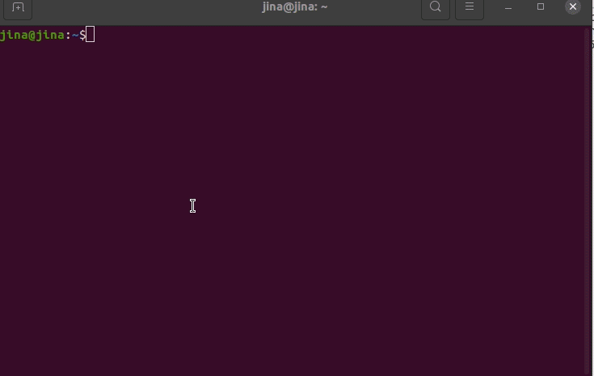

<!-- START doctoc generated TOC please keep comment here to allow auto update -->
<!-- DON'T EDIT THIS SECTION, INSTEAD RE-RUN doctoc TO UPDATE -->
Table of Contents

- [Hubble CLI Guidelines](#hubble-cli-guidelines)
  - [Prerequisites](#prerequisites)
  - [1. Create Executor](#1-create-executor)
  - [2. Push and Pull CLI](#2-push-and-pull-cli)
    - [2.1 Distribute your executor](#21-distribute-your-executor)
    - [2.2 Pull distributed executor](#22-pull-distributed-executor)
  - [3. Use in Jina Flow](#3-use-in-jina-flow)
    - [3.1 Using docker images](#31-using-docker-images)
    - [3.2 Using source codes](#32-using-source-codes)
    - [3.3 Override Default Parameters](#33-override-default-parameters)

<!-- END doctoc generated TOC please keep comment here to allow auto update -->

# JinaHub Guidelines

## Prerequisites

- [Docker](https://docs.docker.com/get-docker) installed.
- `jina[standard] >= 2.0.0` installed.
    - Run `pip install -U "jina[standard]>=2.0.0"` to upgrade jina to correct version.

## 1. Create Executor

To create your Executor, you just need to run this command in your terminal:

```terminal
jina hub new
```

A wizard will ask you some questions about the Executor. For the basic configuration, you will be asked two things: The Executor’s name and where it should be saved. The wizard will ask if you want to have a more advanced configuration, but it is unnecessary for most of user cases.

After running the command, a project with the following structure will be generated:

```text
MyExecutor/
├── Dockerfile	        # Advanced configuration will generate this file
├── manifest.yml
├── config.yml
├── README.md
├── requirements.txt
└── executor.py
```

- `manifest.yml` should contain the annotations of the Executor for getting better appealing on Jina Hub.
- `config.yml` is the config file of your Executor. You can define **__init__** arguments using **with** keyword in this config file.
- `requirements.txt` describes the Python dependencies of the Executor.
- `executor.py` should contain the main logic of your Executor.
- `README.md` should describe the usage of the Executor.

Example usage:



## 2. Push Executor to JinaHub

If you want to share your Executors to other persons or colleges, you can push your local Executor to JinaHub.

### 2.1 Basic

```bash
$ jina hub push [--public/--private] <path_to_executor_folder>
```

It will return an **UUID** as well as a **SECRET**. You would need these two items when using or update the Executor later. **Please keep them carefully.**

**Notes**:

- When no `--public` or `--private` visibility options are provided. **By default, it's public.**
- There is only one difference between `--public` and `--private`. You can use public Executor once you know the `UUID`, but you must know `SECRET` and `UUID` if you want to use a private Executor.

### 2.2 Advanced

```bash
$ jina hub push <path_to_executor_folder> -t TAG1 -t TAG2 -f <path_to_dockerfile>
```

You can specify `-t` or `--tags` parameters to tag one Executor. In additional, you can specify `-f` or `--docker-file` parameters to use a specific docker file to build your Executor.

## 3. Update Executor in JinaHub

### 3.1 Basic

Everything is iterating in Internet world. We also provide a way to update your existing Executor in JinaHub. To update one Executor, you must have both `UUID` and `SECRET`.

```bash
$ jina hub push [--public/--private] --force <UUID> --secret <SECRET> <path_to_executor_folder>
```

**Notes**:
- With `--public` option, the resulted Executor will be **visible to public**.
- With `--private` options, the resulted Executor will be **invisible to public**.

### 3.2 Advanced

If you want to make a new tag on the existing Executor, you can also add the `-t` option here:

```bash
$ jina hub push [--public/--private] --force <UUID> --secret <SECRET> -t TAG <path_to_executor_folder>
```

## 4. Pull Executor from JinaHub

`Pull` means fetching the Executor content to your local machine. For each Executor, there are two different format content for user to pull.

### 4.1 Docker Image

```bash
$ jina hub pull jinahub+docker://<UUID>[:<SECRET>]
```

You can find the Executor by running this command `docker images`.

### 4.2 Source Code

```bash
$ jina hub pull jinahub://<UUID>[:<SECRET>]
```

It will store Executor source code to `~/.jina/hub-packages`.

**Note**:

- For public Executor, you can ignore the `SECRET` option.
- For private Executor, you must provide the `SECRET` option.

## 5. Use in Jina Flow

It will pull Executor automatically if you didn't pull it before.

### 5.1 Using docker images

Use the prebuilt images from `Hubble` in your python codes,

```python
from jina import Flow

# SECRET must be provided for private Executor
f = Flow().add(uses='jinahub+docker://<UUID>[:<SECRET>][/<TAG>]')
```

**Attention:**

If you are a Mac user, please use `host.docker.internal` as your url when you want to connect a local port from Executor
docker container.

For
example: [`jinahub+docker://PostgreSQLStorage`](https://github.com/jina-ai/executor-indexers/tree/main/jinahub/indexers/storage/PostgreSQLStorage)
will connect PostgreSQL server which was started at local. Then you must use it with:

```python
from jina import Flow, Document

f = Flow().add(uses='jinahub+docker://PostgreSQLStorage', 
               uses_with={'hostname': 'host.docker.internal'})
with f:
    resp = f.post(on='/index', inputs=Document(), return_results=True)
    print(f'{resp}')
```

### 5.2 Using source codes

Use the source codes from `Hubble` in your python codes,

```python
from jina import Flow

f = Flow().add(uses='jinahub://<UUID>[:<SECRET>][/<TAG>]')
```

### 5.3 Override Default Parameters

It is possible that the default parameters of the published Executor may not be ideal for your use case. You can override
any of these parameters by passing `uses_with` and `uses_metas` as parameters.

```python
from jina import Flow

f = Flow().add(uses='jinahub://<UUID>[:<SECRET>]', 
               uses_with={'param1': 'new_value'},
               uses_metas={'name': 'new_name'})
```

This way, the Executor will work with the overrode parameters.
