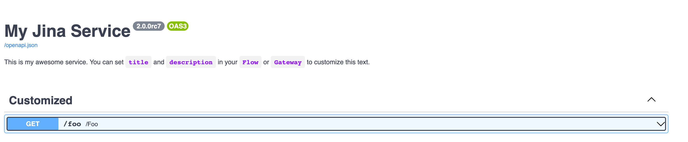
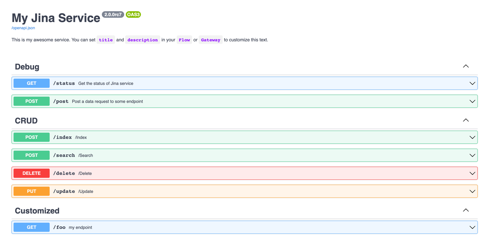
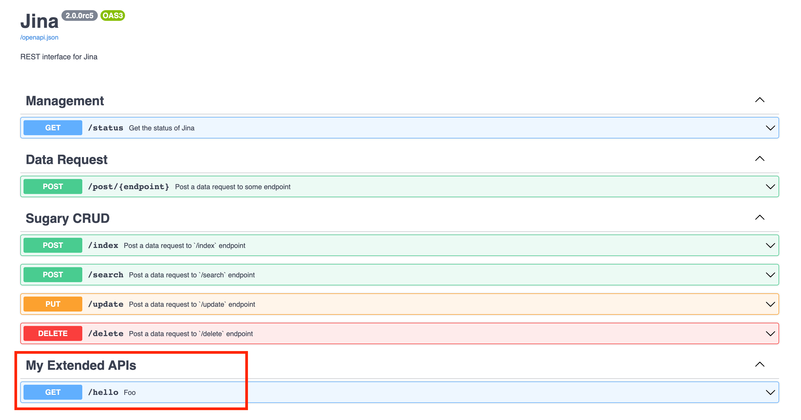

# Cookbook on Serving Jina

Congrats! If you come to this page, most likely you have already built some cool stuff with Jina and now want to share it to the world. This cookbook will
guide you from basic serving for demo purpose to advanced serving in production.


<!-- START doctoc generated TOC please keep comment here to allow auto update -->
<!-- DON'T EDIT THIS SECTION, INSTEAD RE-RUN doctoc TO UPDATE -->
Table of Contents

- [Minimum Working Example](#minimum-working-example)
- [Flow-as-a-service](#flow-as-a-service)
  - [Supported Communication Protocols](#supported-communication-protocols)
  - [via gRPC](#via-grpc)
  - [via WebSocket](#via-websocket)
  - [via HTTP](#via-http)
    - [Use Swagger UI to Send HTTP Request](#use-swagger-ui-to-send-http-request)
    - [Use `curl` to Send HTTP Request](#use-curl-to-send-http-request)
    - [Use Python to Send HTTP Request](#use-python-to-send-http-request)
    - [Enable Cross-origin-resources-sharing (CORS)](#enable-cross-origin-resources-sharing-cors)
    - [Extend HTTP Interface](#extend-http-interface)
  - [Switch Between Communication Protocols](#switch-between-communication-protocols)

<!-- END doctoc generated TOC please keep comment here to allow auto update -->

## Minimum Working Example


<table>
<tr>
<td>
<b>Server</b>
</td>
<td>
<b>Client</b>
</td>
</tr>
<tr>
<td>

```python
from jina import Flow

f = Flow(protocol='grpc', port_expose=12345)
with f:
    f.block()
```

</td>
<td>

```python
from jina import Client, Document

c = Client(protocol='grpc', port_expose=12345)
c.post('/', Document())
```

</td>
</tr>
</table>

## Flow-as-a-service

A `Flow` _is_ a service by nature. Though implicitly, you are already using it as a service.

When you start a `Flow` and call `.post()` inside the context, a `jina.Client` object is created and used for
communication.


Many times we need to use `Flow` & `Client` in a more explicit way, often due to one of the following reasons:

- `Flow` and `Client` are on different machines: one on GPU, one on CPU;
- `Flow` and `Client` have different lifetime: one lives longer, one lives shorter;
- Multiple `Client` want to access one `Flow`;
- One `Client` want to interleave its access to multiple `Flow`;
- `Client` is browser/curl/Postman.

Before this cookbook, you are mostly using Flow as an implicit service. In the sequel, we will show you how to serve
Flow in an explicit C/S style.

### Supported Communication Protocols

Jina supports `grpc`, `websocket`, `http` three communication protocols between `Flow` and `Client`.

| Protocol | Requirements | Description | Performance on large data |
| --- | --- | --- | --- |
| `grpc` | - |  Default gRPC protocol, mainly for streaming data | Super |
| `websocket` | `pip install "jina[client,http]"` | WebSocket protocol, used in frontend language that supports websocket, mainly for streaming data | Super |
| `http` |`pip install "jina[client,http]"` | HTTP protocol, mainly for allow any client to have HTTP access | Good |

The protocol is controlled by `protocol=` argument in `Flow`/`Client`'s constructor.


### via gRPC

On the server-side, create an empty Flow and use `.block` to prevent the process exiting.

```python
from jina import Flow

with Flow(port_expose=12345) as f:
    f.block()
```

```console
        gateway@14736[I]:input tcp://0.0.0.0:56392 (PULL_CONNECT) output tcp://0.0.0.0:56392 (PUSH_BIND) control over ipc:///var/folders/89/wxpq1yjn44g26_kcbylqkcb40000gn/T/tmp5pe2snw1 (PAIR_BIND)
        gateway@14736[S]:GRPCRuntime is listening at: 0.0.0.0:12345
        gateway@14733[S]:ready and listening
           Flow@14733[I]:1 Pods (i.e. 1 Peas) are running in this Flow
           Flow@14733[S]:🎉 Flow is ready to use!
           Flow@14733[I]:
	🔗 Protocol: 		GRPC
	🏠 Local access:	0.0.0.0:12345
	🔒 Private network:	192.168.31.159:12345
```

Note that the host address is `192.168.31.159` and `port_expose` is `12345`.

While keep this server open, let's create a client on a different machine:

```python
from jina import Client

c = Client(host='192.168.31.159', port_expose=12345)

c.post('/')
```

```console
GRPCClient@14744[S]:connected to the gateway at 0.0.0.0:12345!
```


### via WebSocket


```python
from jina import Flow

f = Flow(protocol='websocket', port_expose=12345)
with f:
    f.block()
```

```console
        gateway@14550[I]:input tcp://0.0.0.0:56192 (PULL_CONNECT) output tcp://0.0.0.0:56192 (PUSH_BIND) control over ipc:///var/folders/89/wxpq1yjn44g26_kcbylqkcb40000gn/T/tmpwn67zk99 (PAIR_BIND)
        gateway@14550[S]:WebSocketRuntime is listening at: 0.0.0.0:12345
        gateway@14547[S]:ready and listening
           Flow@14547[I]:1 Pods (i.e. 1 Peas) are running in this Flow
           Flow@14547[S]:🎉 Flow is ready to use!
           Flow@14547[I]:
	🔗 Protocol: 		WEBSOCKET
	🏠 Local access:	0.0.0.0:12345
	🔒 Private network:	192.168.31.159:12345
```

This will serve the Flow with WebSocket, so any Client connects to it should follow the WebSocket protocol as well.

```python
from jina import Client

c = Client(protocol='websocket', host='192.168.31.159', port_expose=12345)
c.post('/')
```

```console
WebSocketClient@14574[S]:connected to the gateway at 0.0.0.0:12345!
```

### via HTTP

To enable a Flow to receive from HTTP requests, you can add `protocol='http'` in the Flow constructor.

```python
from jina import Flow

f = Flow(protocol='http', port_expose=12345)

with f:
    f.block()
```

```console
        gateway@14786[I]:input tcp://0.0.0.0:56454 (PULL_CONNECT) output tcp://0.0.0.0:56454 (PUSH_BIND) control over ipc:///var/folders/89/wxpq1yjn44g26_kcbylqkcb40000gn/T/tmp_uqd9ifv (PAIR_BIND)
        gateway@14786[S]:HTTPRuntime is listening at: 0.0.0.0:12345
        gateway@14783[S]:ready and listening
           Flow@14783[I]:1 Pods (i.e. 1 Peas) are running in this Flow
           Flow@14783[S]:🎉 Flow is ready to use!
           Flow@14783[I]:
	🔗 Protocol: 		HTTP
	🏠 Local access:	0.0.0.0:12345
	🔒 Private network:	192.168.31.159:12345
	💬 Swagger UI:		http://localhost:12345/docs
	📚 Redoc:		    http://localhost:12345/redoc
```

#### Use Swagger UI to Send HTTP Request

You can navigate to the Swagger docs UI via `http://localhost:12345/docs`:


#### Use `curl` to Send HTTP Request

Now you can send data request via `curl`/Postman:

```console
$ curl --request POST -d '{"exec_entrypoint":"index", "data": [{"text": "hello world"}]}' -H 'Content-Type: application/json' http://localhost:12345/post/

{
  "request_id": "1f52dae0-93a5-47b5-9fa0-522a75301d99",
  "data": {
    "docs": [
      {
        "id": "28287a66-b86a-11eb-99c2-1e008a366d49",
        "tags": {},
        "text": "hello world",
        "content_hash": "",
        "granularity": 0,
        "adjacency": 0,
        "parent_id": "",
        "chunks": [],
        "weight": 0.0,
        "siblings": 0,
        "matches": [],
        "mime_type": "",
        "location": [],
        "offset": 0,
        "modality": "",
      }
    ],
    "groundtruths": []
  },
  "header": {
    "exec_endpoint": "index",
    "target_peapod": "",
    "no_propagate": false
  },
  "routes": [
    {
      "pod": "gateway",
      "pod_id": "5e4211d0-3916-4f33-8b9e-eec54be8ed9a",
      "start_time": "2021-05-19T06:19:24.472050Z",
      "end_time": "2021-05-19T06:19:24.473895Z"
    },
    {
      "pod": "gateway",
      "pod_id": "83a7ad34-1042-4b5d-b065-3692e2fc691b",
      "start_time": "2021-05-19T06:19:24.473831Z"
    }
  ],
  "status": {
    "code": "SUCCESS",
    "description": ""
  }
}
```

#### Use Python to Send HTTP Request

One can also use Python Client to send HTTP request, simply:

```python
from jina import Client

c = Client(protocol='http', port_expose=12345)
c.post('/', ...)
```

Note this HTTP client is less-performant on large data, it does not stream. Hence, it should be only used for debugging & testing.

#### Enable Cross-origin-resources-sharing (CORS)

CORS is by default disabled for security. That means you can not access the service from a webpage with different domain. To override this, simply do:

```python
from jina import Flow

f = Flow(cors=True, protocol='http')
```

#### Extend HTTP Interface

By default the following endpoints are exposed to the public:

| Endpoint | Description |
| --- | ---|
| `/status` | Check Jina service running status |
| `/post` | Corresponds to `f.post()` method in Python |
| `/index` | Corresponds to `f.post('/index')` method in Python |
| `/search` | Corresponds to `f.post('/search')` method in Python |
| `/update` | Corresponds to `f.post('/update')` method in Python |
| `/delete` | Corresponds to `f.post('/delete')` method in Python |

##### Hide CRUD and Debug Endpoints from HTTP Interface

User can decide to hide CRUD and debug endpoints in production, or when the context is not applicable. For example, in the code snippet below, we didn't implement any CRUD endpoints for the executor, hence it does not make sense to expose them to public.

```python
from jina import Flow
f = Flow(protocol='http', 
         no_debug_endpoints=True, 
         no_crud_endpoints=True)
```




##### Expose Customized Endpoints to HTTP Interface

`Flow.expose_endpoint` can be used to expose executor's endpoint to HTTP interface, e.g.


```python
from jina import Executor, requests, Flow

class MyExec(Executor):

    @requests(on='/foo')
    def foo(self, docs, **kwargs):
        pass

f = Flow(protocol='http').add(uses=MyExec)
f.expose_endpoint('/foo', summary='my endpoint')
with f:
    f.block()
```



Now, sending HTTP data request to `/foo` is equivalent as calling `f.post('/foo', ...)` in Python.

You can add more kwargs to build richer semantics on your HTTP endpoint. Those meta information will be rendered by Swagger UI and be forwarded to the OpenAPI schema.

```python
f.expose_endpoint('/bar', 
                  summary='my endpoint',
                  tags=['fine-tuning'],
                  methods=['PUT']
                  )
```


##### Add non-Jina Related Routes

If you want to add more customized routes, configs, options to HTTP interface, you can simply
override `jina.helper.extend_rest_interface` function as follows:

```python
import jina.helper
from jina import Flow


def extend_rest_function(app):
    @app.get('/hello', tags=['My Extended APIs'])
    async def foo():
        return 'hello'

    return app


jina.helper.extend_rest_interface = extend_rest_function
f = Flow(protocol='http')

with f:
    f.block()
```

And you will see `/hello` is now available:



### Switch Between Communication Protocols

You can switch to other protocol also via `.protocol` property setter. This setter works even in Flow runtime.

```python
from jina import Flow, Document

f = Flow(protocol='grpc') 

with f:
    f.post('/', Document())
    f.protocol = 'http'  # switch to HTTP protocol request
    f.block()
```