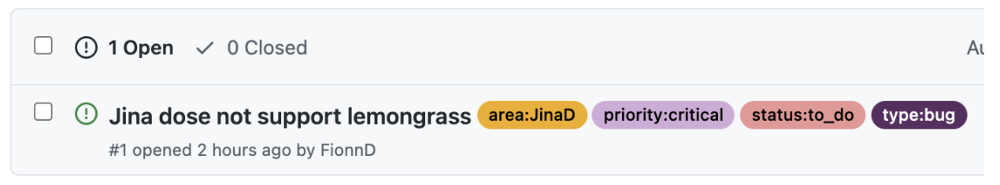

# Jina Issue Labeling

## Scope
These guidelines serve as a primary document for explaining how GitHub issues are labeled in Jina repos. For community members reading this document, it should explain how a label was assigned to your issue, and what that label means. For Jina maintainers, it describes how to assign labels correctly.

**Note:** These guideline only apply to the following repos; [Jina](https://github.com/jina-ai/jina), [Jina-hub](https://github.com/jina-ai/jina-hub), [Dashboard](https://github.com/jina-ai/dashboard), [docs](https://github.com/jina-ai/docs), [cloud-ops](https://github.com/jina-ai/cloud-ops),  [Jinabox.js](https://github.com/jina-ai/jinabox.js)

## Why is labeling important?
* Labels provide a good starting point for community members to contribute to Jina.
* Labels provide status for both community members and Jina maintainers on ongoing workstreams and feature requests.
* Labels provide an overview of the development status of Jina, highlighting areas of issue that need attention. They can be used as metrics of productivity and health of the project.

## How labels are used in Jina repos.

Labels added by community members are automatically assigned the label `needs-triage`. A Jina maintainers member should then read the issue and assign it to the correct labels.

An issue added by a Jina maintainers member can skip triage and directly be assigned a type, priority, status and area label.

All issues are assigned a type label. Some issues may be assigned a priority, status, and area label.
**An issue should only ever have one type label, one status label, one priority label, and one area label.**

This is an example of a correctly labelled issue

## How to assign: a step-by-step flow
This aims to walk you through a standard triaging process.

#### 1. Assign one type label:
You should only assign one type label at a time. If an issue applies to many types, choose the most relevant type. If an issue contains both a feature request and a separate question, you should suggest they open two separate issues.

| Label | Description and action to be taken  |
|--|--|
|`type/irrelevant` | This issue is completely unrelated to Jina and should be closed.|
|`type/question` | This is a question about Jina. It should be answered and closed after 20 days. |
|`type/duplicate` |This issue is a duplicate of an existing issue. It should be linked to the original issue, the user should notified and the issue closed.|
|`triage/needs-information` |This issue needs more info added by the author to be correctly triaged. Reply to the user and request more info.  |
|`type/bug`|This issue describes an error, flaw or fault in a Jina that causes it to produce an incorrect or unexpected result, or to behave in unintended ways.|
|`type/feature-request` | This issue describes a new feature or behaviour a user or users desires.|
|`type/maintenance`|This issue is not a bug or a feature_request.|

#### 2. Assign a priority label:
*Only issues of type bug - feature_request - maintenance are assigned a priority label.*

|Label  |Description |
|--|--|
|`priority/critical`| Team leaders are responsible for making sure that these issues (in their area) are being actively worked on—i.e., drop what you're doing. Stuff is burning. These should be fixed before the next release.|
|`priority/important-soon`|Must be maintainersed and worked on either currently or very soon—ideally in time for the next release.|
|`priority/important-longterm`|Important over the long term, but may not be currently maintainersed and/or may require multiple releases to complete.|
|`priority/backlog`|General agreement that this is a nice-to-have, but no one's available to work on it anytime soon. Community contributions would be most welcome in the meantime.|
|`priority/research`|Possibly useful, but not yet enough research to actually get it done.|

#### 3.  Assign a status label:
*Only issues of type bug - feature_request - maintenance are assigned a status label.*

| Label | Description |
|--|--|
|`status/available`| The issue is available for someone to begin working on. |
|`status/in-progess`|This issue is activity being worked on.|
|`status/blocked-upstream`|This issue is blocked by an upstream issue.|
|`status/blocked-internal`|This issue is blocked by another internal issue.|
|`status/blocked-help_needed`| This issue is blocked and needs support. Likely used by a community member who needs support from a Jina professional maintainers.|
|`status/done`|This issue is complete.|

#### 4. Assign an area label:
Only one area label should be assigned. If an issue applies to many area, choose the most relevant area.

Area labels are similar to epics in Jira. They group similar issues by workstream. For example, all issues that affect CRUD operations should be assigned the `area/crud` label.

Area labels will be specific to each repo, and created by PMs and team leads on an organic basis.

#### 5. [if applicable] assign good first issue
The `good_first_issue` label allows a smooth onboarding to the Jina open source project on GitHub. It encourages new developers to join the developer community.

####  What makes a ‘good first issue’?

**Priority**

The Jina community has five different levels of issue priority. Only issues of type `priority/backlog` and `priority/important-longterm` should be assigned a `good_first_issue` label.

**Technical complexity**

These issues should not require detailed knowledge of Jina architecture or design patterns. They should be bug or feature requests that are pretty easy to code.

**Specifications**
The issue should naturally explain what the problem is. It should also include some tips and starting point for how to solve the problem. For example, link to the relevant pages on the documentation site that someone might read to understand how to begin fixing the problem.

**Acceptance Criteria**

The issue should include a list of acceptance criteria. These are requirements that must be met for the issue to be marked done. By adding clear and understandable acceptance criteria, it helps the community members work towards an end goal.
