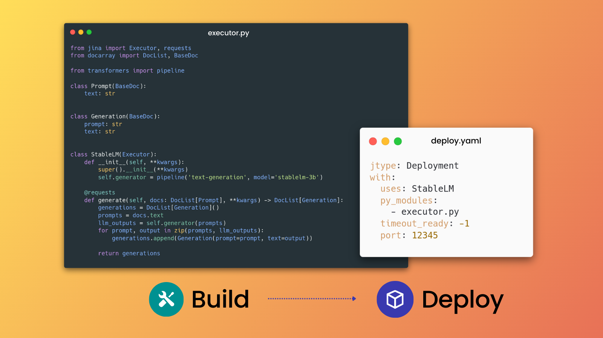

<p align="center">
<!-- survey banner start -->
<a href="https://10sw1tcpld4.typeform.com/to/EGAEReM7?utm_source=readme&utm_medium=github&utm_campaign=user%20experience&utm_term=feb2023&utm_content=survey">
  
</a>
<!-- survey banner start -->

<p align="center">
<a href="https://docs.jina.ai"></a>
</p>

<p align="center">
<b>Build multimodal AI services with cloud native technologies</b>
</p>

<p align=center>
<a href="https://pypi.org/project/jina/"></a>
<!--<a href="https://codecov.io/gh/jina-ai/jina"></a>-->
<a href="https://discord.jina.ai"></a>
<a href="https://pypistats.org/packages/jina"></a>
<a href="https://github.com/jina-ai/jina/actions/workflows/cd.yml"></a>
</p>

<!-- start jina-description -->

Jina lets you build multimodal [**AI services**](#build-ai-models) and [**pipelines**](#build-a-pipeline) that communicate via gRPC, HTTP and WebSockets, then scale them up and deploy to production. You can focus on your logic and algorithms, without worrying about the infrastructure complexity.



Jina provides a smooth Pythonic experience for serving ML models transitioning from local deployment to advanced orchestration frameworks like Docker-Compose, Kubernetes, or Jina AI Cloud. Jina makes advanced solution engineering and cloud-native technologies accessible to every developer.

- Build and serve models for any [data type](https://docs.docarray.org/data_types/first_steps/) and any mainstream [deep learning framework](https://docarray.org/docarray/how_to/multimodal_training_and_serving/).
- Design high-performance services, with [easy scaling](https://docs.jina.ai/concepts/orchestration/scale-out/), duplex client-server streaming, batching, [dynamic batching](https://docs.jina.ai/concepts/serving/executor/dynamic-batching/), async/non-blocking data processing and and any [protocol](https://docs.jina.ai/concepts/serving/gateway/#set-protocol-in-python).
- Serve [LLM models while streaming their output](#streaming-for-llms).
- Docker container integration via [Executor Hub](https://cloud.jina.ai), OpenTelemetry/Prometheus observability.
- Streamlined CPU/GPU hosting via [Jina AI Cloud](https://cloud.jina.ai).
- Deploy to your own cloud or system with our [Kubernetes](https://docs.jina.ai/cloud-nativeness/k8s/) and [Docker Compose](https://docs.jina.ai/cloud-nativeness/docker-compose/) integration().

<details>
    <summary><strong>Wait, how is Jina different from FastAPI?</strong></summary>
Jina's value proposition may seem quite similar to that of FastAPI. However, there are several fundamental differences:

 **Data structure and communication protocols**
  - FastAPI communication relies on Pydantic and Jina relies on [DocArray](https://github.com/docarray/docarray) allowing Jina to support multiple protocols
  to expose its services. The support for gRPC protocol is specially useful for data intensive applications as for embedding services
  where the embeddings and tensors can be more efficiently serialized.

 **Advanced orchestration and scaling capabilities**
  - Jina allows you to easily containerize and orchestrate your services and models, providing concurrency and scalability.
  - Jina lets you deploy applications formed from multiple microservices that can be containerized and scaled independently.

 **Journey to the cloud**
  - Jina provides a smooth transition from local development (using [DocArray](https://github.com/docarray/docarray)) to local serving using [Deployment](https://docs.jina.ai/concepts/orchestration/deployment/) and [Flow](https://docs.jina.ai/concepts/orchestration/flow/)
  to having production-ready services by using Kubernetes capacity to orchestrate the lifetime of containers.
  - By using [Jina AI Cloud](https://cloud.jina.ai) you have access to scalable and serverless deployments of your applications in one command.
</details>

<!-- end jina-description -->

## [Documentation](https://docs.jina.ai)

## Install 

```bash
pip install jina
```

Find more install options on [Apple Silicon](https://docs.jina.ai/get-started/install/apple-silicon-m1-m2/)/[Windows](https://docs.jina.ai/get-started/install/windows/).

## Get Started

### Basic Concepts

Jina has three fundamental layers:

- Data layer: [**BaseDoc**](https://docarray.docs.org/) and [**DocList**](https://docarray.docs.org/) (from [DocArray](https://github.com/docarray/docarray)) are the input/output formats in Jina.
- Serving layer: An [**Executor**](https://docs.jina.ai/concepts/serving/executor/) is a Python class that transforms and processes Documents. By simply wrapping your models into an Executor, you allow them to be served and scaled by Jina. [**Gateway**](https://docs.jina.ai/concepts/serving/gateway/) is the service making sure connecting all Executors inside a Flow.
- Orchestration layer:  [**Deployment**](https://docs.jina.ai/concepts/orchestration/deployment) serves a single Executor, while a [**Flow**](https://docs.jina.ai/concepts/orchestration/flow/) serves Executors chained into a pipeline.


[The full glossary is explained here](https://docs.jina.ai/concepts/preliminaries/#).

### Serve AI models
<!-- start build-ai-services -->

Let's build a fast, reliable and scalable gRPC-based AI service. In Jina we call this an **[Executor](https://docs.jina.ai/concepts/serving/executor/)**. Our simple Executor will wrap the [StableLM](https://huggingface.co/stabilityai/stablelm-base-alpha-3b) LLM from Stability AI. We'll then use a **Deployment** to serve it.


> **Note**
> A Deployment serves just one Executor. To combine multiple Executors into a pipeline and serve that, use a [Flow](#build-a-pipeline).

Let's implement the service's logic:

<table>
<tr>
<th><code>executor.py</code></th> 
<tr>
<td>

```python
from jina import Executor, requests
from docarray import DocList, BaseDoc

from transformers import pipeline


class Prompt(BaseDoc):
    text: str


class Generation(BaseDoc):
    prompt: str
    text: str


class StableLM(Executor):
    def __init__(self, **kwargs):
        super().__init__(**kwargs)
        self.generator = pipeline(
            'text-generation', model='stabilityai/stablelm-base-alpha-3b'
        )

    @requests
    def generate(self, docs: DocList[Prompt], **kwargs) -> DocList[Generation]:
        generations = DocList[Generation]()
        prompts = docs.text
        llm_outputs = self.generator(prompts)
        for prompt, output in zip(prompts, llm_outputs):
            generations.append(Generation(prompt=prompt, text=output))
        return generations
```

</td>
</tr>
</table>

Then we deploy it with either the Python API or YAML:
<div class="table-wrapper">
<table>
<tr>
<th> Python API: <code>deployment.py</code> </th> 
<th> YAML: <code>deployment.yml</code> </th>
</tr>
<tr>
<td>

```python
from jina import Deployment
from executor import StableLM

dep = Deployment(uses=StableLM, timeout_ready=-1, port=12345)

with dep:
    dep.block()
```

</td>
<td>

```yaml
jtype: Deployment
with:
  uses: StableLM
  py_modules:
    - executor.py
  timeout_ready: -1
  port: 12345
```

And run the YAML Deployment with the CLI: `jina deployment --uses deployment.yml`

</td>
</tr>
</table>
</div>

Use [Jina Client](https://docs.jina.ai/concepts/client/) to make requests to the service:

```python
from jina import Client
from docarray import DocList, BaseDoc


class Prompt(BaseDoc):
    text: str


class Generation(BaseDoc):
    prompt: str
    text: str


prompt = Prompt(
    text='suggest an interesting image generation prompt for a mona lisa variant'
)

client = Client(port=12345)  # use port from output above
response = client.post(on='/', inputs=[prompt], return_type=DocList[Generation])

print(response[0].text)
```

```text
a steampunk version of the Mona Lisa, incorporating mechanical gears, brass elements, and Victorian era clothing details
```

<!-- end build-ai-services -->

> **Note**
> In a notebook, you can't use `deployment.block()` and then make requests to the client. Please refer to the Colab link above for reproducible Jupyter Notebook code snippets.

### Build a pipeline

<!-- start build-pipelines -->

Sometimes you want to chain microservices together into a pipeline. That's where a [Flow](https://docs.jina.ai/concepts/orchestration/flow/) comes in.

A Flow is a [DAG](https://en.wikipedia.org/wiki/Directed_acyclic_graph) pipeline, composed of a set of steps, It orchestrates a set of [Executors](https://docs.jina.ai/concepts/serving/executor/) and a [Gateway](https://docs.jina.ai/concepts/serving/gateway/) to offer an end-to-end service.

> **Note**
> If you just want to serve a single Executor, you can use a [Deployment](#build-ai--ml-services).

For instance, let's combine [our StableLM language model](#build-ai--ml-services) with a Stable Diffusion image generation model. Chaining these services together into a [Flow](https://docs.jina.ai/concepts/orchestration/flow/) will give us a service that will generate images based on a prompt generated by the LLM.


<table>
<tr>
<th><code>text_to_image.py</code></th> 
<tr>
<td>

```python
import numpy as np
from jina import Executor, requests
from docarray import BaseDoc, DocList
from docarray.documents import ImageDoc


class Generation(BaseDoc):
    prompt: str
    text: str


class TextToImage(Executor):
    def __init__(self, **kwargs):
        super().__init__(**kwargs)
        from diffusers import StableDiffusionPipeline
        import torch

        self.pipe = StableDiffusionPipeline.from_pretrained(
            "CompVis/stable-diffusion-v1-4", torch_dtype=torch.float16
        ).to("cuda")

    @requests
    def generate_image(self, docs: DocList[Generation], **kwargs) -> DocList[ImageDoc]:
        images = self.pipe(
            docs.text
        ).images  # image here is in [PIL format](https://pillow.readthedocs.io/en/stable/)
        docs.tensor = np.array(images)
```

</td>
</tr>
</table>


Build the Flow with either Python or YAML:

<div class="table-wrapper">
<table>
<tr>
<th> Python API: <code>flow.py</code> </th> 
<th> YAML: <code>flow.yml</code> </th>
</tr>
<tr>
<td>

```python
from jina import Flow
from executor import StableLM
from text_to_image import TextToImage

flow = (
    Flow(port=12345)
    .add(uses=StableLM, timeout_ready=-1)
    .add(uses=TextToImage, timeout_ready=-1)
)

with flow:
    flow.block()
```

</td>
<td>

```yaml
jtype: Flow
with:
    port: 12345
executors:
  - uses: StableLM
    timeout_ready: -1
    py_modules:
      - executor.py
  - uses: TextToImage
    timeout_ready: -1
    py_modules:
      - text_to_image.py
```

Then run the YAML Flow with the CLI: `jina flow --uses flow.yml`

</td>
</tr>
</table>
</div>

Then, use [Jina Client](https://docs.jina.ai/concepts/client/) to make requests to the Flow:

```python
from jina import Client
from docarray import DocList, BaseDoc
from docarray.documents import ImageDoc


class Prompt(BaseDoc):
    text: str


prompt = Prompt(
    text='suggest an interesting image generation prompt for a mona lisa variant'
)

client = Client(port=12345)  # use port from output above
response = client.post(on='/', inputs=[prompt], return_type=DocList[ImageDoc])

response[0].display()
```


<!-- end build-pipelines -->

### Easy scalability and concurrency

Why not just use standard Python to build that service and pipeline? Jina accelerates time to market of your application by making it more scalable and cloud-native. Jina also handles the infrastructure complexity in production and other Day-2 operations so that you can focus on the data application itself.

Increase your application's throughput with scalability features out of the box, like [replicas](https://docs.jina.ai/concepts/orchestration/scale-out/#replicate-executors), [shards](https://docs.jina.ai/concepts/orchestration/scale-out/#customize-polling-behaviors) and [dynamic batching](https://docs.jina.ai/concepts/serving/executor/dynamic-batching/).

Let's scale a Stable Diffusion Executor deployment with replicas and dynamic batching:


* Create two replicas, with [a GPU assigned for each](https://docs.jina.ai/concepts/orchestration/scale-out/#replicate-on-multiple-gpus).
* Enable dynamic batching to process incoming parallel requests together with the same model inference.


<div class="table-wrapper">
<table>
<tr>
<th> Normal Deployment </th> 
<th> Scaled Deployment </th>
</tr>
<tr>
<td>

```yaml
jtype: Deployment
with:
  uses: TextToImage
  timeout_ready: -1
  py_modules:
    - text_to_image.py
```

</td>
<td>

```yaml
jtype: Deployment
with:
  uses: TextToImage
  timeout_ready: -1
  py_modules:
    - text_to_image.py
  env:
   CUDA_VISIBLE_DEVICES: RR
  replicas: 2
  uses_dynamic_batching: # configure dynamic batching
    /default:
      preferred_batch_size: 10
      timeout: 200
```

</td>
</tr>
</table>
</div>

Assuming your machine has two GPUs, using the scaled deployment YAML will give better throughput compared to the normal deployment.

These features apply to both [Deployment YAML](https://docs.jina.ai/concepts/orchestration/yaml-spec/#example-yaml) and [Flow YAML](https://docs.jina.ai/concepts/orchestration/yaml-spec/#example-yaml). Thanks to the YAML syntax, you can inject deployment configurations regardless of Executor code.

## Deploy to the cloud

### Containerize your Executor

In order to deploy your solutions to the cloud, you need to containerize your services. Jina provides the [Executor Hub](https://docs.jina.ai/concepts/serving/executor/hub/create-hub-executor/), the perfect tool
to streamline this process taking a lot of the troubles with you. It also lets you share these Executors publicly or privately.

You just need to structure your Executor in a folder:

```shell script
TextToImage/
├── executor.py
├── config.yml
├── requirements.txt
```
<div class="table-wrapper">
<table>
<tr>
<th> <code>config.yml</code> </th>
<th> <code>requirements.txt</code> </th>
</tr>
<tr>
<td>

```yaml
jtype: TextToImage
py_modules:
  - executor.py
metas:
  name: TextToImage
  description: Text to Image generation Executor based on StableDiffusion
  url:
  keywords: []
```

</td>
<td>

```requirements.txt
diffusers
accelerate
transformers
```

</td>
</tr>
</table>
</div>


Then push the Executor to the Hub by doing: `jina hub push TextToImage`.

This will give you a URL that you can use in your `Deployment` and `Flow` to use the pushed Executors containers.


```yaml
jtype: Flow
with:
    port: 12345
executors:
  - uses: jinai+docker://<user-id>/StableLM
  - uses: jinai+docker://<user-id>/TextToImage
```


### Get on the fast lane to cloud-native

Using Kubernetes with Jina is easy:

```bash
jina export kubernetes flow.yml ./my-k8s
kubectl apply -R -f my-k8s
```

And so is Docker Compose:

```bash
jina export docker-compose flow.yml docker-compose.yml
docker-compose up
```

> **Note**
> You can also export Deployment YAML to [Kubernetes](https://docs.jina.ai/concepts/serving/executor/serve/#serve-via-kubernetes) and [Docker Compose](https://docs.jina.ai/concepts/serving/executor/serve/#serve-via-docker-compose).

That's not all. We also support [OpenTelemetry, Prometheus, and Jaeger](https://docs.jina.ai/cloud-nativeness/opentelemetry/).

What cloud-native technology is still challenging to you? [Tell us](https://github.com/jina-ai/jina/issues) and we'll handle the complexity and make it easy for you.

### Deploy to JCloud

You can also deploy a Flow to JCloud, where you can easily enjoy autoscaling, monitoring and more with a single command. 

First, turn the `flow.yml` file into a [JCloud-compatible YAML](https://docs.jina.ai/yaml-spec/) by specifying resource requirements and using containerized Hub Executors.

Then, use `jina cloud deploy` command to deploy to the cloud:

```shell
wget https://raw.githubusercontent.com/jina-ai/jina/master/.github/getting-started/jcloud-flow.yml
jina cloud deploy jcloud-flow.yml
```

> **Warning**
>
> Make sure to delete/clean up the Flow once you are done with this tutorial to save resources and credits.

Read more about [deploying Flows to JCloud](https://docs.jina.ai/concepts/jcloud/#deploy).

### Streaming for LLMs
<!-- start llm-streaming-intro -->
Large Language Models can power a wide range of applications from chatbots to assistants and intelligent systems.
However, these models can be heavy and slow and your users want systems that are both intelligent _and_ fast!

Large language models work by turning your questions into tokens and then generating new token one at a 
time until it decides that generation should stop.
This means you want to **stream** the output tokens generated by a large language model to the client. 
In this tutorial, we will discuss how to achieve this with Streaming Endpoints in Jina.
<!-- end llm-streaming-intro -->

#### Service Schemas
<!-- start llm-streaming-schemas -->
The first step is to define the streaming service schemas, as you would do in any other service framework.
The input to the service is the prompt and the maximum number of tokens to generate, while the output is simply the 
token ID:
```python
from docarray import BaseDoc


class PromptDocument(BaseDoc):
    prompt: str
    max_tokens: int


class ModelOutputDocument(BaseDoc):
    token_id: int
    generated_text: str
```
<!-- end llm-streaming-schemas -->

#### Service initialization
<!-- start llm-streaming-init -->
Our service depends on a large language model. As an example, we will use the `gpt2` model. This is how you would load 
such a model in your executor
```python
from jina import Executor, requests
from transformers import GPT2Tokenizer, GPT2LMHeadModel
import torch

tokenizer = GPT2Tokenizer.from_pretrained('gpt2')


class TokenStreamingExecutor(Executor):
    def __init__(self, **kwargs):
        super().__init__(**kwargs)
        self.model = GPT2LMHeadModel.from_pretrained('gpt2')
```
<!-- end llm-streaming-init -->


#### Implement the streaming endpoint
<!-- start llm-streaming-endpoint -->
Our streaming endpoint accepts a `PromptDocument` as input and streams `ModelOutputDocument`s. To stream a document back to 
the client, use the `yield` keyword in the endpoint implementation. Therefore, we use the model to generate 
up to `max_tokens` tokens and yield them until the generation stops: 
```python
class TokenStreamingExecutor(Executor):
    ...

    @requests(on='/stream')
    async def task(self, doc: PromptDocument, **kwargs) -> ModelOutputDocument:
        input = tokenizer(doc.prompt, return_tensors='pt')
        input_len = input['input_ids'].shape[1]
        for _ in range(doc.max_tokens):
            output = self.model.generate(**input, max_new_tokens=1)
            if output[0][-1] == tokenizer.eos_token_id:
                break
            yield ModelOutputDocument(
                token_id=output[0][-1],
                generated_text=tokenizer.decode(
                    output[0][input_len:], skip_special_tokens=True
                ),
            )
            input = {
                'input_ids': output,
                'attention_mask': torch.ones(1, len(output[0])),
            }
```

Learn more about {ref}`streaming endpoints <streaming-endpoints>` from the `Executor` documentation.
<!-- end llm-streaming-endpoint -->


#### Serve and send requests
<!-- start llm-streaming-serve -->

The final step is to serve the Executor and send requests using the client.
To serve the Executor using gRPC:
```python
from jina import Deployment

with Deployment(uses=TokenStreamingExecutor, port=12345, protocol='grpc') as dep:
    dep.block()
```

To send requests from a client:
```python
import asyncio
from jina import Client


async def main():
    client = Client(port=12345, protocol='grpc', asyncio=True)
    async for doc in client.stream_doc(
        on='/stream',
        inputs=PromptDocument(prompt='what is the capital of France ?', max_tokens=10),
        return_type=ModelOutputDocument,
    ):
        print(doc.generated_text)


asyncio.run(main())
```

```text
The
The capital
The capital of
The capital of France
The capital of France is
The capital of France is Paris
The capital of France is Paris.
```

<!-- end llm-streaming-serve -->

<!-- start support-pitch -->

## Support

- Join our [Discord community](https://discord.jina.ai) and chat with other community members about ideas.
- Subscribe to the latest video tutorials on our [YouTube channel](https://youtube.com/c/jina-ai)

## Join Us

Jina is backed by [Jina AI](https://jina.ai) and licensed under [Apache-2.0](./LICENSE).

<!-- end support-pitch -->
