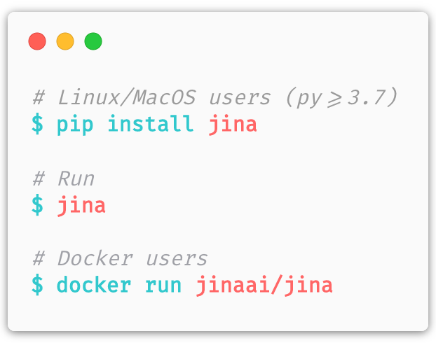

<p align="center">
  
</p>

<p align="center">
 
[](https://jina.ai)
[](#jina-hello-world-)
[](#license)
[](https://docs.jina.ai)
[](https://jina.ai/jobs)
<a href="https://twitter.com/intent/tweet?text=%F0%9F%91%8DCheck+out+Jina%3A+the+New+Open-Source+Solution+for+Neural+Information+Retrieval+%F0%9F%94%8D%40JinaAI_&url=https%3A%2F%2Fgithub.com%2Fjina-ai%2Fjina&hashtags=JinaSearch&original_referer=http%3A%2F%2Fgithub.com%2F&tw_p=tweetbutton" target="_blank">
  </img>
</a>
[](#)
[](https://hub.docker.com/r/jinaai/jina/tags)
[](https://github.com/jina-ai/jina/actions?query=workflow%3ACI)
[](https://github.com/jina-ai/jina/actions?query=workflow%3ACD)
[](https://github.com/jina-ai/jina/actions?query=workflow%3A%22Release+Cycle%22)
[](https://github.com/jina-ai/jina/actions?query=workflow%3A%22Release+CD%22)

</p>

<p align="center">
  <a href="https://github.com/jina-ai/jina">English</a> •
  <a href="https://github.com/jina-ai/jina/blob/master/README.ja.md">日本語</a> •
  <a href="https://github.com/jina-ai/jina/blob/master/README.fr.md">français</a> •
  <a href="https://github.com/jina-ai/jina/blob/master/README.de.md">Deutsch</a> •
  <a href="https://github.com/jina-ai/jina/blob/master/README.ru.md">Русский язык</a> •
  <a href="https://github.com/jina-ai/jina/blob/master/README.zh.md">中文</a>
</p>

<p align="center">
  <a href="https://jina.ai">Website</a> •
  <a href="https://docs.jina.ai">Docs</a> •
  <a href="https://github.com/jina-ai/examples">Examples</a> •
  <a href="mailto:newsletter+subscribe@jina.ai">Newsletter</a> •
  <a href="https://github.com/jina-ai/jina-hub">Hub (beta)</a> •
  <a href="https://dashboard.jina.ai">Dashboard (beta)</a> •
  <a href="https://twitter.com/intent/tweet?text=%F0%9F%91%8DCheck+out+Jina%3A+the+New+Open-Source+Solution+for+Neural+Information+Retrieval+%F0%9F%94%8D%40JinaAI_&url=https%3A%2F%2Fgithub.com%2Fjina-ai%2Fjina&hashtags=JinaSearch&original_referer=http%3A%2F%2Fgithub.com%2F&tw_p=tweetbutton">Twitter</a> •
  <a href="https://jina.ai/jobs">We are Hiring</a> •
  <a href="https://jina.ai/events">Events</a> •
  <a href="https://jina.ai/blog">Blog</a>
</p>

想要构建一个由深度学习支持的搜索系统？你来对地方了！

**名字**是__云原生神经搜索框架由最先进的人工智能和深度学习提供支持。是的**长期支持**全职的，[风险支持团队](https://jina.ai).

**🌌通用搜索解决方案**- Jina 可在多个平台和体系结构上实现任何类型的大规模索引和查询。无论您是在寻找图像、视频剪辑、音频片段、长法律文档、短推文，Jina 都能处理所有这些操作。

**🚀高性能和最先进的**- Jina 的目标是 AI 生产。您可以轻松扩展 VideoBERT、Xception、单词标记器、图像分段器和数据库，以处理数十亿级数据。副本和分片等功能是现成的。

**🐣系统工程变得简单**- Jina 提供一站式解决方案，让您从手工制作和胶着包、库和数据库中解放。拥有最直观的 API 和[仪表板 UI](https://github.com/jina-ai/dashboard)，构建云原生搜索系统只是一分钟的事情。

**🧩强大的扩展，简单的集成**-Jina 的新 AI 型号？只需编写 Python 脚本或构建 Docker 映像即可。插入新的算法从未如此简单，因为它应该如此简单。退房[吉纳中心（贝塔）](https://github.com/jina-ai/jina-hub)并找到更多扩展，了解社区贡献的不同用例。

Jina是一个开源项目。[我们正在招聘](https://jina.ai/jobs)AI 工程师、全堆栈开发人员、传道者、要构建的 PM__下一个神经搜索生态系统在开源。

## 内容



<!-- START doctoc generated TOC please keep comment here to allow auto update -->
<!-- DON'T EDIT THIS SECTION, INSTEAD RE-RUN doctoc TO UPDATE -->


- [安装](#%E5%AE%89%E8%A3%85)
- [吉娜"你好，世界 👋🌍！](#%E5%90%89%E5%A8%9C%E4%BD%A0%E5%A5%BD%E4%B8%96%E7%95%8C-)
- [开始](#%E5%BC%80%E5%A7%8B)
- [文档](#%E6%96%87%E6%A1%A3)
- [贡献](#%E8%B4%A1%E7%8C%AE)
- [社区](#%E7%A4%BE%E5%8C%BA)
- [路线 图](#%E8%B7%AF%E7%BA%BF-%E5%9B%BE)
- [许可证](#%E8%AE%B8%E5%8F%AF%E8%AF%81)

<!-- END doctoc generated TOC please keep comment here to allow auto update -->

## 安装

#### 从 PyPi 安装

在安装了 Python = 3.7 的 Linux/MacOS 上，只需在终端中运行此命令：

```bash
pip install jina
```

要安装具有额外依赖关系的 Jina，或将其安装在树莓派上，请参阅[文档](https://docs.jina.ai).

#### ...或使用 Docker 容器运行

我们提供通用的 Jina 映像（仅 80MB！），支持多个体系结构（包括 x64、x86、arm-64/v7/v6），只需执行：

```bash
docker run jinaai/jina
```

## 吉娜"你好，世界 👋🌍！

作为初学者，你被邀请尝试Jina的"你好，世界" - 图像神经搜索的简单演示[时尚-MNIST](https://hanxiao.io/2018/09/28/Fashion-MNIST-Year-In-Review/).无需额外的依赖项，只需执行：

```bash
jina hello-world
```

...甚至更容易为 Docker 用户，_无需任何安装_只是：

```bash
docker run -v "$(PWD)/j:/j" jinaai/jina hello-world --workdir /j && open j/hello-world.html
```

<details>
<summary>Click here to see the console output</summary>

<p align="center">
  
</p>

</details>  

它下载时尚-MNIST培训和测试数据，并告诉Jina_指数_训练集中的 60，000 张图片。然后，它随机采样来自测试集的图像作为_查询_，请吉娜检索相关结果。大约 1 分钟后，它将打开一个网页并显示如下所示的结果：

<p align="center">
  
</p>

背后的实现呢？简单，因为它应该是：

<table>
<tr>
<td> Python API </td>
<td> index.yml</td>
<td> <a href="https://github.com/jina-ai/dashboard">Flow in Dashboard</a></td>
</tr>
<tr>
<td> 

```python
from jina.flow import Flow

f = Flow.load_config('index.yml')

with f:
    f.index(raw_bytes=input_fn)
```

</td>
<td>
  <sub>

```yaml
!Flow
pods:
  chunk_seg:
    yaml_path: helloworld.crafter.yml
    replicas: $REPLICAS
    read_only: true
  doc_idx:
    yaml_path: helloworld.indexer.doc.yml
  encode:
    yaml_path: helloworld.encoder.yml
    needs: chunk_seg
    replicas: $REPLICAS
  chunk_idx:
    yaml_path: helloworld.indexer.chunk.yml
    replicas: $SHARDS
    separated_workspace: true
  join_all:
    yaml_path: _merge
    needs: [doc_idx, chunk_idx]
    read_only: true
```

</sub>

</td>
<td>


</td>
</tr>
</table>

所有大字，你可以命名：计算机视觉，神经红外，微服务，消息队列，弹性，副本和分片发生在一分钟内！

感兴趣？通过：

```bash
jina hello-world --help
```

请务必继续我们的[金娜 101 指南](https://github.com/jina-ai/jina#jina-101-first-thing-to-learn-about-jina)- 在3分钟内了解Jina的所有关键概念！

## 开始

<table>
  <tr>
      <td width="30%">
    <a href="https://github.com/jina-ai/jina/tree/master/docs/chapters/101">
      
    </a>
    </td>
    <td width="70%">
&nbsp;&nbsp;<h3><a href="https://github.com/jina-ai/jina/tree/master/docs/chapters/101">Jina 101: First Thing to Learn About Jina</a></h3>
&nbsp;&nbsp;<a href="https://github.com/jina-ai/jina/tree/master/docs/chapters/101">English</a> •
  <a href="https://github.com/jina-ai/jina/tree/master/docs/chapters/101/README.jp.md">日本語</a> •
  <a href="https://github.com/jina-ai/jina/tree/master/docs/chapters/101/README.fr.md">français</a> •
  <a href="https://github.com/jina-ai/jina/tree/master/docs/chapters/101/README.ru.md">Русский язык</a> •
  <a href="https://github.com/jina-ai/jina/tree/master/docs/chapters/101/README.cn.md">中文</a>
    </td>

  </tr>
</table>

<table>
<tr><th width="90%">Tutorials</th><th width="10%">Level</th></tr><tr>

<tr>
<td>
<h4><a href="https://docs.jina.ai/chapters/flow/README.html">Use Flow API to Compose Your Search Workflow</a></h4>
Learn how to orchestrate Pods to work together: sequentially and in parallel; locally and remotely
</td>
<td><h3>🐣</h3></td>
</tr>

<tr>
<td>
<h4><a href="https://github.com/jina-ai/dashboard">Use Dashboard to Get Insight of Jina Workflow</a></h4>
Learn to use dashboard to monitor and get insight of a running workflow
</td>
<td><h3>🐣</h3></td>
</tr>

<tr>
<td>
<h4><a href="https://github.com/jina-ai/examples/tree/master/x-as-service">From BERT-as-Service to X-as-Service</a></h4>
Learn how to use Jina to extract feature vector using any deep learning representation
</td>
<td><h3>🐣</h3></td>
</tr>

<tr>
<td>
<h4><a href="https://github.com/jina-ai/examples/tree/master/southpark-search">Build a NLP Semantic Search System</a></h4>
Learn how build a script search system for South Park and practice your knowledge on Flows and Pods
</td>
<td><h3>🐣</h3></td>
</tr>

<tr>
<td>
<h4><a href="https://github.com/jina-ai/examples/tree/master/flower-search">Build a Flower Image Search System</a></h4>
Learn how to build an image search system and how to define you own executors and run them in docker
</td>
<td><h3>🐣</h3></td>
</tr>

<tr>
<td>
<h4><a href="https://github.com/jina-ai/examples/tree/master/tumblr-gif-search">Video Semantic Search in Scale with Prefetching and Sharding</a></h4>
Learn how to increase the performance by using prefetching and sharding
</td>
<td><h3>🕊</h3></td>
</tr>

<tr>
<td>
<h4><a href="https://docs.jina.ai/chapters/remote/main.html">Distribute Your Workflow Remotely</a></h4>
Learn to run Jina on remote instances and distribute your workflow
</td>
<td><h3>🕊</h3></td>
</tr>

<tr>
<td>
<h4><a href="https://docs.jina.ai/chapters/extend/executor.html">Extend Jina by Implementing Your Own Executor</a></h4>
Learn how to implement your own ideas into Jina's plugin
</td>
<td><h3>🕊</h3></td>
</tr>

<tr>
<td>
<h4><a href="https://docs.jina.ai/chapters/hub/main.html">Run Jina Pod via Docker Container</a></h4>
Learn how Jina solves complex dependencies easily with Docker container
</td>
<td><h3>🕊</h3></td>
</tr>

<tr>
<td>
<h4><a href="https://github.com/jina-ai/jina-hub#publish-your-pod-image-to-jina-hub">Share Your Extension with the World</a></h4>
Learn to use Jina Hub and share your extension with engineers around the globe
</td>
<td><h3>🚀</h3></td>
</tr>

</table>
  

## 文档

<a href="https://docs.jina.ai/">

</a>

深入了解 Jina 的最佳方式是阅读我们的文档。文档基于主分支的每个推送、合并和发布事件构建。您可以在我们的文档中找到有关以下主题的更多详细信息。

-   [Jina 命令行接口参数解释](https://docs.jina.ai/chapters/cli/main.html)
-   [吉纳Python API接口](https://docs.jina.ai/api/jina.html)
-   [针对执行器、驱动程序和流的 Jina YAML 语法](https://docs.jina.ai/chapters/yaml/yaml.html)
-   [吉娜普罗托布夫架构](https://docs.jina.ai/chapters/proto/main.html)
-   [Jina 中使用的环境变量](https://docs.jina.ai/chapters/envs.html)
-   ...[和更多](https://docs.jina.ai/index.html)

你是医生明星吗？那就加入我们吧！我们欢迎对文档进行各种改进。

旧版本的文档[存档在此处](https://github.com/jina-ai/docs/releases).

## 贡献

我们欢迎开放源码社区、个人和合作伙伴提供的各种贡献。没有你的积极参与，Jina不可能成功。

以下资源可帮助您做出良好的第一贡献：

-   [贡献指南](CONTRIBUTING.md)
-   [发布周期和开发阶段](RELEASE.md)

## 社区

-   [松弛通道](https://join.slack.com/t/jina-ai/shared_invite/zt-dkl7x8p0-rVCv~3Fdc3~Dpwx7T7XG8w)- 一个沟通平台，供开发人员讨论Jina
-   [社区通讯](mailto:newsletter+subscribe@jina.ai)- 订阅 Jina 的最新更新、发布和事件新闻
-   [LinkedIn](https://www.linkedin.com/company/jinaai/)- 了解 Jina AI 作为公司
-   - 关注我们，并使用井号标签与我们互动`#JinaSearch`  
-   [加入我们](mailto:hr@jina.ai)-想和我们在吉纳全职工作吗？我们正在招聘！
-   [公司](https://jina.ai)- 了解更多关于我们公司，我们完全致力于开源！

## 路线 图

的[GitHub 里程碑](https://github.com/jina-ai/jina/milestones)为未来的改进开辟道路。

我们正在寻找合作伙伴关系，在Jina周围建立一个开放治理模式（例如技术指导委员会），从而建立健康的开源生态系统和开发商友好的文化。如果您有兴趣参与，请随时与我们联系：[hello@jina.ai](mailto:hello@jina.ai)

## 许可证

版权所有（c） 2020 金娜AI有限公司。保留所有权利。

Jina 根据 Apache 许可证 2.0 获得许可。看到[许可证](LICENSE)用于完整许可证文本。
