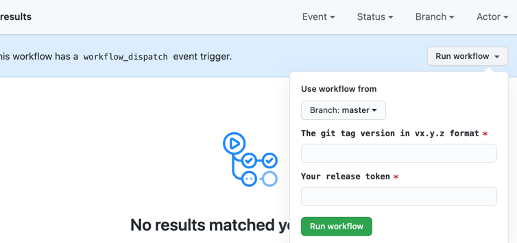

# Release & Version Identifier

Jina is shipped from two package management systems, PyPi and Docker Hub. This article clarifies the release cycle and version identifier behind each system.

<!-- START doctoc generated TOC please keep comment here to allow auto update -->
<!-- DON'T EDIT THIS SECTION, INSTEAD RE-RUN doctoc TO UPDATE -->

- [PyPi package versioning](#pypi-package-versioning)
- [Docker image versioning](#docker-image-versioning)
- [Manual Release Entrypoint](#manual-release-entrypoint)

<!-- END doctoc generated TOC please keep comment here to allow auto update -->


## PyPi package versioning

We follow [PEP-440](https://www.python.org/dev/peps/pep-0440/), and a form of [semantic versioning](https://semver.org/) as explained above.

To install the latest final release:

```bash
pip install -U jina
```

To install a particular final release:

```bash
pip install jina==x.y.z
```

The term "final release" is relative to "developmental release" as described below.  

### Install Jina with Recommended Extensions

`pip install -U jina` only installs the core dependencies of Jina.

The recommended way of installing Jina is `pip install -U jina`

`"standard"` include extra dependencies that enables:
- Executor Hub + Docker support
- FastAPI + Websocket support (required when using `Flow(protocol='http')` or `Flow(protocol='websocket')`)
- the best compression via LZ4 algorithm
- the best async eventloop management via `uvloop`

Other extension tags such as  `[devel]` can be found in [extra-requirements.txt](extra-requirements.txt). 

##### Do I need "[standard]"?

Depends on how you use and distribute Jina. 

If you are using/distributing Jina as a microservice, you often only need to install the core dependencies via `pip install jina`.

### Developmental releases versioning

One every master-merging event, we create early releases directly from source control which do not conflict with later project releases. The version identifier for development release is `x.y.z.devN`, which adds a suffix `.dev`, followed by a non-negative integer value `N`, which is reset on every release.

To install the latest development release:

```bash
pip install --pre jina
```

### Version epochs


#### Release cycle and versioning
Jina is developed continuously by the community and core team. Updates are grouped and released at regular intervals to align with software development best practices.

Jina follows a form of numbered versioning. The version number of the product is a three-part value `x.y.z` where `x`, `y`, and `z` are the major, minor, and patch components respectively.

-   Patch release (`x.y.z` -> `x.y.(z+1)`): Contain bug fixes, new features and breaking changes. Released weekly on a Wednesday morning CET.
-   Minor release (`x.y.z -> x.(y+1).0`): Contain bug fixes, new features and breaking changes. Released monthly on the first Wednesday of the month CET. This release is more QA tested and considered more stable than a patch release.
-   Major release (`x.y.z -> (x+1).0.0`): Are released based on the development cycle of the Jina company. There is no set scheduled for when these will occur.


The following example shows how Jina is released from 0.9 to 0.9.2 according to the schema we defined above.

|Event `e` | After `e`, `pip install jina` | After `e`, `pip install --pre jina` | After `e`, master `__init__.py` |
|--- | ---  | --- | --- |
| Release | 0.9.0 | 0.9.0 | 0.9.1.dev0 |
| Master merging | 0.9.0 | 0.9.1.dev0 | 0.9.1.dev1 |
| Master merging | 0.9.0 | 0.9.1.dev1 | 0.9.1.dev2 |
| Master merging | 0.9.0 | 0.9.1.dev2 | 0.9.1.dev3 |
| Release | 0.9.1 | 0.9.1 | 0.9.2.dev0 |
| Master merging | 0.9.1 | 0.9.2.dev0 | 0.9.2.dev1 |

## Docker image versioning

Our universal Docker image is ready-to-use on linux/amd64, linux/armv7+, linux/arm/v6, linux/arm64. The Docker image name always starts with `jinaai/jina` followed by a tag composed of three parts:

```text
jinaai/jina:{version}{python_version}{extra}
```

- `{version}`: The version of Jina. Possible values:
    - `latest`: the last release;
    - `master`: the master branch of `jina-ai/jina` repository;
    - `x.y.z`: the release of a particular version;
    - `x.y`: the alias to the last `x.y.z` patch release, i.e. `x.y` = `x.y.max(z)`;
- `{python_version}`: The Python version of the image. Possible values:
    - `-py37`: Python 3.7;
    - ` `, `-py38` for Python 3.8;
    - `-py39` for Python 3.9;
    - `-py310` for Python 3.10;
    - `-py311` for Python 3.11;
- `{extra}`: the extra dependency installed along with Jina. Possible values:
    - ` `: Jina is installed inside the image via `pip install jina`;
    - `-standard`: Jina is installed inside the image via `pip install jina`. It includes all recommended dependencies;  
    - `-devel`: Jina is installed inside the image via `pip install "jina[devel]"`. It includes `standard` plus some extra dependencies;

Examples:

- `jinaai/jina:0.9.6`: the `0.9.6` release with Python 3.7 and the entrypoint of `jina`.
- `jinaai/jina:latest`: the latest release with Python 3.7 and the entrypoint of `jina`
- `jinaai/jina:master`: the master with Python 3.7 and the entrypoint of `jina`

### Image alias and updates

| Event | Updated images | Aliases |
| --- | --- | --- |
| On Master Merge | `jinaai/jina:master{python_version}{extra}` | |
| On `x.y.z` release | `jinaai/jina:x.y.z{python_version}{extra}` | `jinaai/jina:latest{python_version}{extra}`, `jinaai/jina:x.y{python_version}{extra}` |

Six images are built, i.e. taking the combination of:
  - `{python_version} = ["-py37", "-py38", "-py39"]`
  - `{extra} = ["", "-devel", "-standard"]`


### Image size on different tags

|Image Size|
| ---|
||
||
||
||
||
||
||
||
||
||
||
||
||
||
||
||
||
||
||
||
||
||
||
||

---

## Manual Release Entrypoint

Manual release entrypoint is designed for authorized core developers of Jina.

### Trigger weekly release manually

One can release a hotfix immediately without waiting for the weekly release. Here are the steps:

1. [Go to here](https://github.com/jina-ai/jina/actions?query=workflow%3A%22Manual+Release%22)
2. Click on "Run Workflow" dropdown button on the right and input the release token and the release reason.
3. Click on "Run Workflow" green button.

### Rebuild all Docker images for certain `git tag` manually

1. [Go to here](https://github.com/jina-ai/jina/actions?query=workflow%3A%22Manual+Docker+Build%22)
2. Click on "Run Workflow" dropdown button on the right and input the release token and the release reason.
3. Click on "Run Workflow" green button.



Note, the manual rebuild on Docker images will *NOT* update `:latest-*` and `:x.y-*` aliases.
