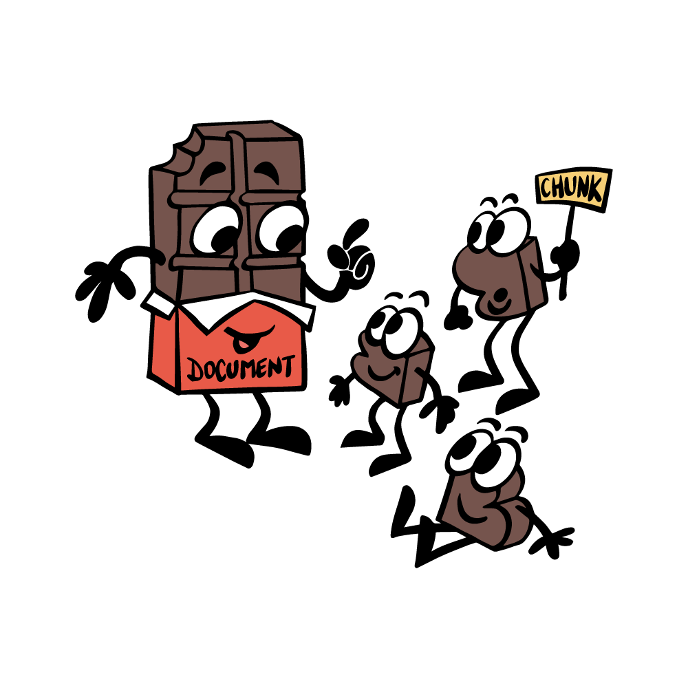
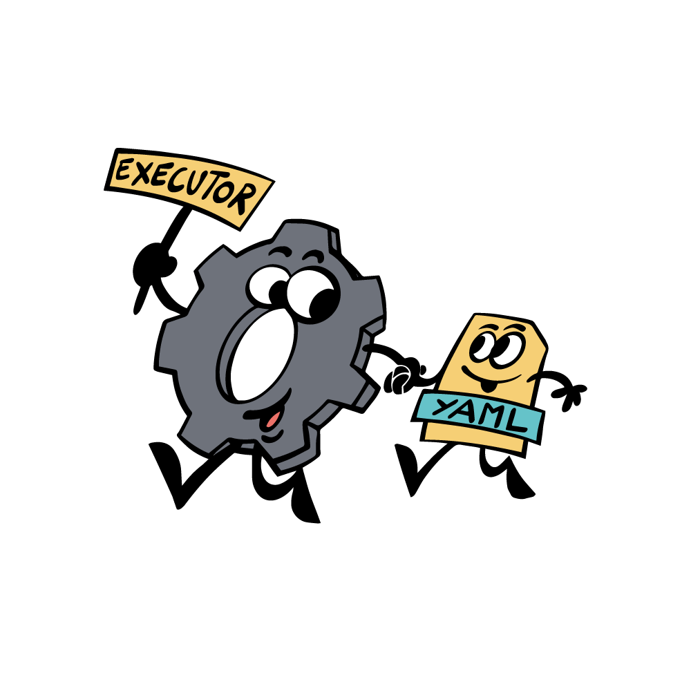
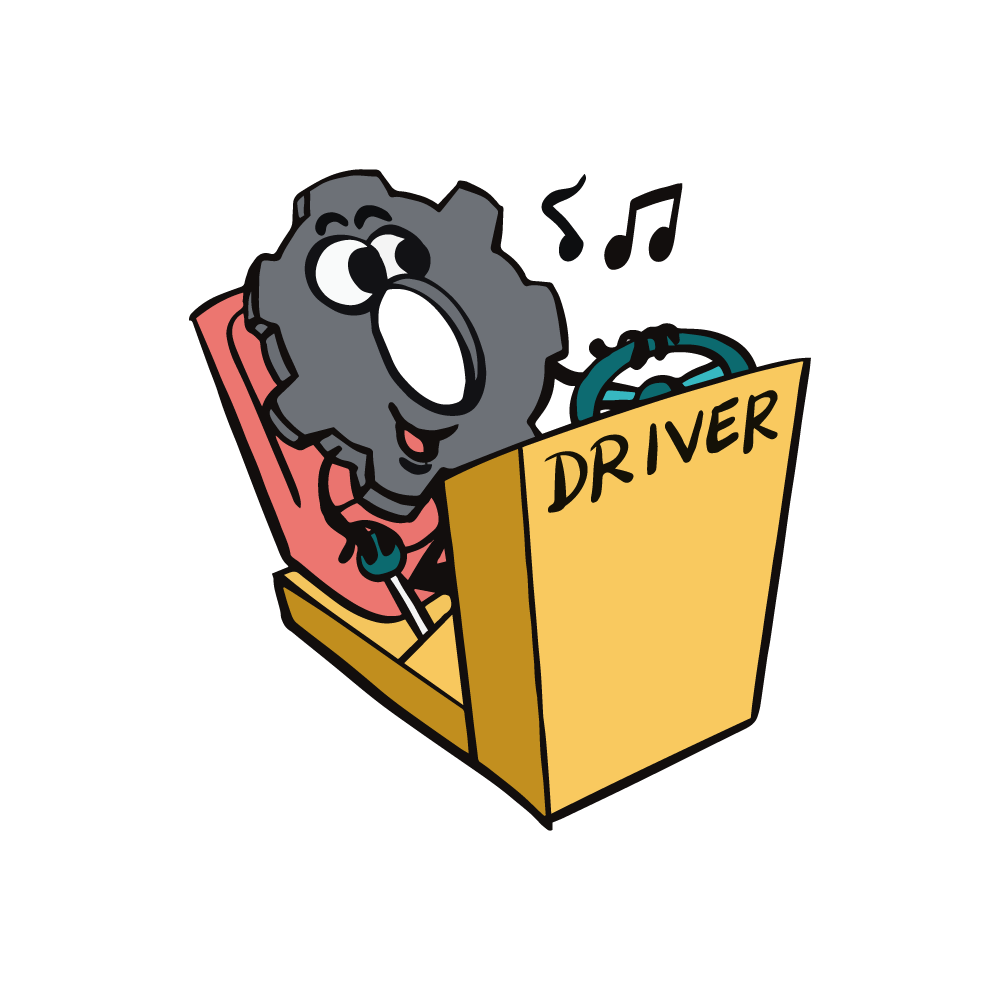
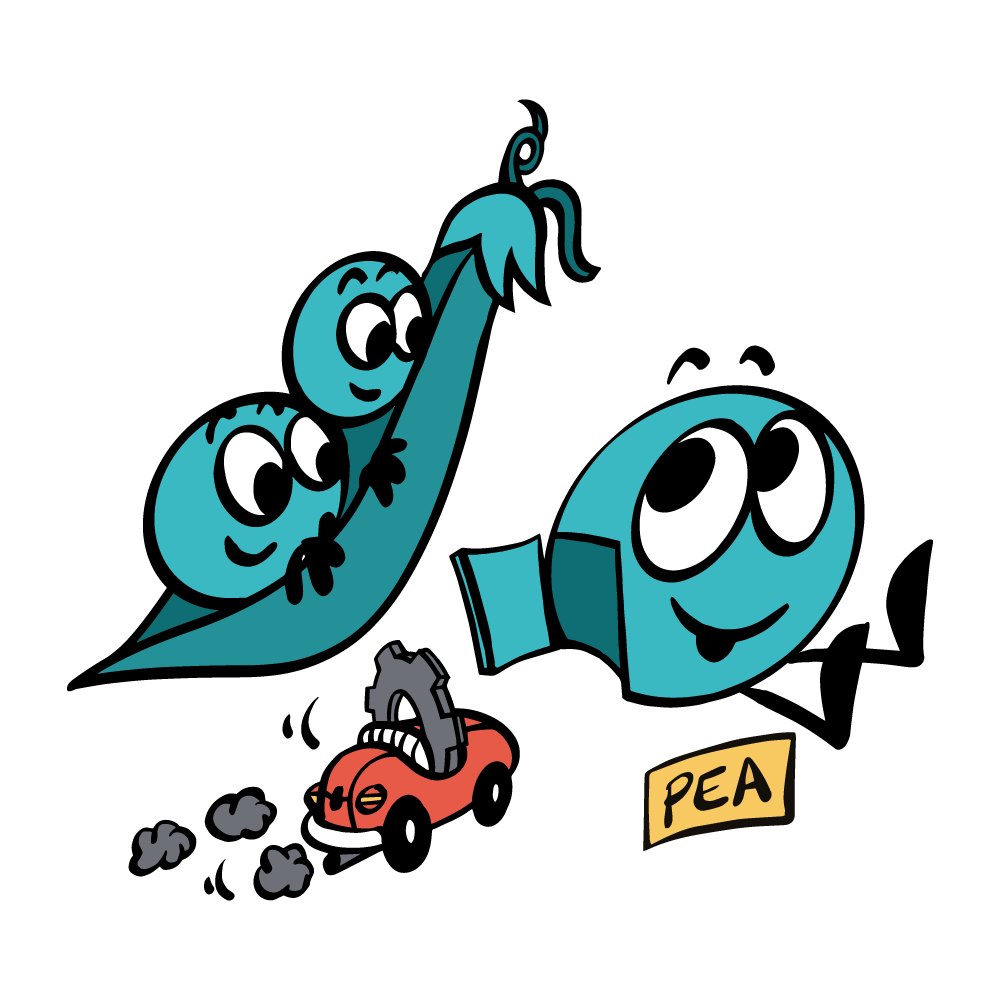
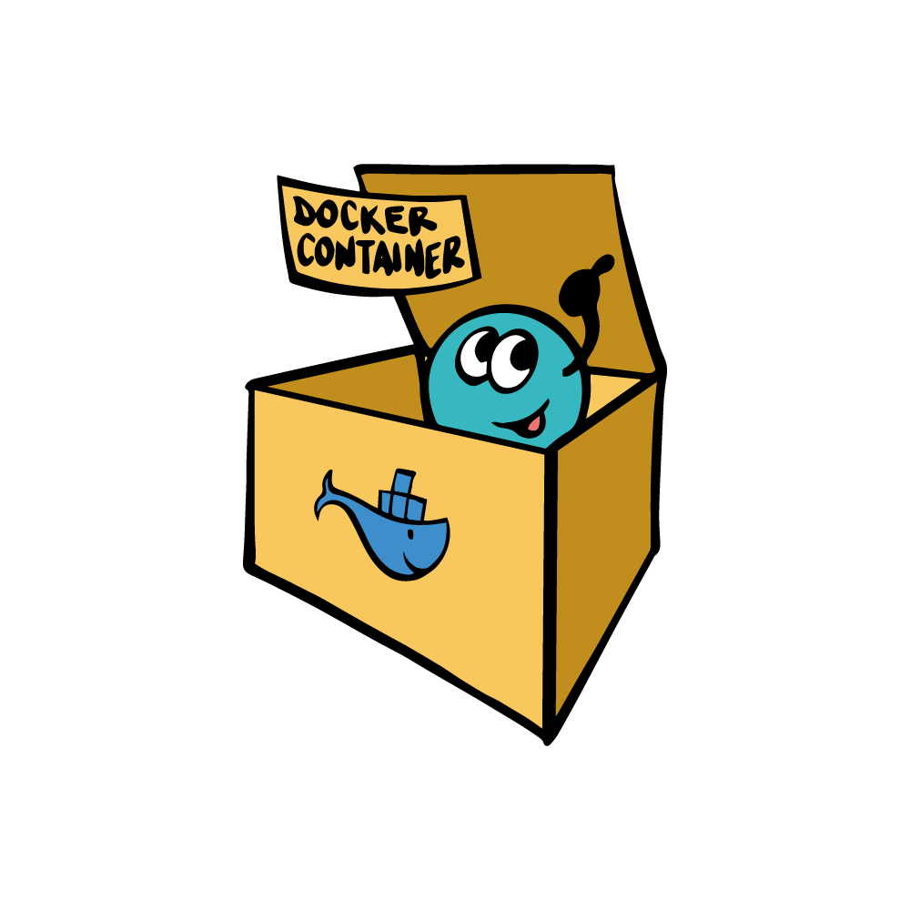
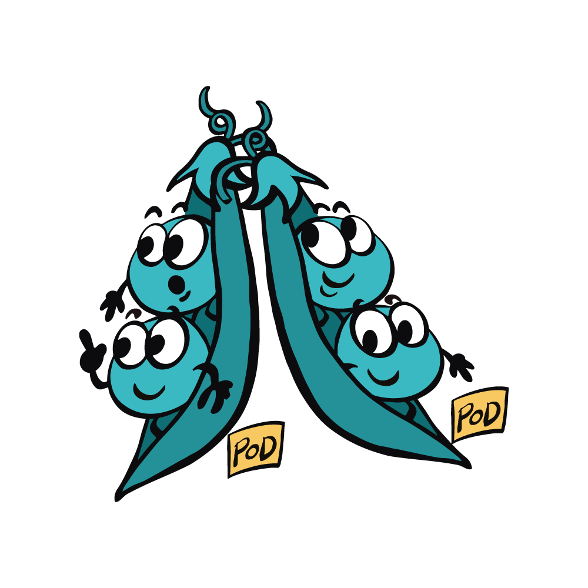

# Jina 101: First Thing to Learn About Jina

> Checkout [our Github for multi-lingual version of this 101 Guide](https://github.com/jina-ai/jina/blob/master/docs/chapters/101/).

## Document & Chunk

In Jina, **a Document is anything that you want to search for**: a text document, a short tweet, a code snippet an image, a video/audio clip, GPS traces of a day. A Document is also the input query when searching.

**A Chunk is a small semantic unit of a Document.** It could be a sentence, a 64x64 image patch, a 3 second video shot, a pair of coordinate and address. 

In Jina, a Document is like chocolate bar. Not only because it comes with different kinds and ingredients, but also you can break it into chunks in the way you like. Eventually, what you buy and store are the chocolate bars, and what you eat and digest are the chunks. You don’t want to swallow the whole bar, you also don’t want to cut it into powder; either way you will lose the flavor (i.e. the semantic).

## YAML config

**A YAML config is widely used in Jina to describe the properties of an object.** It offers customization, allowing users to change the behavior of an object without touching its code. Jina can build a very complicated object directly from a simple YAML config, and save an object into a YAML config.

## Executor

**Executor represents an algorithmic unit in Jina.** Algorithms such as encoding images into vectors, storing vectors on the disk, ranking results, can all be formulated as Executors. Executor provides useful interfaces, allowing AI developers and engineers to really focus on the algorithm. Features such as persistency, scheduling, chaining, grouping and parallelization come out of the box.

The properties of an Executor are stored in a YAML config, they always go hands-in-hands.

### Family of Executors

**Executor is a big family.** Each family member focuses on one important aspect of the search system. Let’s meet:
- **Crafter**: for crafting/segmenting/transforming the documents and chunks
- **Encoder**: for representing the chunks as vectors
- **Indexer**: for saving and retrieving vectors and key-value information from storage
- **Ranker**: for sorting the results

Having a new algorithm in mind? No problem, this family always welcome new members!

## Driver

**Driver defines how an Executor behaves on network requests.** Driver helps the Executor to handle the network traffic by interpreting the traffic data (e.g. Protobuf) into the format that the Executor can understand and handle (e.g. Numpy array).

## Pea

**Pea wraps an Executor and grants it the ability to exchange data over a network.** Pea can send and receive data from other Peas. Pea can also run inside a Docker container, containing all dependencies and the contextual environment in one place.

## Pod

**Pod is a group of Peas with the same property.** Peas are running in parallel inside a Pod. Pod unifies the network interfaces of those Peas, making them look like one single Pea from outside. Beyond that, a Pod adds more control, scheduling and context management to the Peas.

Pod can be run either on local host or on different computers over a network. 

## Flow

**Flow represents a high-level task**, e.g. indexing, searching, training. It manages the states and context of a group of Pods, orchestrating them to accomplish one task. Flow embraces diversity, whether a Pod is remote or in the Docker container, one Flow to rule them all!

## From Micro to Macro

Jina is a happy family. You can feel the harmony when you use Jina. 

You can design at the micro-level and scale that up to the macro-level. YAMLs becomes algorithms, threads become processes, pods become flows. The patterns and logic always remain the same. This is the beauty of Jina. 

    ✨<b>Intrigued? Try our "Hello, World!" and build your neural image search in 1 min. </b>

    ✨<b>Unleash your curiosity and happy searching! </b>🔍

> Checkout [our Github for multi-lingual version of this 101 Guide](https://github.com/jina-ai/jina/blob/master/docs/chapters/101/).

