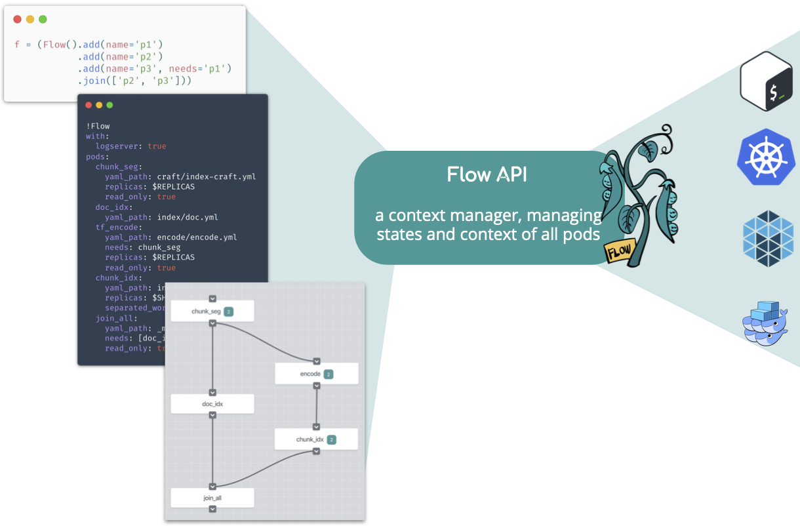

# Using Flow API to Compose Your Jina Workflow

In search systems, tasks such as indexing often involve multiple steps: preprocessing, encoding, storing, etc. In Jina's architecture, each step is implemented by an Executor and wrapped by a Pod. This microservice design makes the whole pipeline flexible and scalable. Accomplishing a task is then orchestrating all these Pods to work together, either sequentially or in parallel; locally or remotely. 

The Flow API is a context manager for Pods. Each `Flow` object corresponds to a real-world task. It helps the user to manage the states and contexts of all Pods required in that task. The Flow API translates a workflow defined in Python code, YAML file, or interactive graph to a runtime backed by multi-thread/process, Kubernetes, Docker Swarm, etc. Users don't need to worry about where the Pod is running or how the Pods are connected.



<!-- START doctoc generated TOC please keep comment here to allow auto update -->
<!-- DON'T EDIT THIS SECTION, INSTEAD RE-RUN doctoc TO UPDATE -->


- [Use Flow API in Python](#use-flow-api-in-python)
- [Use Flow API in YAML](#use-flow-api-in-yaml)
- [Design a Flow with Dashboard](#design-a-flow-with-dashboard)

<!-- END doctoc generated TOC please keep comment here to allow auto update -->


## Use Flow API in Python

### Create a Flow 

To create a new Flow:

```python
from jina.flow import Flow

f = Flow()
```

`Flow()` accepts some arguments, see `jina flow --help` or [our documentation](https://docs.jina.ai) for details. For example, `Flow(log_server=True)` will enable sending logs to the [dashboard](https://github.com/jina-ai/dashboard). 

When the arguments given to `Flow()` cannot be parsed, they are propagated to all the Flow's `Pods` for parsing (if they are accepted, see `jina pod --help` for the list of arguments). For example:

```python
f = Flow(read_only=True)
```

will set the `read_only` attribute of all Pods in `f` to `True`.

### Add Pod into the Flow

To add a Pod to the Flow, simply call `.add()`:

```python
f = (Flow().add(name='p1', uses='mypod1.yml')
           .add(name='p2', uses='mypod2.yml', timeout_ready=50000)
           .add(name='p3', uses='mypod3.yml', read_only=True))
``` 

This will create a sequential workflow:

```

gateway -> p1 -> p2 -> p3 -> gateway

``` 

The input of each Pod is the output of the last Pod in sequential order. The gateway is the entrypoint of the whole Jina network. The `gateway` Pod is automatically added to every `Flow`, of which the output is the first Pod and the input is the last Pod defined in the Flow.

All accepted arguments follow the command line interface of `Pod`, which can be found in `jina pod --help`. Just remember to replace the dash `-` to underscore `_` in the name of the argument when referring to it in Python.

Besides the file path, in Flow API `uses` can accept other types:

| Type | Example | Remark |
| --- | --- | --- |
| YAML file path | `crafter/my.yml` | |
| Inline YAML | `'!DataURICrafter\nwith: {mimetype: png}'` | don't forget `!` in the beginning |
| The name of an executor [listed here](../all_exec.html) | `TransformerTorchEncoder` | only the executors that have full default values can be directly used |
| Built-in simple executors [listed here](../simple_exec.html) | `_clear` | Always starts with `_` |
 
#### Add a Containerized Pod into the Flow

To run a Pod in a Docker container, simply specify the `image` argument:

```python
f = (Flow().add(name='p1')
           .add(name='p2', image='jinaai/hub.executors.encoders.bidaf:latest')
           .add(name='p3'))
``` 

This will run `p2` in a Docker container equipped with the image `jinaai/hub.executors.encoders.bidaf:latest`. More information on using containerized Pod can be found in [our documentation](https://docs.jina.ai). 

#### Add a Remote Pod into the Flow

To run a Pod remotely, simply specify the `host` and `port_expose` arguments. For example:

```python
f = (Flow().add(name='p1')
           .add(name='p2', host='192.168.0.100', port_expose=53100)
           .add(name='p3'))
```

This will start `p2` remotely on `192.168.0.100`, whereas `p1` and `p3` run locally.

To use remote Pods, you need to start a `gateway` on `192.168.0.100` in advance. More information on using remote Pods can be found in [our documentation](https://docs.jina.ai).  


#### Add a Remote Containerized Pod into the Flow

A very useful pattern is to combine the above two features together:

```python

f = (Flow().add(name='p1')
           .add(name='p2', host='192.168.0.100', port_expose=53100,
                image='jinaai/hub.executors.encoders.bidaf:latest')
           .add(name='p3'))
```

This will start `p2` remotely on `192.168.0.100` running a Docker container equipped with the image `jinaai/hub.executors.encoders.bidaf:latest`. Of course Docker is required on `192.168.0.100`. More information on using remote Pods can be found in [our documentation](https://docs.jina.ai). 


### Parallelize the Steps

By default, if you keep adding `.add()` to a `Flow`, it will create a long chain of sequential workflow. You can parallelize some of the steps by using `needs` argument. For example,

```python
f = (Flow().add(name='p1')
           .add(name='p2')
           .add(name='p3', needs='p1'))
```

This creates a workflow, where `p2` and `p3` work in parallel with the output of `p1`. 
```
gateway -> p1 -> p2
            |
              -> p3 -> gateway 
```

### Waiting for Parallel Steps to Finish

In the prior example, the message is returned to the gateway regardless of the status of `p2`. To wait for multiple parallel steps to finish before continuing, you can do:

```python
f = (Flow().add(name='p1')
           .add(name='p2')
           .add(name='p3', needs='p1')
           .join(['p2', 'p3']))
```
  
which gives

```
gateway -> p1 -> p2 ->
            |          | -> wait until both done -> gateway
              -> p3 -> 
```


### Run a Flow

To run a Flow, simply use the `with` keyword:

```python
f = (Flow().add(...)
           .add(...))

with f:
    # the flow is now running

```

Though you can manually call the `start()` method to run the flow, you also need to call the corresponding `close()` method to release the resource. Using `with` saves you the trouble, as the resource is automatically released when running out of the scope. 

#### Test Connectivity with Dry Run

You can test the whole workflow with `dry_run()`. For example:

```python

with f:
    f.dry_run()

```

This will send a `ControRequest` to all pods following the topology you defined. You can use it to test the connectivity of all pods. 

### Iterate over Pods in the Flow

You can iterate the Pods in a Flow like you would a list:

```python
f = (Flow().add(...)
           .add(...))

for p in f.build():
    print(f'{p.name} in: {str(p.head_args.socket_in)} out: {str(p.head_args.socket_out)}')
```

Note `f.build()` will build the underlying network context but not run the Pods. It is very useful for debugging.

### Feed Data to the Flow

You can use `.index()`, `.search()` to feed index data and search query to a Flow:

```python
with f:
    f.index(input_fn)
```

```python
with f:
    f.search(input_fn, top_k=50, output_fn=print)
```

- `input_fn` is an `Iterator[bytes]`, each of which corresponds to the representation of a Document with bytes.
- `output_fn` is the callback function after each request, and takes a `Request` protobuf as its only input.

A simple `input_fn` is defined as follows:

```python
def input_fn():
    for _ in range(10):
        yield b's'


# or ...
input_fn = (b's' for _ in range(10))
```

> Please note that the current Flow API does not support using `index()` and `search()` together in the same `with` scope. This is because the workflow of `index()` and `search()` are usually different and you cannot use one workflow for both tasks.

#### Feed Data to the Flow from Other Clients

If you don't use Python as a client, or your client and Flow are in different instances, you can keep a Flow running and use a client in another language to connect to it:

```python
import threading

with f:
    f.block()
```

Please check out our [hello world in client-server architecture](https://github.com/jina-ai/examples/tree/master/helloworld-in-cs) for a complete example.

**WARNING**: don't use a while loop to do the waiting, it is extremely inefficient:

```python
with f:
    while True: # <- dont do that
        pass # <- dont do that
```

## Use Flow API in YAML

You can also write a Flow in YAML:

```yaml
!Flow
with:
  logserver: true
pods:
  chunk_seg:
    uses: craft/index-craft.yml
    replicas: $REPLICAS
    read_only: true
  doc_idx:
    uses: index/doc.yml
  tf_encode:
    uses: encode/encode.yml
    needs: chunk_seg
    replicas: $REPLICAS
    read_only: true
  chunk_idx:
    uses: index/chunk.yml
    replicas: $SHARDS
    separated_workspace: true
  join_all:
    uses: _merge
    needs: [doc_idx, chunk_idx]
    read_only: true
```

You can use enviroment variables with `$` in YAML. More information on the Flow YAML Schema can be found in [our documentation](https://docs.jina.ai). 

### Load a Flow from YAML

```python
from jina.flow import Flow
f = Flow.load_config('myflow.yml')
```

### Start a Flow Directly from the CLI

The following command will start a Flow from the console and hold it for a client to connect.

```bash
jina flow --yaml-path myflow.yml
``` 


## Design a Flow with Dashboard

With Jina Dashboard, you can interactively drag and drop Pods, set their attribute and export to a Flow YAML file.  


More information on the dashboard can be found [here](https://github.com/jina-ai/dashboard).

# Common Design Patterns

Jina is a really flexible AI-powered neural search framework and is designed to enable any pattern that can be framed as a neural search problem. However, there are basic common patterns that show up when developing search solutions with Jina:

## CompoundIndexer (Vector + KV Indexers)

For neural search applications, it helps to use a `CompoundIndexer` in the same Pod for both the index and query Flows. The following YAML file shows an example of this pattern:

```yaml
!CompoundIndexer
components:
  - !NumpyIndexer
    with:
      index_filename: vectors.gz
      metric: cosine
    metas:
      name: vecIndexer
  - !BinaryPbIndexer
    with:
      index_filename: values.gz
    metas:
      name: kvIndexer  # a customized name
metas:
  name: complete indexer
```

The above YAML creates a Flow that:

* Acts as a single indexer
* Lets you seamlessly query the index with the embedding vector from any upstream encoder
* Returns the binary information in the key-value index in the Pod's response message.
 
The `VectorIndexer`:

* Retrieves the most relevant Documents by finding similarities in the embedding space
* Uses the key-value index to extract meaningful data and fields from those Documents

## Text Document Segmentation

A common search pattern is storing long text documents in an index to retrieve them later using short sentences. A single embedding vector per long text document is not the proper way to do this: It makes it hard to extract a single semantically-meaningful vector from a long document. Jina solves this by introducing [Chunks](https://github.com/jina-ai/jina/tree/master/docs/chapters/101#document--chunk). The common scenario is to have a `crafter` segmenting the document into smaller parts (typically short sentences) followed by an NLP-based encoder. 

```yaml
!Sentencizer
with:
  min_sent_len: 2
  max_sent_len: 64
```
```yaml
!TransformerTorchEncoder
with:
  pooling_strategy: auto
  pretrained_model_name_or_path: distilbert-base-cased
  max_length: 96
```

This way a single document contains `N` different Chunks that are later independently encoded by a downstream encoder. This lets Jina query the index using a short sentence as input, where similarity search can be applied to find the most common Chunks. This way the same Document can be retrieved based on searching different parts of it.

For instance, a text document containing 3 sentences can be decomposed into 3 Chunks:

`Someone is waiting at the bus stop. John looks surprised, his face seems familiar` ->
[`Someone is waiting at the bus stop`, `John looks surprised`, `his face seems familiar`]

This lets us retrieve the Document from different `input` sentences that match any of these 3 parts. For instance, these 3 different inputs could lead to the extraction of the same document by targeting 3 different Chunks:

- A standing guy -> Someone is waiting at the bus stop.
- He is amazed` -> John looks surprised.
- a similar look -> his face seems familiar.

## Indexers at Different Depth Levels

In a configuration like the one for *Text Document Segmentation*, we need different levels of indexing. The system needs to keep the data related to the Chunks as well as the information of the original documents. This way: 

1. The actual search is performed at the Chunk level following the `CompoundIndexer` pattern.
2. Then the Document indexer works as a final step to extract the actual Documents expected by the user.
 
To implement this, two common structures appear in `index` and `query`. In an `index` flow, these two indexers work in parallel:

* The `chunk indexer` gets messages from an `encoder`
* The `doc indexer` can get the documents even from the `gateway`.

```yaml
!Flow
pods:
  encoder:
    uses: BaseEncoder
  chunk_indexer:
    uses: CompoundIndexer
  doc_indexer:
    uses: BinaryPbIndexer
    needs: gateway
  join_all:
    uses: _merge
    needs: [doc_indexer, chunk_indexer]
```

However, at query time the Document and Chunk indexers work sequentially. Normally the Document would get messages from the Chunk indexer with a `Chunk2DocRanker` Pod in the middle of the Flow. The `ranker` would rank the Chunks by relevance and reduce the results to the parent IDs, enabling the `doc indexer` to extract the original Document's binary information.

```yaml
!Flow
  encoder:
    uses: BaseEncoder
  chunk_indexer:
    uses: CompoundIndexer
  ranker:
    uses: Chunk2DocRanker
  doc_indexer:
    uses: BinaryPbIndexer
```

## Switch Vector Indexer at Query Time

Jina lets you decide which kind of vector index to use when exposing the system to be queried. Almost all of Jina's advanced vector indexers inherit from `BaseNumpyIndexer`. These classes only override methods related to querying the index, but not the ones related to storing vectors, meaning they all store vectors in the same format. Jina takes advantage of this, and has the flexibility to offer the same vector data in different vector indexer types. To implement this functionality there are two things to consider, one for indexing and one for querying.

### Indexing

At index time, we use `NumpyIndexer`. It is important that the `Pod` containing this Executor ensures `read_only: False`. This way, the same indexer can be reconstructed from binary form, which contains information of the vectors (dimensions, ...) that are needed to have it work at query time.

```yaml
!NumpyIndexer
with:
  index_filename: 'vec.gz'
metas:
  name: wrapidx
```

### Querying

At query time, we use `NumpyIndexer` as `ref_indexer` for any advanced indexer inheriting from `BaseNumpyIndexer` (see `AnnoyIndexer`, `FaissIndexer`, ...).

```yaml
!FaissIndexer
with:
  ref_indexer:
    !NumpyIndexer
    metas:
      name: wrapidx
    with:
      index_filename: 'vec.gz'
```

In this case, this construction lets the `FaissIndexer` use the `vectors` stored by the indexer named `wrapidx`. 
