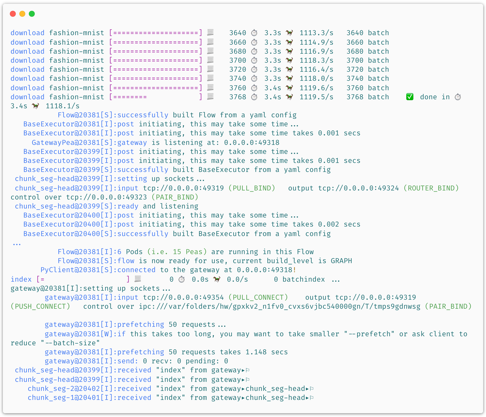
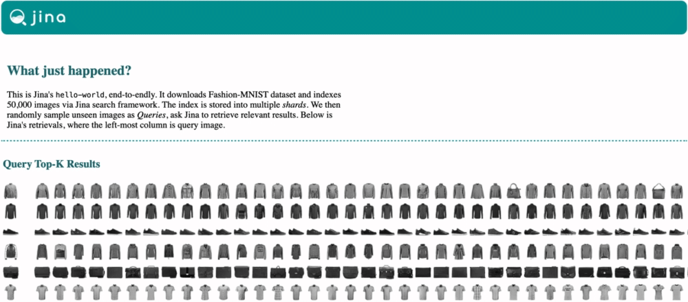

*************************
Jina "Hello, World!" 👋🌍
*************************

As a starter, we invite you to try Jina's "Hello, World" - a simple demo of image neural search for `Fashion-MNIST <https://hanxiao.io/2018/09/28/Fashion-MNIST-Year-In-Review/>`_. No extra dependencies needed, simply run:

.. highlight:: bash
.. code-block:: bash

    jina hello-world

Or even easier for Docker users, *no install required*, simply for MacOS:

.. highlight:: bash
.. code-block:: bash

    docker run -v "$(pwd)/j:/j" jinaai/jina hello-world --workdir /j && open j/hello-world.html

On Linux:

.. highlight:: bash
.. code-block:: bash

    docker run -v "$(pwd)/j:/j" jinaai/jina hello-world --workdir /j && xdg-open j/hello-world.html

This downloads the Fashion-MNIST training and test data and tells Jina to *index* 60,000 images from the training set. Then, it randomly samples images from the test set as *queries*, and asks Jina to retrieve relevant results. After about 1 minute, it opens a web page and show results like this:

And the implementation behind it? It's simple:

.. confval:: Python API

    .. highlight:: python
    .. code-block:: python

        from jina.flow import Flow

        f = Flow.load_config('helloworld.flow.index.yml')

        with f:
            f.index_ndarray(fashion_mnist)

.. confval:: YAML spec

    .. highlight:: yaml
    .. code-block:: yaml

        !Flow
        pods:
          encode:
            uses: helloworld.encoder.yml
            parallel: 2
          index:
            uses: helloworld.indexer.yml
            shards: 2
            separated_workspace: true

.. confval:: Flow in Dashboard

    .. image:: hello-world-flow.png
       :align: center

All the big words you can name: computer vision, neural IR, microservice, message queue, elastic, replicas, and shards all happened in just one minute!

View "Hello World" in Jina Dashboard
====================================

.. highlight:: bash
.. code-block:: bash

    pip install "jina[sse]"

    jina hello-world --logserver

Or if you use Docker:

.. highlight:: bash
.. code-block:: bash

    docker run -p 5000:5000 -v "$(pwd)/j:/j" jinaai/jina hello-world --workdir /j --logserver && open j/hello-world.html # replace "open" with "xdg-open" on Linux

More Options for "Hello, World"
==============================

Intrigued? Play with different options via:

.. highlight:: bash
.. code-block:: bash

    jina hello-world --help

.. argparse::
   :noepilog:
   :ref: jina.parsers.get_main_parser
   :prog: jina
   :path: hello-world

