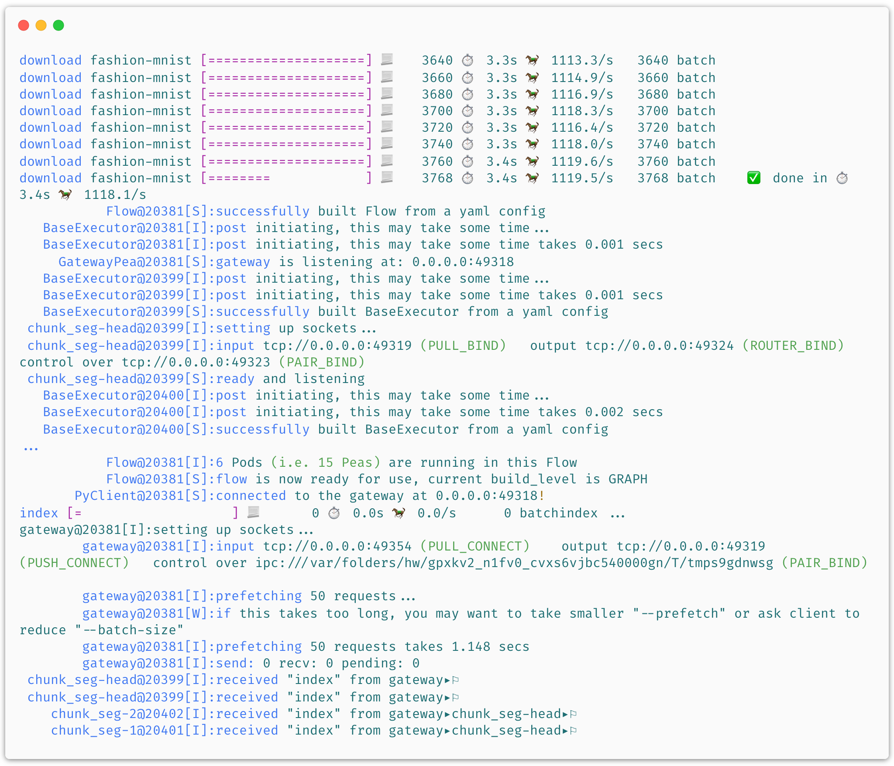

## Jina "Hello, World!" 👋🌍

As a starter, we invite you to try Jina's "Hello, World" - a simple demo of image neural search for [Fashion-MNIST](https://hanxiao.io/2018/09/28/Fashion-MNIST-Year-In-Review/). No extra dependencies needed, simply do:

```bash
jina hello-world
```

...or even easier for Docker users, *no any install required*, simply:

```bash
docker run -v "$(PWD)/j:/j" jinaai/jina:devel hello-world --workdir /j --logserver && open j/hello-world.html
```


  

It downloads Fashion-MNIST training and test data and tells Jina to *index* 60,000 images from the training set. Then, it randomly samples images from the test set as *queries*, asks Jina to retrieve relevant results. After about 1 minute, it will open a webpage and show results like this:


And the implementation behind? As simple as it should be:

<table>
<tr>
<td> Python API </td>
<td> index.yml</td>
<td> Flow in Dashboard</td>
</tr>
<tr>
<td> 

  
```python
from jina.flow import Flow

f = Flow.load_config('index.yml')

with f.build() as fl:
    fl.index(raw_bytes=input_fn)
```

</td>
<td>
  <sub>

```yaml
!Flow
pods:
  chunk_seg:
    yaml_path: helloworld.crafter.yml
    replicas: $REPLICAS
    read_only: true
  doc_idx:
    yaml_path: helloworld.indexer.doc.yml
  encode:
    yaml_path: helloworld.encoder.yml
    needs: chunk_seg
    replicas: $REPLICAS
  chunk_idx:
    yaml_path: helloworld.indexer.chunk.yml
    replicas: $SHARDS
    separated_workspace: true
  join_all:
    yaml_path: _merge
    needs: [doc_idx, chunk_idx]
    read_only: true
```
</sub>

</td>
<td>


</td>
</tr>
</table>


All big words you can name: computer vision, neural IR, microservice, message queue, elastic, replicas & shards happened in just one minute!

Intrigued? Play with different options via:

```bash
jina hello-world --help
```


.. argparse::
   :noepilog:
   :ref: jina.main.parser.get_main_parser
   :prog: jina
   :path: hello-world


## View "Hello World" in Jina Dashboard

```bash

pip install jina[sse]

jina hello-world --logserver
```

or if you use Docker:

```bash
docker run -p 5000:5000 -v $(PWD)/tmp:/workspace jinaai/jina:devel hello-world --workdir /workspace --logserver && open tmp/hello-world.html
```

