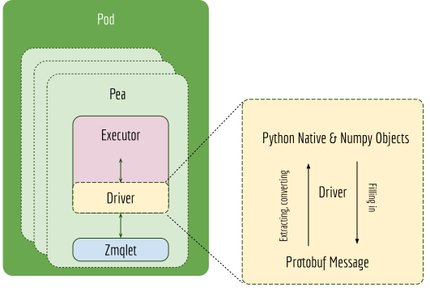

JEP 1 --- Redesigning ``Driver`` and its relation to ``Executor``
=================================================================

.. contents:: Table of Contents
   :depth: 3

:Author: Han Xiao (han.xiao@jina.ai)
:Created: Feb. 24, 2020
:Status: Accepted
:Related JEPs:
:Created on Jina VCS version: ``@ece529e``
:Merged to Jina VCS version: ``@f6796ac``
:Released in Jina version: TBA
:Discussions: https://github.com/jina-ai/jina/issues/27

.. contents:: Table of Contents
   :depth: 2

Abstract
--------

We describe why and how we refactor the :class:`jina.drivers.BaseDriver` and make it as a part of :class:`jina.executors.BaseExecutor`.

Rationale
---------

In the current implementation, the driver config is placed separately from the executor config. They are connected through CLI parameters ``--uses`` and ``--driver_group`` on the Pea’s level.

This poses multiple problems such as:

- As people working on executor, they have a very vague clue how it will work in the microservice/network settings. They later have to design the corresponding ``driver_group`` to match the logic of the executor.
- Almost every executor needs a driver, separating the driver from the executor seems unnecessary.
- Two YAML configs are cross-referencing the others. This is error-prone.
- The name ``driver`` and ``handler`` are used interchangeably and they can be very confusing.

What we are expecting is the driver specification defined inside the executor YAML config, such as

.. highlight:: yaml
.. code-block:: yaml

    !CompoundExecutor
    components:
      - !NumpyIndexer
        with:
          num_dim: -1
          index_key: HNSW32
          index_filename: vec.idx
        metas:
          name: my_vec_indexer  # a customized name
          workspace: $TEST_WORKDIR
      - !MetaProtoIndexer
        with:
          index_filename: chunk.gzip
        metas:
          name: chunk_meta_indexer
          workspace: $TEST_WORKDIR
    metas:
      name: chunk_compound_indexer
      workspace: $TEST_WORKDIR
    on:
      SearchRequest:  # under request type1
        - !ChunkSearchDriver:
            with:
              name: my_vec_indexer
              method: query
        - !ChunkMetaSearchDriver
            with:
              method: meta_query
      IndexRequest:    # under request type2
        - !ChunkIndexDriver
            with:
                method: add
        - !PruneChunkDriver {}
        - !MetaChunkDriver
            with:
                method: add

The above YAML illustrates a simple example when writing JEP-1, please refer to the docs for the final YAML syntax and specification.

Specification
-------------

New design of the ``Executor``, ``Driver`` and ``Pea``
^^^^^^^^^^^^^^^^^^^^^^^^^^^^^^^^^^^^^^^^^^^^^^^^^^^^^^

``Driver`` is purposed to translate between protobuf message (in the network layer) and the python native object (in the executor). It connects the Python native ``jina.executors.BaseExecutor`` with the network layer ``jina.peapods.pea.Pea``. With ``Driver`` ML developers can focus on the model/logic behind an ``Executor``, using Python objects/numpy array as input and output, without worrying about how it deals with protobuf. The next figure illustrates this idea.

|

Each public ``Executor`` function requires a ``Driver`` if this function want to process the Protobuf message from the ``Pea``.  If an ``Executor`` exposes multiple function interfaces, e.g. :func:`add`, :func:`query`, then multiple ``Driver`` need to be implemented respectively. This is because each function requires different information from the Protobuf message, thus requires different extraction and filling strategies of each ``Driver``.

A ``Driver`` has access to both ``Executor`` and ``Pea``'s context. In particular, it can access any function from the ``Executor`` and the current message and previous messages received from ``Pea``.

The same executor may work differently under different incoming requests, this is defined by chaining multiple drivers together as a driver group. The executor invokes different driver group according to the type of message that the Pea received.

Connecting ``Driver``, ``Pea`` and ``Executor``
^^^^^^^^^^^^^^^^^^^^^^^^^^^^^^^^^^^^^^^^^^^^^^^

``Driver``, ``Pea`` and ``Executor`` are connected via a chain of :func:`attach`. First, the ``Pea`` tells the ``Executor`` to attach to the ``Pea`` after loading:

.. literalinclude:: pea.py
   :language: python
   :lines: 155-160

The ``Executor`` tells all contained drivers to :func:`attach` to the ``Pea`` and ``Executor``.

.. literalinclude:: exec.py
   :language: python
   :lines: 523-530

Depending on the ``Driver`` type, :class:`jina.drivers.BaseExecutableDriver` is attached to both, whereas :class:`jina.drivers.BaseDriver` is only attach to ``Pea``.

.. literalinclude:: driver.py
   :language: python
   :lines: 51-57

Adding ``requests.on`` syntax
^^^^^^^^^^^^^^^^^^^^^^^^^^^^^
The ``requests`` field is used to define the behavior of the executor under different requests. It is defined at the same level with ``metas`` and ``with``. The ``on`` field describes what will the executor do on certain network requests. For example, for a :class:`jina.executors.encode.BaseEncoder`, which is expected to do :func:`encode` in any circumstances. The ``on`` field should be defined as follows:

.. highlight:: yaml
.. code-block:: yaml

    !AwesomeExecutor
    with:
    metas:
    requests:
        on:
            [SearchRequest, IndexRequest, TrainRequest]:
                - !EncodeDriver
                    with:
                        method: encode

In the future, there may be other subfields implemented right under the ``requests`` field.

.. confval:: requests.on.[RequestType]

    ``[RequestType]`` can be a list of ``jina.jina_pb2.Request``, i.e. SearchRequest, IndexRequest, TrainRequest and ControlRequest.

.. confval:: requests.on.[RequestType].method

    The executor's method to call, the method must be defined inside the scope of this executor. It is **optional** though.

.. confval:: requests.on.[RequestType].driver

    The corresponding driver to use, defined in :mod:`jina.drivers`. It is **always required**.

The ``on`` field supports multiple methods/drivers, and they are being called in the order of how they defined. For example,

.. highlight:: yaml
.. code-block:: yaml

    on:
        SearchRequest:
            - !PruneChunkDriver {}
            - !Chunk2DocScoreDriver
              with:
                method: score
            - !PruneDocDriver {}

For the :mod:`jina.executors.compound.CompoundExecutor`, the ``on`` field supports specifying a method of a member executor with ``executor``. For example,

.. highlight:: yaml
.. code-block:: yaml

    !CompoundExecutor
    components:
      - !NumpyIndexer
        metas:
          name: my_vec_indexer  # a customized name
      - !MetaProtoIndexer
        metas:
          name: chunk_meta_indexer
    requests:
        on:
            SearchRequest:  # under request type1
                - !VecIndexDriver
                    with:
                        executor: my_vec_indexer
                        method: query

                - !MetaChunkIndexDriver
                    with:
                        executor: chunk_meta_indexer
                        method: meta_query

.. confval:: requests.on.[RequestType].executor

    The name of the sub-executor defined. It is only required for :class:`jina.executors.compound.CompoundExecutor`.

Note, a meaningful ``Executor`` is not always required. For example, a "router", which only forwards the message can be defined as the follows using simply the :class:`jina.executors.BaseExecutor`:

.. highlight:: yaml
.. code-block:: yaml

    !BaseExecutor
    requests:
      on:
        [SearchRequest, IndexRequest, TrainRequest]:
            - !RouteDriver {}

The default values on ``requests.on``
^^^^^^^^^^^^^^^^^^^^^^^^^^^^^^^^^^^^^

Certain behaviors are followed by all executors, it makes sense to have a :file:`requests.default.yml` to define all those default behaviors. A redefinition in the user-specified YAML will certainly override these default values.

.. confval:: requests.on.ControlRequest

    All executors must handle the ``ControlRequest`` correctly, so that they (and their container :class:`jina.peapods.pea.Pea`) can be closed/terminated gracefully. Therefore, it is more convenient to set ``ControlRequest`` as defaults:

    .. highlight:: yaml
    .. code-block:: yaml

        requests:
            on:
                ControlRequest:
                    - !ControlReqDriver {}

Serialization of ``Driver``
^^^^^^^^^^^^^^^^^^^^^^^^^^^

When :func:`jina.drivers.BaseExecutableDriver.save` or :func:`jina.drivers.BaseExecutableDriver.save_config` is called, then the driver it contains will be also saved as a part of YAML or as a part of the binary pickle. Note, that the driver deserialized from the binary/YAML will be always "unattached". This is because the attached ``Pea`` and ``Executor`` should not be serialized while saving. Thus it has to call :func:`attach` for making it connected to :class:`jina.peapods.pea.Pea` and :class:`jina.executuors.BaseExecutor` again.

We make :class:`jina.drivers.BaseDriver` and :class:`jina.drivers.BaseExecutableDriver` loadable from YAML configs. The arguments of :func:`__init__` can be specified via ``with``, and a non-parametric :func:`__init__` can be specified via ``{}``. Very similar to how it is defined for :class:`jina.executors.BaseExecutor`. For example,

.. highlight:: yaml
.. code-block:: yaml

    - !MetaDocSearchDriver
      with:
        executor: blah
        method: goto
    - !ControlReqDriver {}
    - !BaseDriver {}

Backwards Compatibility
-----------------------

- The old :mod:`jina.drivers` module is essentially removed.
- The Pod arguments ``--uses`` and ``driver_group`` are removed. Flow interface is also affected.
- The Pod arguments ``--uses`` is renamed to ``yaml_path`` as now the Pod only needs one YAML config file.
- :file:`resources/drivers.default.yml` is kept only for references, it is not used in any Python code anymore. This file is expected to be removed in the future release.
- A solely driver-powered ``Pea`` such as :func:`route`, :func:`merge`, :func:`clear` are now implemented with :file:`resources/executors.route.yml`, :file:`resources/executors.merge.yml` and :file:`resources/executors.clear.yml`. The Pod arguments  ``--yaml_path`` is also adapted to accept ``route``,  ``merge``,  ``clear`` as shortcuts.

