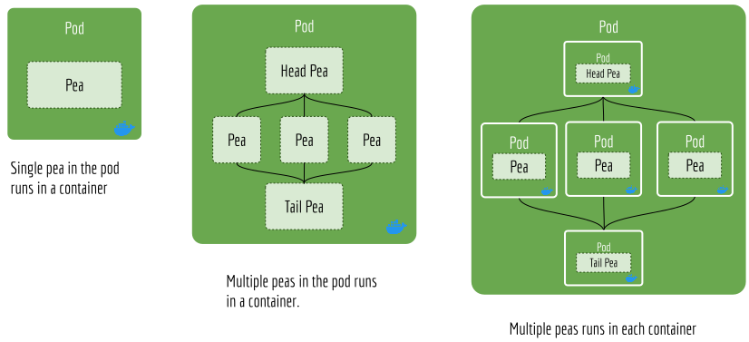

JEP 2 --- Supporting Docker Container in Flow API
=================================================

.. contents:: Table of Contents
   :depth: 3

:Author: Han Xiao (han.xiao@jina.ai)
:Created: Feb. 29, 2020
:Status: Draft
:Related JEPs:
:Created on Jina VCS version: ``@c66b4b9``
:Merged to Jina VCS version: TBA
:Released in Jina version: TBA
:Discussions: https://github.com/jina-ai/jina/issues/33

.. contents:: Table of Contents
   :depth: 2

Abstract
--------

We describe why and how we make :mod:`jina.flow` to support Docker container.

Motivation
----------

:mod:`jina.flow` serves as the primary interface for Jina's new users. It provides a set of friendly, easy-to-use API to organize a flow of microservices (aka, :class:`jina.peapods.pod.Pod`). It also provides basic orchestration abilities, such as start, scale up, flow pruning and terminate. This saves user quite some time as they would otherwise launch each :class:`jina.peapods.pod.Pod` and connect them manually.

In the current version, :class:`jina.flow.Flow` supports :func:`jina.flow.Flow.add` to allow user to define their own "graph" by specifying ``send_to``, ``recv_from``. The :class:`jina.flow.Flow` later uses :func:`jina.flow.Flow.build` method and connects all the ``Pod`` together. All sockets assignment are hidden from the user perspective.

One of the big limitations of the current :class:`jina.flow.Flow` is it does not support containerization, either partial or wholly. Imagine a user needs to run a :class:`jina.peapods.pod.Pod` in a container because of the complicated dependencies it relies on. The current :class:`jina.flow.Flow` can not do that. All :class:`jina.peapods.pod.Pod` are either run as a thread or process. This is in fact a common requirement as most of the DL/AI libraries do require specific versions of the DL package or complicated dependencies. Promoting the idea of "Model-as-Docker" and encouraging users to adapt to this idea not only solves the dependency issue, but also serves as preliminary education to our Jina Hub.

Rationale
---------

To add containerization feature to the :class:`jina.flow.Flow`, we first need to understand what are the common use cases.

- All pods run outside of the container locally;
    This is already supported in the current version
- All pods run outside of the container remotely;
    This should be supported but not tested. For the sake of security, this should not be encouraged.
- Some pods run outside of the container;
    This is a common use case, either locally or remotely.
- All pods run inside of **one** container;
    No clear usage. May need to design the API separately
- Each pod runs in its own container;
    This is a special case of "some pods run outside of the container".

As one can observe from the list, designing an API that allows Pods running locally or remotely, inside or outside the container is the key of this JEP. Imagine we add two new arguments when spawning each pod, ``host`` and ``image``. Note that these two arguments should not be added to the arguments of :class:`jina.peapods.pod.Pod` but to :func:`jina.flow.Flow.add`.

Can we support remote Pod in the Flow API?
^^^^^^^^^^^^^^^^^^^^^^^^^^^^^^^^^^^^^^^^^^

Let's first look at ``host`` argument. Supposedly,

.. confval:: host

    ``host`` describes the IP address that the added ``Pod`` will be running on, e.g. ``192.168.1.20``.

    :type: str

One immediate problem is that :class:`jina.flow.Flow` has no way to start this ``Pod`` remotely on ``192.168.1.20``. To achieve, all remote workers need to register themselves or keep a daemon in the background, waiting the "master" Flow sending a "spawning" signal to them so they can start. We have no intention to implement such mechanism right now. This is completely out of the scope of the Flow API and seems reinventing the orchestration layer of Kubernetes or Docker Swarm.

Assuming the Pod is started already on the ``host``, then writing ``host`` as an argument of :func:`jina.flow.Flow.add` can make it accessible to other Pods. This looks true at first, but look at the example below:

.. highlight:: python
.. code-block:: python

    f = (Flow().add(name='p1', host='192.168.0.2')
                .add(name='p2', host='192.168.0.3')
                .join(['p1', 'p2']))  # -> p3

In the example, `p3` is blocking the flow until `p1` and `p2` are all done. `p3` is on the "bind" side, `p1` and `p2` are on the "connect" side. Therefore, it is in fact `p3` who needs to expose its IP to `p1` and `p2` to make sure ``p1.host_out = p3.host`` and ``p2.host_out = p3.host``, not in the other way. Simply put, the ``host`` argument of `p1` and `p2` is useless in this case. Besides that, as `p1` and `p2` are already running in remote (manually), their ``host_out`` is not changeable by the Flow. This simple use case is not even possible if the Flow can not spawn Pod remotely.

So what can we support? If a remote pod is on the "bind" side, and the local pods are on the "connect" side, then this works fine. Though in this case we can simply use the existing ``host_in``, ``host_out``. For example,

.. highlight:: python
.. code-block:: python

    f = (Flow().add(name='p1')  # -> p1 running remotely on 192.168.0.2
                .add(name='p2', host_in='192.168.0.2')
        )

That is, in the current Flow API a remote pod must be "bind" on both input socket and output socket. Otherwise, its "connect" socket must be specified with an IP address that is manually given when spawning.

Note, it is difficult to guarantee a "bi-bind" Pod in an arbitrary flow. Depending on the topology, the input/output socket may switch the role between "bind" and "connect". Implementing heuristics to maximize the chance that a remote Pod enjoys  "bi-bind" may be possible, but is tedious and not very cost-effective.

As the conclusion, **we decide not to support remote Pod in this JEP.** All pods are limited to run locally.

Run pods in their own container
^^^^^^^^^^^^^^^^^^^^^^^^^^^^^^^

.. confval:: image

    ``image`` describes the docker image that a ``Pod`` will be running with, e.g. ``jina-encoder:nlp-bert:0.1``.

    :type: str

First, we may need a good naming convention for the image tag. This needs to be discussed separately.

Let's look at the following example:

.. highlight:: python
.. code-block:: python

    f = (Flow().add(name='p1', uses='./encode.yml', image='jina-encoder:cv-blah')  # -> p1 runs in the container
                .add(name='p2'))

All keyword arguments of `p1` now forward to ``jina-encoder:cv-blah``. So instead of running process/thread in

.. literalinclude:: flow.py
   :language: python
   :emphasize-lines: 410-413
   :linenos:
   :lines: 405-415

It should run the Pod via :command:`docker run -v jina-encoder:cv-blah --name p1 --yaml_path ./encode.yml`.

But how to handle multiple replicas?

Note a Pod can contain multiple Peas when ``--replicas > 1``. If a Pod is wrapped in a container, then that means all its Peas, including the head and tail are all running in the container.

This poses a problem. The head and tail of a Pod can be eliminated during the :func:`jina.flow.Flow.build`. The structure of a Pod is "broken" because of this. We can of course omit the heuristic of topology optimization when ``image`` and ``replicas`` are both set. But before that, let's first think what does it mean when a user specify ``replicas`` and ``image`` at the same time. Does it mean running one container but having ``replicas`` number of peas inside the container, or does it mean running ``replicas`` number of containers? The following figure illustrates the difference.

|

In the Docker documentation, ``replicas`` is defined as "the number of containers that should be running at any given time". We follow this definition and choose the last interpretation in the figure above. This should offer us more flexibility and consistency with Docker and Kubernetes API.

**Each container contains a ``Pea``, not a ``Pod``, therefore a ``Pea`` should provide a CLI with the some additional argument.**

.. confval:: replica_id

    A ``Pea`` is always unary, it has no replicas. ``replicas_id`` represent an integer index that its parent ``Pod`` assign to it. ``replica_id`` is defined on the ``Pea`` level.

.. confval:: image

    ``image`` is defined at the ``Pod`` level. It describes all non-head and non-tail peas should be running with. If it is specified, then the following code needs to behave differently:

    .. literalinclude:: pod.py
       :language: python
       :lines: 160-170
       :emphasize-lines: 164-169
       :linenos:

These lines should start Docker containers with args followed.

The ``Pod`` will inherit these CLI arguments.

New CLI argument
^^^^^^^^^^^^^^^^

..confval:: hostname

    Useful when the current Pea socket is ``BIND`` and other Peas ``CONNECT`` to it,

    - a remote IP address (72.214.121.283), remote
    - The DNS name (e.g. encoder-1), local/remote
    - 0.0.0.0, local
    - host.docker.internal, local

    :type: str

..confval:: remote

    To tell if the Pea is running remotely or locally

    :type: bool

.. confval:: image

    If set then the Pea is running inside the docker

    :type: str

Specification
-------------

If the ``socket_type`` is BIND, then it is always bind to ``tcp://0.0.0.0:port``. The key problem is to determine the ``host_in`` and ``host_out`` when the ``socket_type`` is CONNECT.

Logic when connecting, the Pea that opens a BIND socket is *Server*, and the Pea connects to it as *Client*:

+---------+--------+---------------------+-----------------------+----------------------+--------------------------------------+-------------------------------------------+
|         |        |                     |                       |                      | BIND                                 |                                           |
+---------+--------+---------------------+-----------------------+----------------------+--------------------------------------+-------------------------------------------+
|         |        |                     | Local                 |                      | Remote                               |                                           |
+---------+--------+---------------------+-----------------------+----------------------+--------------------------------------+-------------------------------------------+
|         |        |                     | Docker                | Host Thread/Process  | Docker                               | Host Thread/Process                       |
+---------+--------+---------------------+-----------------------+----------------------+--------------------------------------+-------------------------------------------+
| CONNECT | Local  | Docker              | host.docker.internal* | host.docker.internal | hostname_of_BIND                     | hostname_of_BIND                          |
+---------+--------+---------------------+-----------------------+----------------------+--------------------------------------+-------------------------------------------+
|         |        | Host Thread/Process | 0.0.0.0               | 0.0.0.0              | hostname_of_BIND                     | hostname_of_BIND                          |
+---------+--------+---------------------+-----------------------+----------------------+--------------------------------------+-------------------------------------------+
|         | Remote | Docker              | hostname_of_BIND      | hostname_of_BIND     | Same Remote? Then follow local-local | Different Remote?Then follow remote-local |
+---------+--------+---------------------+-----------------------+----------------------+--------------------------------------+-------------------------------------------+
|         |        | Host Thread/Process | hostname_of_BIND      | hostname_of_BIND     |                                      |                                           |
+---------+--------+---------------------+-----------------------+----------------------+--------------------------------------+-------------------------------------------+

A minimum Jina Docker Contianer
^^^^^^^^^^^^^^^^^^^^^^^^^^^^^^^

Specification
-------------

Backwards Compatibility
-----------------------
