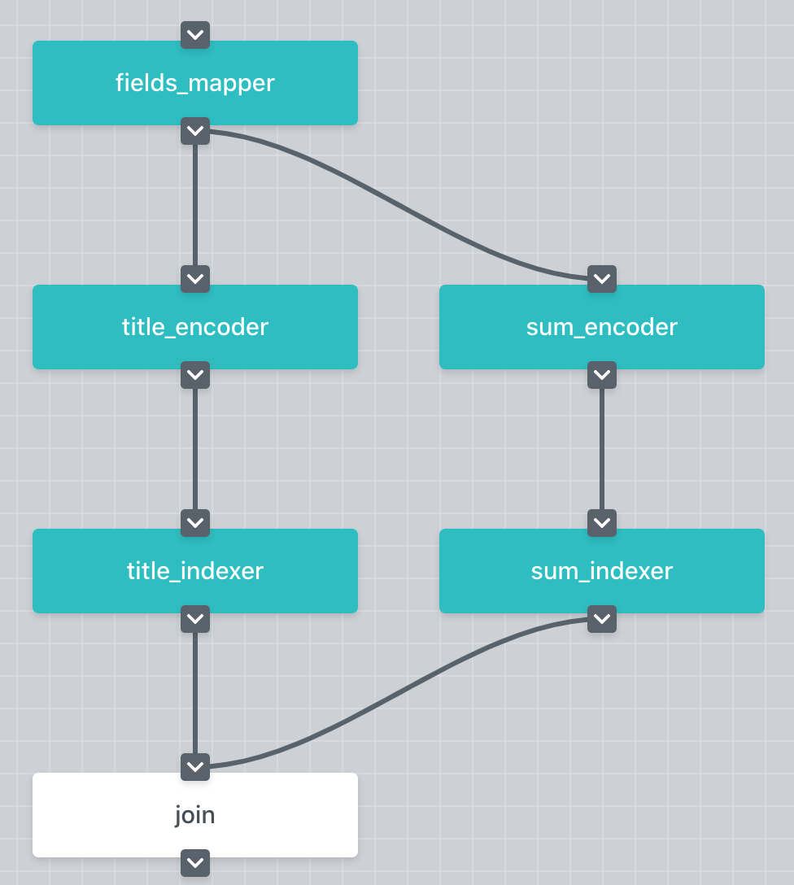

JEP 3 --- Adding support for multi-fields search
=================================================================

.. contents:: Table of Contents
   :depth: 3

:Author: Nan Wang (nan.wang@jina.ai)
:Created: May. 28, 2020
:Status: Proposal
:Related JEPs:
:Created on Jina VCS version: ``TBA``
:Merged to Jina VCS version: ``TBA``
:Released in Jina version: TBA
:Discussions: https://github.com/jina-ai/jina/issues/441

.. contents:: Table of Contents
   :depth: 2

Abstract
--------

We propose a way to implement the multi-field search in Jina.

Motivation
---------
The Multi-field search is commonly used in practice. Concretely,

.. highlights::
    as a user, I want to limit the query within some selected fields.

In the following use case, there are two documents and three two fields in each of them, i.e. `title` and `summary`.
The user wants to query ``painter`` but **only** from the `title` field. The expected result will be `{'doc_id': 11, 'title': 'hackers and painters'}`.

.. highlight:: json
.. code-block:: json

    {
      "doc_id": 10,
      "title": "the story of the art",
      "summary": "This is a book about the history of the art, and the stories of the great painters"
    }, {
      "doc_id": 11,
      "title": "hackers and painters",
      "summary": "This book discusses hacking, start-up companies, and many other technological issues"
    }

Rationale
---------
The core issue of this use case is the need of marking the ``Chunks`` from different fields.
During the query time,
the user should be able to change the selected fields in different queries **without rebuilding the query** ``Flow``.

Modify ``jina.proto``
^^^^^^^^^^^^^^^^^^^^^

Let's take the following ``Flow`` as an example.
The ``FieldsMapper`` is a ``Crafter`` that split each ``Document`` into fields and add the  ``field_name`` information for ``Chunks``.
Afterwards, the ``Chunks`` containing the `title` and the `summary` information are processed differently in two pathways and stored seperately.

To add the field information into ``Chunks``, we need first add new fields in the protobuf defination.
At the ``Chunk`` level, one new field, namely ``field_name``, is required to denote the field information of the ``Chunk``.
Each ``Document`` have one or more fields, and each field can be further splitted into one or more ``Chunks``.
In other words, each ``Chunk`` can **only** be assigned to one field, but each field contains one or more ``Chunks``.

.. highlights::
    The concept of `field` can be considered as a group of ``Chunks``.

Secondly, at the ``Request`` level, we will add another new field, namely ``filter_by``, for the ``SearchRequest``.
This is used to store the information of on which fields the user wants to query.
By adding this information, the users can specify different fields to query in each search request.

Adapt Index-Flow Pods
^^^^^^^^^^^^^^^^^^^^^
During index time, most parts of the ``Flow`` stay the same as before.

To make the ``Encoder`` only encode the ``Chunks`` whose ``field_name`` meet the selected fields, a new argument, ``filter_by``, is introduced to specify which fields will be encoded.
To do so, we need adapt ``EncodeDriver`` and the ``extract_docs()``.

.. highlight:: python
.. code-block:: python

    def extract_docs(
            docs: Iterable['jina_pb2.Document'],
            filter_by: Union[str, Tuple[str], List[str]],
            embedding: bool) -> Tuple:
        """
        :param filter_by: a list of service names to wait
        """

.. highlight:: python
.. code-block:: python

    class EncodeDriver(BaseEncodeDriver):
        def __init__(self, filter_by: Union[str, List[str], Tuple[str]] = None, *args, **kwargs)
            super().__init__(*args, **kwargs)
            self.filter_by = filter_by

        def __call__(self, *args, **kwargs):
            filter_by = self.filter_by
            if self._request.__class__.__name__ == 'SearchRequest':
                filter_by = self.req.filter_by
            contents, chunk_pts, no_chunk_docs, bad_chunk_ids = \
                extract_docs(self.req.docs, self.filter_by, embedding=False)

In order to make the ``Indexer`` only index the ``Chunks`` whose ``field_name`` meet the selected fields, we need to adapt the ``VectorIndexDriver`` as well.

.. highlight:: python
.. code-block:: python

    class VectorIndexDriver(BaseIndexDriver):
        def __init__(self, filter_by: Union[str, List[str], Tuple[str]] = None, *args, **kwargs):
            super().__init__(*args, **kwargs)
            self.filter_by = filter_by

        def __call__(self, *args, **kwargs):
            embed_vecs, chunk_pts, no_chunk_docs, bad_chunk_ids = \
                extract_docs(self.req.docs, self.filter_by, embedding=True)

The same change goes for the ``ChunkKVIndexDriver``.

.. highlight:: python
.. code-block:: python

    class ChunkKVIndexDriver(KVIndexDriver):
        def __init__(self,
                     level: str = 'chunk', filter_by: Union[str, List[str], Tuple[str]] = None, *args, **kwargs):
            super().__init__(level, *args, **kwargs)
            self.filter_by = filter_by if self.filter_by else []

        def __call__(self, *args, **kwargs):
            from google.protobuf.json_format import MessageToJson
            content = {
                f'c{c.chunk_id}': MessageToJson(c)
                for d in self.req.docs for c in d.chunks
                if len(self.filter_by) > 0 and c.field_name in self.filter_by}
            if content:
                self.exec_fn(content)

Adapt Query-Flow Pods
^^^^^^^^^^^^^^^^^^^^^

During the query time,
Moreover, we need to refactor the ``BasePea`` so that the ``Pea`` gets the information of how many incoming messages are expected.
The expected number of incoming messages will change from query to query because the user will select different fields with the ``filter_by`` argument.
In the current version (v.0.1.15), this information is fixed and stored in ``self.args.num_parts`` when the graph is built.
And the ``Pea`` will **NOT** start processing the data until the expected number of incoming messages arrive.
In order to make the ``Pea`` handle the varying number of incoming messages, we need to make the expected number adjustable on the fly for each query.
Note that the ``self.args.num_parts`` is the upper bound of the expected number of incoming messages.
Thereafter, it is reasonable to set the expected number of incoming messages as following,

.. highlight:: python
.. code-block:: python

        num_part = self.args.num_part
        if self.request_type == 'SearchRequest':
            # modify the num_part on the fly for SearchRequest
            num_part = min(self.args.num_part, max(len(self.request.filtered_by), 1))

Furthermore, the ``VectorSearchDriver`` and the ``KVSearchDriver`` also need to be adapted accordingly in order to **only** process the ``Chunks`` meet the ``filter_by`` requirement.

.. highlight:: python
.. code-block:: python

    class VectorSearchDriver(BaseSearchDriver):
        def __call__(self, *args, **kwargs):
            embed_vecs, chunk_pts, no_chunk_docs, bad_chunk_ids = \
                extract_docs(self.req.docs, self.req.filter_by, embedding=True)
            ...

.. highlight:: python
.. code-block:: python

    class KVSearchDriver(BaseSearchDriver):
        def __call__(self, *args, **kwargs):
            ...
            elif self.level == 'chunk':
                for d in self.req.docs:
                    for c in d.chunks:
                        if c.field_name not in self.req.filter_by:
                            continue
                        ...
            elif self.level == 'all':
                for d in self.req.docs:
                    self._update_topk_docs(d)
                    for c in d.chunks:
                        if c.field_name not in self.req.filter_by:
                            continue
                        ...
            ...

Specification
-------------

For the use case above, the `index.yml` will be defined as following,

.. highlight:: yaml
.. code-block:: yaml

    !Flow
    pods:
      fields_mapper:
        uses: mapper.yml
      title_encoder:
        uses: title_encoder.yml
        needs: fields_mapper
      sum_encoder:
        uses: sum_encoder.yml
        needs: fields_mapper
      title_indexer:
        uses: title_indexer.yml
        needs: title_encoder
      sum_indexer:
        uses: sum_indexer.yml
        needs: sum_encoder
      join:
        needs:
          - title_indexer
          - sum_indexer

And the `mapper.yml` will be defined as below,

.. highlight:: yaml
.. code-block:: yaml

    !FilterMapper
    requests:
      on:
        [SearchRequest, IndexRequest]:
          - !MapperDriver
            with:
              method: craft
              mapping: {'title': 'title', 'summary': 'summ'}

The `sum_encoder.yml` is as below,

.. highlight:: yaml
.. code-block:: yaml

    !AnotherTextEncoder
    requests:
      on:
        [SearchRequest, IndexRequest]:
          - !EncodeDriver
            with:
              method: encode
              filter_by: summ

The `sum_indexer.yml` is as below,

.. highlight:: yaml
.. code-block:: yaml

    !ChunkIndexer
    components:
      - !NumpyIndexer
        with:
          index_filename: vec.gz
      - !BasePbIndexer
        with:
          index_filename: chunk.gz
    requests:
      on:
        IndexRequest:
          - !VectorIndexDriver
            with:
              executor: NumpyIndexer
              filter_by: summ
          - !PruneDriver {}
          - !KVIndexDriver
            with:
              executor: BasePbIndexer
              filter_by: summ
        SearchRequest:
          - !VectorSearchDriver
            with:
              executor: NumpyIndexer
              filter_by: summ
          - !PruneDriver {}
          - !KVSearchDriver
            with:
              executor: BasePbIndexer
              filter_by: summ

To send the request, one can specify the `filter_by` argument as below,

.. highlight:: python
.. code-block:: python

        with flow.build() as fl:
            fl.search(read_data_fn, callback=call_back_fn, filter_by=['title',])

Open Issues
-----------

This use case can be further extened to the multi-modality search by extending the ``filter_by`` to accepting the ``mimitype``.