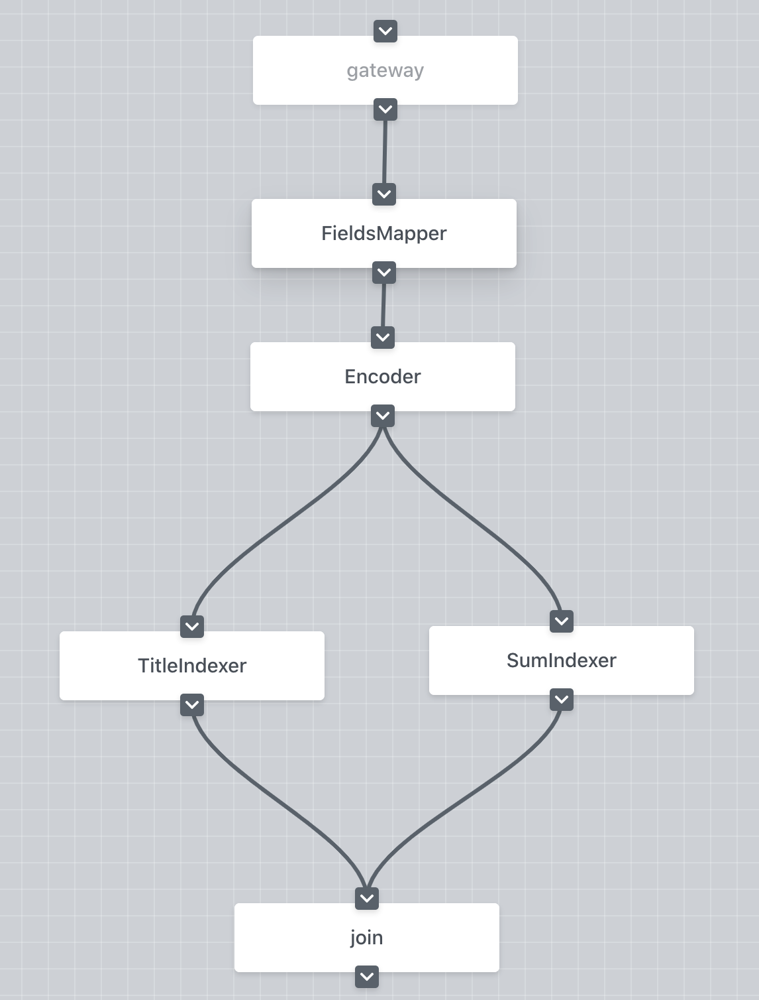

JEP 3 --- Adding support for multi-fields search
=================================================================

.. contents:: Table of Contents
   :depth: 3

:Author: Nan Wang (nan.wang@jina.ai)
:Created: May. 28, 2020
:Status: Proposal
:Related JEPs:
:Created on Jina VCS version: ``TBA``
:Merged to Jina VCS version: ``TBA``
:Released in Jina version: TBA
:Discussions: https://github.com/jina-ai/jina/issues/441

.. contents:: Table of Contents
   :depth: 2

Abstract
--------

[A short (~200 word) description of the technical issue being addressed.]

Motivation
---------
Multi-field search is commonly used in practice.
Concretely, the use case is to limit the query within some fields that the user has selected.
In the following case, there are two documents and three two fields in each of them, i.e. ``title`` and ``summary``.
The user wants to query ``painter`` but only from the ``title`` field, and the expected result is ``doc_id: 11``.

.. highlight:: json
.. code-block:: json

    {
      "doc_id": 10,
      "title": "the story of the art",
      "summary": "This is a book about the history of the art, and the stories of the great painters"
    }, {
      "doc_id": 11,
      "title": "hackers and painters",
      "summary": "This book discusses hacking, start-up companies, and many other technological issues"
    }

Rationale
---------
The core issue of this use case is the need of marking the ``Chunks`` from different fields.
During the query time,
the user should be able to change the selected fields in different queries without rebuilding the query ``Flow``.

We need first add new fields in the protobuf defination. At the ``Chunk`` level, one new field, namely ``field_name``, is required to denote the field information of the ``Chunk``. Each ``Document`` have one or more fields, each field can be further splitted into one or more ``Chunks``. In other words, each ``Chunk`` can only be assigned to one field, and each field contains one or more ``Chunks``.

Secondly, at the ``Request`` level, we will add another new field, namely ``filter_by``, for the ``SearchRequest`` so that the users can specify different fields in each request.

Let's take the following ``Flow`` as an example, `FieldsMapper` is a ``Crafter`` that split each ``Document`` into fields and add the  ``field_name`` information for ``Chunks``.

Flow
^^^^

.. image:: JEP3-index-design.png
   :align: center
   :width: 60%

During the query time, the ``EncodeDriver`` will extract only the ``Chunks`` that meet the ``filter_by`` requirement.
This requires the refactoring of the ``EncodeDriver``. The change will mainly taken place in the ``extract_chunks`` function, as below.

.. highlight:: python
.. code-block:: python

    def extract_chunks(
            docs: Iterable['jina_pb2.Document'],
            filter_by: Union[str, Tuple[str], List[str]],
            embedding: bool) -> Tuple:
        """
        :param filter_by: a list of service names to wait
        """

.. highlight:: python
.. code-block:: python

    class EncodeDriver(BaseEncodeDriver):
        """Extract the chunk-level content from documents and call executor and do encoding
        """

        def __call__(self, *args, **kwargs):
            contents, chunk_pts, no_chunk_docs, bad_chunk_ids = \
                extract_chunks(self.req.docs, self.req.filter_by, embedding=False)

Plus, we need refactoring the ``BasePea`` so that the information of the services to wait is stored. This information is required when the ``Pea`` handle the input requests.
In the query time, the ``Pea`` needs to combine this information together with the ``filter_by`` information from the request to eventually decides which requests to wait.
In the current version (v.0.1.14), the information of the services to wait is only stored at the ``Pod`` level for the purpose of building the graph when the ``Pod`` is used together with the ``Flow`` api.
To make this information available at the ``Pea`` level, we need add ``--needs`` as a new argument in the ``set_pea_parser`` and adapt the ``handle()`` function accordingly.
So that the ``Pea`` only wait for the services that selected by the ``filter_by``.
If the ``filter_by`` is not given, the ``Pea`` will wait for all the services defined during the initialization.

.. highlight:: python
.. code-block:: python

    def set_pea_parser(parser=None):
        gp5 = add_arg_group(parser, 'pea messaging arguments')
        gp5.add_argument('--needs', type=str, action='append', default=None)

In another example, we want to share the same ``Encoder`` but index the ``Chunks`` from different fields in seperated indices. The diagram is as below.

In the index time, we need adapt the ``VectorIndexDriver`` to the ``extract_chunks`` function. So that the ``VectorIndexDriver`` only keep the ``Chunks`` from the fields specified by ``filter_by`` argument.
The same logic goes for the ``ChunkKVIndexDriver``.

.. highlight:: python
.. code-block:: python

    class VectorIndexDriver(BaseIndexDriver):
        def __init__(self, filter_by: Union[str, List[str], Tuple[str]] = None, *args, **kwargs):
            super().__init__(*args, **kwargs)
            self.filter_by = filter_by

        def __call__(self, *args, **kwargs):
            embed_vecs, chunk_pts, no_chunk_docs, bad_chunk_ids = \
                extract_chunks(self.req.docs, self.filter_by, embedding=True)

.. highlight:: python
.. code-block:: python

    class ChunkKVIndexDriver(KVIndexDriver):
        def __init__(self,
                     level: str = 'chunk', filter_by: Union[str, List[str], Tuple[str]] = None, *args, **kwargs):
            super().__init__(level, *args, **kwargs)
            self.filter_by = filter_by if self.filter_by else []

        def __call__(self, *args, **kwargs):
            from google.protobuf.json_format import MessageToJson
            content = {
                f'c{c.chunk_id}': MessageToJson(c)
                for d in self.req.docs for c in d.chunks
                if len(self.filter_by) > 0 and c.field_name in self.filter_by}
            if content:
                self.exec_fn(content)

In the query time, the ``VectorSearchDriver`` and the ``KVSearchDriver`` also need to be adapted accordingly in order to only process the ``Chunks`` meet ``filter_by``.

.. highlight:: python
.. code-block:: python

    class VectorSearchDriver(BaseSearchDriver):
        def __call__(self, *args, **kwargs):
            embed_vecs, chunk_pts, no_chunk_docs, bad_chunk_ids = \
                extract_chunks(self.req.docs, self.req.filter_by, embedding=True)

.. highlight:: python
.. code-block:: python

    class KVSearchDriver(BaseSearchDriver):
        def __call__(self, *args, **kwargs):
            if self.level == 'doc':
                for d in self.req.docs:
                    self._update_topk_docs(d)
            elif self.level == 'chunk':
                for d in self.req.docs:
                    for c in d.chunks:
                        if c.field_name not in self.req.filter_by:
                            continue
                        self._update_topk_chunks(c)
            elif self.level == 'all':
                for d in self.req.docs:
                    self._update_topk_docs(d)
                    for c in d.chunks:
                        if c.field_name not in self.req.filter_by:
                            continue
                        self._update_topk_chunks(c)
            else:
                raise TypeError(f'level={self.level} is not supported, must choose from "chunk" or "doc" ')

Specification
-------------

The selected multiple fields will be given in the query by ``field_name`` as following.

.. highlight:: json
.. code-block:: json

    {
        "data": "painter",
        "top_k": 10,
        "mime_type": "application/text"
        "fields_name": ["title"],
    }

Backwards Compatibility
-----------------------

[Describe potential impact and severity on pre-existing code.]

Reference Implementation
------------------------

[Link to any existing implementation and details about its state, e.g. proof-of-concept.]

Open Issues
-----------

This use case can be further extened to the multi-modality search by extending the ``filter_by`` to accepting the ``mimitype``.

References
----------

[A collection of URLs used as references through the JEP.]