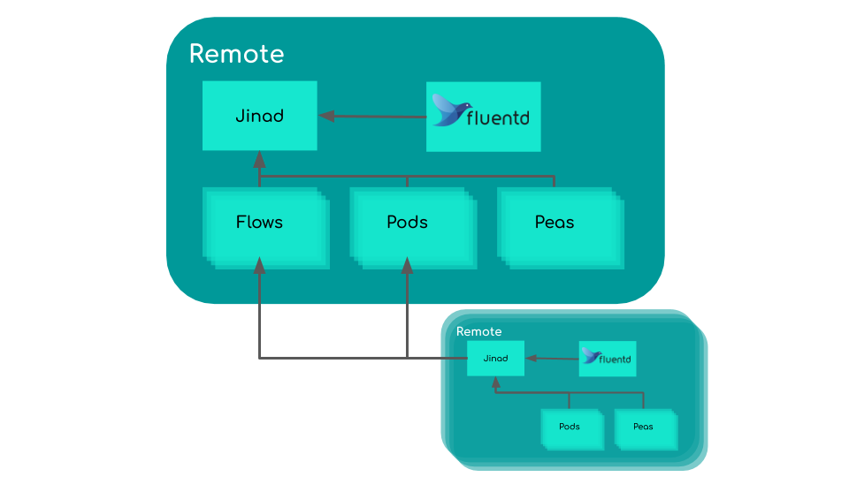

# Jina Daemon

`jinad`, aka `Jina Daemon`, is a persistent process for deploying and managing Jina Flow, Pods, and Peas in a distributed system. 

## Terminologies

- *Workflow*: a set of connected pods for accomplishing certain task, e.g. indexing, searching, extracting.
- *Flow API*: a pythonic way for users to construct workflows in Jina with clean, readable idioms. 
- *Remote*, *remote instance*, *remote machine*: the place where you want to run the pod, the place offers better computational capability or larger storage. For example, one may want to run an encode pod on the remote GPU instance.  
- *Local*, *local instance*, *local machine*: the place of your entrypoint and the rest parts of your workflow.

## Design

`jinad` is designed to maintain bookkeeping for the running Flows, Pods and Peas on the remote machines. `jinad` can also spawn Pods and Peas to other remote machines that have `jinad` running. [`fluentd`](https://github.com/fluent/fluentd) is used to collect logs from different Processes and ensure the logs belonging to the same Flow are stored consistently. 



## Installation

### Using Docker Images (Recommended)

The simplest way to use `jinad` is via Docker. There is no need to worry about fluent installation. You only need to have [Docker installed](https://docs.docker.com/install/) first. 

In the command below, we use the tag `latest-daemon` which uses the latest release version of `jinad`. Of course, you can switch to other versions, and you can find all the available versions at [hub.docker.com](https://hub.docker.com/repository/docker/jinaai/jina/tags?page=1&ordering=last_updated&name=daemon). You can found more information about the versioning at [github.com/jina-ai/jina](https://github.com/jina-ai/jina/blob/master/RELEASE.md).

```bash
docker pull jinaai/jina:latest-daemon
```

### Using PyPi package

> Notes: As one part of the jina package, `jinad` follows the same [installation instructions of jina](https://docs.jina.ai/chapters/install/via-pip.html) and you only need to cherry pick `[daemon]`

On Linux/Mac, simply run:

```bash
pip install "jina[daemon]"
```

### Install from the Master Branch

If you want to keep track of the master branch of our development repository:

```bash
pip install "git+https://github.com/jina-ai/jina.git#egg=jina[daemon]"
```

### Install from Your Local Fork/Clone

If you are a developer and want to test your changes on-the-fly: 

```bash
git clone https://github.com/jina-ai/jina
cd jina && pip install -e ".[daemon]"
``` 

## Usage 

### Prerequisites
Run `jinad` on the remote machine. We assume the remote is in the intranet and its IP address is `12.34.56.78`. By default, `jinad` will use the port `8000` for receiving requests. Make sure `8000` port is publicly accessible.

After having `jinad` running on the remote, you can open the browser the visit `http://3.16.166.3:8000/alive` to check whether `jinad` is properly set up. If everythong works well, you will see the following response.

```json
{"status_code":200,"jina_version":"0.9.12"}
```

#### Using Docker Container

We start a Docker container under the `host` mode so that it will connect all the ports to the host machine. `-d` option is to keep the container running in the background

```bash
docker run -d --network host jinaai/jina:latest-daemon
```

#### Using Native Python

```bash
jinad
```

### Creating a Remote Pod from Console
In the simplest case, you may want to create a Pod on the remote. The most naive way is to log into the remote machine and start a pod using `jina` CLI [link to run-remote-pod-console](). To avoid logging into the remote machine every time, we can use `jinad` to do the same thing. Furthermore, `jinad` offers a session management for the running Pods on the remote and saves you from manually creating and deleting Pods.

Here we start a simple Pod with the default configuration `_logforward`. The Pod forwards received messages and print the messages out in the logs. On the local, you can run the following command to start a remote pod.

```bash
jina pod --uses _logforward --host 3.16.166.3 --port-expose 8000
```

```text
▶️  /Users/nanwang/.pyenv/versions/3.7.5/bin/jina pod --uses _logforward --host 3.16.166.3 --port-expose 8000
...
   JinadRuntime@68880[S]:created remote pod with id dcb5046e-554a-11eb-86b2-0ab9db700358
        BasePea@68861[S]:ready and listening
   JinadRuntime@68880[I]:🌏 Fetching streamed logs from remote id: dcb5046e-554a-11eb-86b2-0ab9db700358
   🌏 ZEDRuntime@68880[I]:input tcp://0.0.0.0:55223 (PULL_BIND) output tcp://0.0.0.0:55535 (PUSH_BIND) control over tcp://0.0.0.0:49993 (PAIR_BIND)
      🌏 BasePea@68880[I]:ready and listening
```

> Note: The logs starting with 🌏 are fetched from the remote Pod. Now we have already the Pod running remotely and we can check the connectivity.

```bash
jina ping 3.16.166.3 49993
```

```text
▶️  /Users/nanwang/.pyenv/versions/3.7.5/bin/jina ping 3.16.166.3 49993
...
           JINA@69179[I]:ping tcp://3.16.166.3:49993 at 2 round...
           JINA@69179[I]:ping tcp://3.16.166.3:49993 at 2 round takes 1 second (1.23s)
           JINA@69179[S]:avg. latency: 1343 ms
```

### Creating a Remote Pod via Flow API 
A more common usage is to have a Flow running locally with some pods on the remote. In the following codes, we create a Flow on the locale with two Pods. One of the Pods is set to be running on the remote. After building the Flow, we send one index request with two Documents to it.

```python
from jina import Flow
f = (Flow()
     .add(uses='_logforward')
     .add(uses='_logforward', host='3.16.166.3', port_expose=8000))
with f:
    f.index_lines(lines=['hello', 'jina'])
```

As shown in the logs below, `pod1` is running on the remote while `gateway` and `pod0` are running locally. `jinad` manages the creating and deleting of the `pod1` on the remote. 

```text
pod0/ZEDRuntime@69694[I]:input tcp://0.0.0.0:51317 (PULL_BIND) output tcp://3.16.166.3:51321 (PUSH_CONNECT) control over tcp://0.0.0.0:51316 (PAIR_BIND)
...
           pod0@69676[S]:ready and listening
...
         🌏 pod1@69696[I]:ready and listening
           Flow@69676[S]:🎉 Flow is ready to use, accepting gRPC request
           Flow@69676[I]:
	🖥️ Local access:	tcp://0.0.0.0:51327
	🔒 Private network:	tcp://192.168.1.9:51327
	🌐 Public address:	tcp://203.184.132.69:51327
         Client@69676[S]:connected to the gateway at 0.0.0.0:51327!
...
        gateway@69697[I]:send: 1 recv: 0 pending: 1
pod0/ZEDRuntime@69694[I]:recv IndexRequest  from gateway▸pod0/ZEDRuntime▸⚐
pod0/ZEDRuntime@69694[I]:#sent: 0 #recv: 1 sent_size: 0 Bytes recv_size: 423 Bytes
🌏 pod1/ZEDRuntime@69696[I]:recv IndexRequest  from gateway▸pod0/ZEDRuntime▸pod1/ZEDRuntime▸⚐
🌏 pod1/ZEDRuntime@69696[I]:#sent: 0 #recv: 1 sent_size: 0 Bytes recv_size: 508 Bytes
...
	✅ done in ⏱ 2 seconds 🐎 47.9/s
        gateway@69676[S]:terminated
...
           pod1@69676[S]:terminated
...
           pod0@69676[S]:terminated
...
```

### Creating a Remote Flow
One common use case in production is running the whole Flow on the remote with pods distributed on different machines. In this case, the very first thing is to ensure all the remote machines have `jinad` running properly. We will see how to create a remote Flow from the local machine.

#### 1. Create a Flow 
As `jinad` hosts a service on the remote, we can use the `jinad` API `/flow/yaml` to create a Flow via uploading a Flow configuration yaml file. Please refere to the full  [API specifications](https://api.jina.ai/daemon/) for more details.

```python
import requests

def create_flow(flow_url, yamlspec):
    flow_creation_api = f'{flow_url}/flow/yaml/'
    with open(yamlspec, 'rb') as f:
        files = [('yamlspec', f)]
        try:
            r = requests.put(url=flow_creation_api, files=files, timeout=10)
            if r.status_code == requests.codes.ok:
                return r.json()['flow_id']
            else:
                print('Remote Flow creation failed')
        except requests.exceptions.RequestException as ex:
            print(f'Exception raised: {ex!r}')

if __name__ == '__main__':
    host_ip = '3.16.166.3'
    jinad_port = '8000'
    flow_api = f'http://{host_ip}:{jinad_port}'
    flow_id = create_flow(flow_api, 'dummy_flow.yml')
    if not flow_id:
        print('failed to create a remote flow')
        return
    print(f'flow is created: {flow_id}')
```

We use a dummy Flow configuration `dummy_flow.yml` as below for demo purpose.

```yaml
!Flow
version: 1
pods:
  - name: pod0
    method: add
    uses: _logforward
  - name: pod1
    method: add
    uses: _logforward
```

After running the above codes, we print out the flow id and please write down this flow id for the next step. 

```text
flow is created: cdd53e16-5575-11eb-86b2-0ab9db700358
```

#### 2. Check Flow StatusFlow 
Before using the Flow we created, we need to get detail information about the Flow so that we can send queries to the Flow. To get the information of the Flow, we can use the following codes to retrieve the information from `/flow/cdd53e16-5575-11eb-86b2-0ab9db700358`

```python
import requests

def get_flow_info(flow_url, flow_id):
    flow_info_api = f'{flow_url}/flow/{flow_id}'
    try:
        r = requests.get(url=flow_info_api)
        if r.status_code == requests.codes.ok:
            return str(r.json()["port"])
        else:
            print('Remote Flow info retrieval failed')
    except requests.exceptions.RequestException as ex:
        print(f'Exception raised: {ex!r}')

def main():
    host_ip = '3.16.166.3'
    jinad_port = '8000'
    flow_api = f'http://{host_ip}:{jinad_port}'
    flow_id = 'cdd53e16-5575-11eb-86b2-0ab9db700358'
    flow_port = get_flow_info(flow_api, flow_id)
    print(f'Flow serves at {host_ip}:{flow_port}')
``` 

#### 3. Run Index/Query via client 
With the host and port information of the remote Flow, we can use the gRPC client of jina to send index or query requests.

```python
from jina.parsers import set_client_cli_parser
from jina.clients import Client
from jina import Document

def send_index_request(host, port):
    print(f'index request sent to {host}:{port}')
    args = set_client_cli_parser().parse_args(
        ['--host', host, '--port-expose', str(port)])
    grpc_client = Client(args)
    grpc_client.index(
        [Document(text='hello, jina'), ], on_done=print)

def main():
    host_ip = '3.16.166.3'
    flow_port = '51871'
    send_index_request(host_ip, flow_port)
``` 

#### 4. Close Flow
After getting all the work done, we close the Flow by sending a `DELETE` request to the `/flow` API.

```python
import requests

def delete_flow(flow_api, flow_id):
    flow_deletion_api = f'{flow_api}/flow?flow_id={flow_id}'
    try:
        r = requests.delete(url=flow_deletion_api)
        if r.status_code == requests.codes.ok:
            print('Remote Flow deletion succeeded')
        else:
            print('Remote Flow deletion failed')
    except requests.exceptions.RequestException as ex:
        print(f'Exception raised: {ex!r}')


def main():
    host_ip = '3.16.166.3'
    jinad_port = '8000'
    flow_id = 'cdd53e16-5575-11eb-86b2-0ab9db700358'
    flow_api = f'http://{host_ip}:{jinad_port}'
    delete_flow(flow_api, flow_id)
```