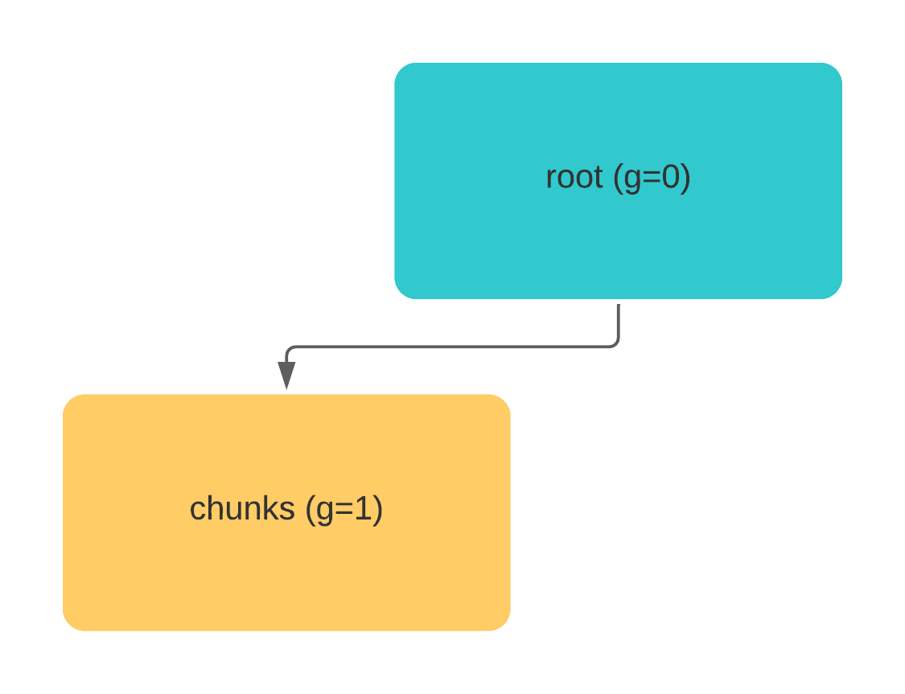

# Understand Jina Recursive Document Representation

In Jina, each `Document` is represented as a recursive representation (tree).

A rooted recursive representation has a root node and every node has X childrens.
In Jina, the root node is the document itself, while the *left* & *right* children are referred as *chunks* and *matches* respectivaly.


The above image illustrates a most simple document structure: A document (root node) consist of two child nodes, *chunks* and *matches*.
We'll dive into these concepts in this document:

- [Chunks in Jina](#chunks-in-jina)
- [Matches in Jina](#matches-in-jina)
- [Recursive structure and Traversal](#recursive-structure-and-traversal)
---

## Chunks in Jina

Each Jina `Document` consist a list of `Chunk`s. A `Chunk` is a small semantic unit of a `Document`, like a sentence or a 64x64 pixel image patch.
Most of the algorithms in Jina works on the `Chunk` level.

Think about these use cases: you wanna search a document at a specific `granularity` level, e.g. a sentence or a paragraph. Or your query consist of mutiple modalities, such as you wanna query an image with a piece of text and another image. `Chunk` makes it feasible!

In Jina [primitive data types](https://hanxiao.io/2020/11/22/Primitive-Data-Types-in-Neural-Search-System/), `Chunk` is defined as a `property` of `Document`:

```python
from jina import Document

with Document() as root:
    root.text = 'What is love? Oh baby do not hurt me.'
# Initialised a document as root with 0 chunks.
print(len(root.chunks))
>>> 0
# Initialise a document and add as a chunk to root.
with Document() as chunk1:
    chunk1.text = 'What is love?'
    root.chunks.add(chunk1)
with Document() as chunk1:
    chunk1.text = 'Oh baby do not hurt me.'
    root.chunks.add(chunk1)
# Now the document has 2 chunks
print(len(root.chunks))
>>> 2
```

What happened by adding `chunk` to `root`?

```python
print(root.granularity)
>>> 0
print(root.chunks[0].granularity)
>>> 1
root.id == root.chunks[0].parent_id
>>> True
```

Two important things happened when adding the `chunk` to `root`:
1. The granularity of the chunk has been increased by 1 (default 0).
2. The `chunk` has been referenced to it's parent: `root`.

This can be seen in the image blow:




