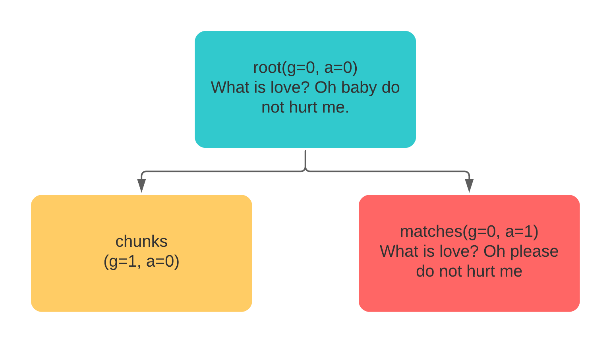
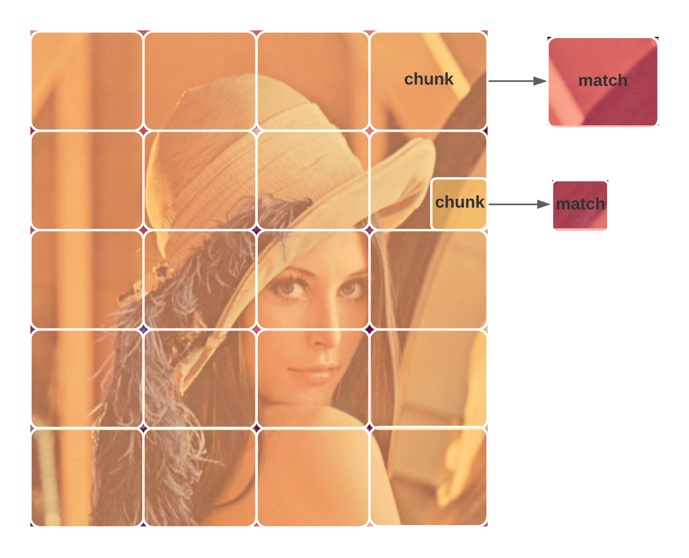
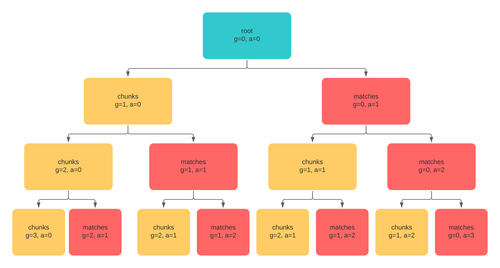

# Understand Jina Recursive Document Representation

In Jina, each `Document` is represented as a recursive representation (tree).

A rooted recursive representation has a root node and every node has X childrens.
In Jina, the root node is the document itself, while the *left* & *right* children are referred as *chunks* and *matches* respectivaly.


The above image illustrates a minimal document structure: A document (root node) consist of two child nodes: *chunks* and *matches*.
`chunks`s are a sequence of `Document`s which is attached to the root document with a higher `granularity` degree. `Matches` is a sequence of `Document`s  which are semantically related to the root document.
We'll dive into these concepts in this document:

- [Chunks](#chunks)
- [Matches](#matches)
- [Let's go deeper: Recursive Document Representation](#lets-go-deeper-recursive-document-representation)
- [Document Traversal with traversal paths](#document-traversal-with-traversal-paths)


## Chunks

Each Jina `Document` consist a list of `Chunk`s. A `Chunk` is a small semantic unit of a `Document`, like a sentence or a 64x64 pixel image patch.
Most of the algorithms in Jina works on the `Chunk` level.

Think about these use cases: you wanna search a document at a specific `granularity` level, e.g. a sentence or a paragraph. Or your query consist of mutiple modalities, such as your query consist of a piece of text together and an image. `Chunk` makes it feasible!

In Jina [primitive data types](https://hanxiao.io/2020/11/22/Primitive-Data-Types-in-Neural-Search-System/), `Chunk` is defined as a `property` of `Document`:

```python
from jina import Document

with Document() as root:
    root.text = 'What is love? Oh baby do not hurt me.'
# Initialised a document as root with 0 chunks.
print(len(root.chunks))
>>> 0
# Initialise two documents and add as chunks to root.
with Document() as chunk1:
    chunk1.text = 'What is love?'
    root.chunks.add(chunk1)
with Document() as chunk2:
    chunk1.text = 'Oh baby do not hurt me.'
    root.chunks.add(chunk2)
# Now the document has 2 chunks
print(len(root.chunks))
>>> 2
```

What happened by adding `chunk` to `root`?

```python
print(root.granularity)
>>> 0
print(root.chunks[0].granularity)
>>> 1
root.id == root.chunks[0].parent_id
>>> True
```

This can be seen in the image blow:


The above code sample & graph demonstrates the basic idea of a `Chunk` in a `Document`.
At the beginning, we initialised a `Document` with `granularity=0` (by default).
We then initialised two chunks and add them to the `root` document.
Two things happened when adding the `chunk` to `root`:

1. The granularity of the chunk has been increased by 1 (default 0).
2. The `chunk` has been referenced to it's parent: `root`.

This allows Jina (and you) to query chunks and reference back to it's root document at any `granularity` level.

## Matches

In a neural search system (and traditional retrieval system), matches are the expected documents returned from the system given the user query.
In Jina, `Matches` could happens at `root` level or any `chunk` level.

In order to fully understand the concept of `Matches`, we introduce a new term, named `adjacency` (short for `a` in the diagram), reflects the level of the document it is connected to.

**NOTE: granularity and adjacency applys to both chunks and matches.**

```python
from jina import Document

with Document() as root:
    root.text = 'What is love? Oh baby do not hurt me.'
print(root.adjacency)
>>> 0
# Initialise two documents and add as chunks to root.
with Document() as chunk1:
    chunk1.text = 'What is love?'
    root.chunks.add(chunk1)
with Document() as chunk2:
    chunk1.text = 'Oh baby do not hurt me.'
    root.chunks.add(chunk2)
# Add a match document.
with Document() as match:
    # a match document semantically related to our root
    match.text = 'What is love? Oh please do not hurt me.'
    root.matches.add(match)
print(len(root.matches))
>>> 1
print(root.matches[0].granularity)
>>> 0
print(root.matches[0].adjacency)
>>> 1

```



In the code snippet and diagram above, we initialised a `Document` as `root` with the text: *What is love? Oh baby do not hurt me.*.
And a `Document` with text *What is love? Oh please do not hurt me.* was added as a match to the `root`.
The matched document `match` is a document without any parents, so it stays at the same level as `root` with a granularity value of 0.
Meanwhile, since `match` is the retrieved result from `root`, so the `adjanjency` increased to 1.

By default, the `root` node has an `adjacency` of 0, and the value increase by 1 when it hit a `match`.

## Let's go deeper: Recursive Document Representation

Till now, we've introduced `chunks` and `matches` **with a depth of 1**.
While in a real-world scenario, things could be much more complicated than this: A `Chunk` could be further divided into small chunks, and a chunk at any level might have it's own `matches` at that level.


Jina has defined a recursive structure with **arbitrary width and depth** instead of a trivial bi-level structure.
Roughly speaking, `chunks` can have the next level chunks and the same level matches; and so does matches.
This could go on and on. The following figure illustrates this structure [Ref: New Features in Jina v0.5 You Should Know About](https://hanxiao.io/2020/08/28/What-s-New-in-Jina-v0-5/).



This recursive structure allows Document to represent many real-world objects much comfortable than before.
For example, in NLP a long document is composed of semantic chapters; each chapter consists of multiple paragraphs, which can be further segmented into sentences.
In CV, a video is composed of one or more scenes, including one or more shots (i.e. a sequence of frames taken by a single camera over a continuous period time).
Each shot includes one or more frames. Such hierarchical structures can be very well represented with the recursive representation.

If we look from a tree view (with a depth of 3):



## Document Traversal with traversal paths

As you already learned from [Jina 101](https://docs.jina.ai/chapters/101/.sphinx.html), one needs to apply transformation (i.e. a `callback`) on different level of documents.
Given the tree structure, how could we achieve that?
The answer is `traversal`.

Jina has defined a method called `traversal` within the class of `Document`, which looks like this:

```python
def traverse(self, traversal_path: str, callback_fn: Callable, *args, **kwargs) -> None
    """Traversal apply `:meth:callback_fn` on the tree representation."""
    ...
```

This allow you to apply the `callback_fn` based on `traversal_path`.
The `traversal_path` is defined as blow:


With these pre-defined node names, you're able to apply any callbacks (defined as `_apply_all` in the `driver`) to a specific node.

For instance:

```yaml
!CompoundIndexer
...
requests:
  on:
    SearchRequest:
      - !VectorSearchDriver
        with:
          traversal_path: ['c']
      - !KVSearchDriver
        with:
          traversal_path: ['cm']
```

In the above yaml configuration, the `VectorSearchDriver` was applied to path `c`, `KVSearchDriver` was applied to path `cm` (matches of chunks).

