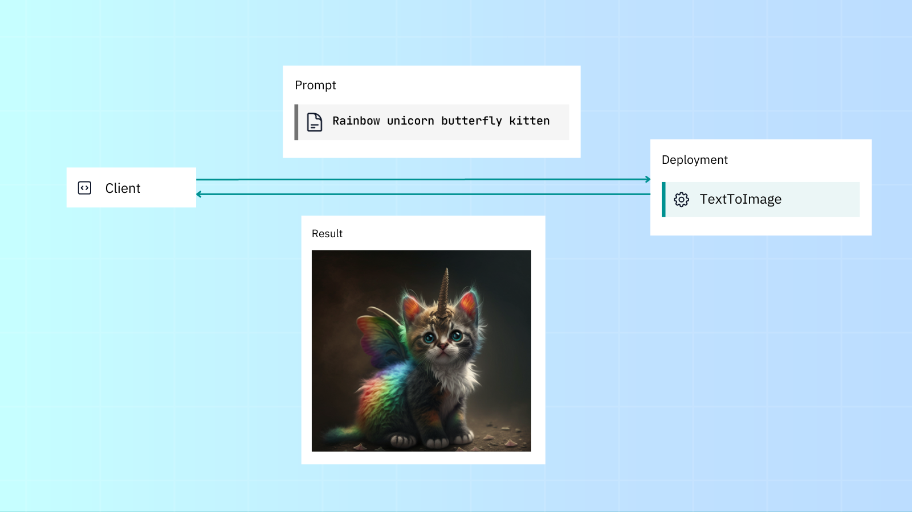
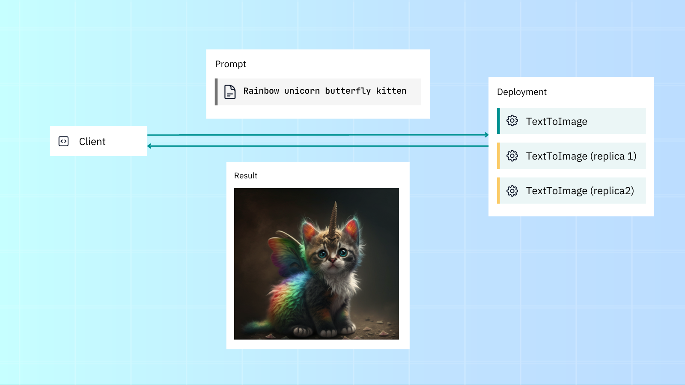

# Deploy a model

```{admonition} Before you start...
:class: note

Please check our {ref}`"Before you start" guide<before-start>` to go over a few preliminary topics.
```

## Introduction

In this tutorial we'll build a fast, reliable and scalable gRPC-based AI service. In Jina we call this an {class}`~jina.Executor`. Our Executor will use Stable Diffusion to generate images from a given text prompt. We'll then use a {class}`~jina.Deployment` to serve it.



```{admonition} Note
:class: note

A Deployment serves just one Executor. To combine multiple Executors into a pipeline and serve that, read our {ref}`tutorial on building a pipeline<build-a-pipeline>`.
```

```{admonition} Run this tutorial in a notebook
:class: tip

You can also run this code interactively in [Colab](https://colab.research.google.com/github/jina-ai/jina/blob/master/.github/getting-started/notebook.ipynb#scrollTo=0l-lkmz4H-jW).
```

## Understand: Executors and Deployments

- All data that goes in and out of Jina is in the form of a DocumentArray from the DocArray package.
- An Executor is a self-contained gRPC microservice that performs a task on a DocumentArray. This could be very simple (like merely capitalizing the entire text of a Document) or a lot more complex (like generating vector embeddings for a given piece of content).
- A Deployment lets you serve your Executor, scale it up with replicas, and allow users to send and receive requests.

When you build a model or service in Jina, it's always in the form of an Executor. An Executor is a Python class that transforms and processes Documents, and can go way beyond image generation, for example, encoding text/images into vectors, OCR, extracting tables from PDFs, or lots more.

## Install prerequisites

In this example we need to install:

- The Jina framework itself
- The dependencies of the specific model we want to serve and deploy

```shell
pip install jina
pip install diffusers
```

## Executor: Implement logic

Let's implement the service's logic in `text_to_image.py`. Don't worry too much about understanding this code right now -- we'll go through it below!

```python
from docarray import DocumentArray
from jina import Executor, requests
import numpy as np

class TextToImage(Executor):
    def __init__(self, **kwargs):
        super().__init__(**kwargs)
        import torch
        from diffusers import StableDiffusionPipeline

        self.pipe = StableDiffusionPipeline.from_pretrained(
            "CompVis/stable-diffusion-v1-4", torch_dtype=torch.float16
        ).to("cuda")

    @requests
    def generate_image(self, docs: DocumentArray, **kwargs):
    	# image here is in PIL format
        images = self.pipe(docs.texts).images
        
        for i, doc in enumerate(docs):
            doc.tensor = np.array(images[i])
```

### Imports

```python
from docarray import DocumentArray
```

Documents and DocumentArrays (from the DocArray package) are Jina's native IO format.

```python
from jina import Executor, requests
```

Jina's Executor class and requests decorator - we'll jump into these in the next section.

```python
import numpy as np
```

In our case, NumPy is specific to this Executor only. We won't really cover it in this article, since we want to keep this as a general overview. (And there’s plenty of information about NumPy out there already).

### Executor class

```python
class TextToImage(Executor):
    def __init__(self, **kwargs):
        super().__init__(**kwargs)
        import torch
        from diffusers import StableDiffusionPipeline

        self.pipe = StableDiffusionPipeline.from_pretrained(
            "CompVis/stable-diffusion-v1-4", torch_dtype=torch.float16
        ).to("cuda")
```

All Executors are created from Jina's Executor class. User-definable parameters (like `self.pipe`) are arguments defined in the __init__() method.

### Requests decorator

```python
@requests
def generate_image(self, docs: DocumentArray, **kwargs):
    # image here is in PIL format
    images = self.pipe(docs.texts).images

    for i, doc in enumerate(docs):
        doc.tensor = np.array(images[i])
```

Any Executor methods decorated with `@requests` can be called via an endpoint when the Executor is run or deployed. Since we're using a bare `@requests` (rather than say `@requests(on='/foo')`), the `generate_image()` method will be called as the default fallback handler for any endpoint.

## Deployment: Deploy the Executor

With a Deployment you can run and scale up your Executor, adding sharding, replicas and dynamic batching. 


We can deploy our Executor with either the Python API or YAML:

````{tab} Python
In `deployment.py`:

```python
from jina import Deployment

dep = Deployment(uses=TextToImage, timeout_ready=-1, install_requirements=True)

with dep:
  dep.block()
```

And then run `python deployment.py` from the CLI.
````
````{tab} YAML
In `deployment.yaml`:

```yaml
jtype: Deployment
with:
  uses: TextToImage
  py_modules:
    - text_to_image.py # name of the module containing your Executor
  timeout_ready: -1
  install_requirements=True
```

And run the YAML Deployment with the CLI: `jina deployment --uses deployment.yml`
````

You'll then see the following output:

```text
──────────────────────────────────────── 🎉 Deployment is ready to serve! ─────────────────────────────────────────
╭────────────── 🔗 Endpoint ───────────────╮
│  ⛓      Protocol                   GRPC │
│  🏠        Local          0.0.0.0:12345  │
│  🔒      Private      172.28.0.12:12345  │
│  🌍       Public    35.230.97.208:12345  │
╰──────────────────────────────────────────╯
```

```{admonition} Running in a notebook
In a notebook, you can't use `deployment.block()` and then make requests with the client. Please refer to the Colab link above for reproducible Jupyter Notebook code snippets.
```

## Client: Send and receive requests to your service

Use {class}`~jina.Client` to make requests to the service. As before, we use Documents as our basic IO format. We'll use the text prompt `rainbow unicorn butterfly kitten`:

```python
from docarray import Document
from jina import Client

image_text = Document(text='rainbow unicorn butterfly kitten')

client = Client(port=12345)  # use port from output above
response = client.post(on='/', inputs=[image_text])

response[0].display()
```

In a different terminal to your Deployment, run `python client.py` to generate an image from the `rainbow unicorn butterfly kitten` text prompt:


## Scale up the microservice

```{admonition} Python vs YAML
:class: info

For the rest of this tutorial we'll stick to using YAML. This separates our code from our Deployment logic.
```

Jina comes with scalability features out of the box like replicas, shards and dynamic batching. This lets you easily increase your application's throughput.

Let's edit our Deployment and scale it with replicas and dynamic batching to:

- Create two replicas, with a GPU assigned for each.
- Enable dynamic batching to process incoming parallel requests to the same model.



Here's the updated YAML:

```{code-block} yaml
---
emphasize-lines: 6-12
---
jtype: Deployment
with:
  timeout_ready: -1
  uses: jinaai://jina-ai/TextToImage
  install_requirements: true
  env:
   CUDA_VISIBLE_DEVICES: RR
  replicas: 2
  uses_dynamic_batching: # configure dynamic batching
    /default:
      preferred_batch_size: 10
      timeout: 200
```

As you can see, we've added GPU support (via `CUDA_VISIBLE_DEVICES`), two replicas (each assigned a GPU) and dynamic batching, which allows requests to be accumulated and batched together before being sent to the Executor.

Assuming your machine has two GPUs, using the scaled Deployment YAML will give better throughput compared to the normal deployment.

Thanks to the YAML syntax, you can inject deployment configurations regardless of Executor code. Of course, all of this is possible via the Python API too.
