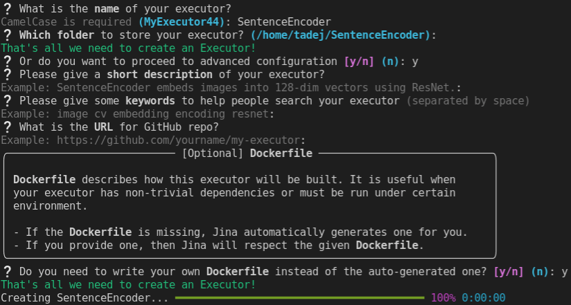

# GPU에서 Executors 구동하기

```{article-info}
:avatar: avatars/tadej.jpg
:avatar-link: https://jobs.jina.ai
:avatar-outline: muted
:author: Tadej @ Jina AI
:date: Sept. 1, 2021
```

이 튜토리얼은 로컬 및 도커 컨테이너 모두에서, GPU의 Executor을 사용하는 방법을 보여줍니다.
또한 미리 구축된 허브 executor에서 GPU를 사용하는 방법에 대해서도 배울 예정입니다.

GPU를 사용하면 대부분의 딥러닝 모델에 대해 인코딩 속도를 크게 높일 수 있으며, 사용되는 모델과 입력 값에 따라 응답 대기시간을 5배에서 100배까지 줄일 수 있습니다.  

Jina는 당신이 파이썬 스크립트에서나 도커 컨테이너에서 그랬듯이 GPU를 사용하도록 돕습니다 - 추가 요구사항이나 구성을 부과하지 않습니다.

```{admonition} Important
:class: important

This tutorial assumes you are already familiar with basic Jina concepts, such as Document, Executor, and Flow. Some knowledge of the [Hub](../advanced/hub/index) is also needed for the last part of the tutorial.

If you're not yet familiar with these concepts, first read the [Basic Concepts](../fundamentals/concepts) and related documentation, and return to this tutorial once you feel comfortable performing baisc operations in Jina.
```

## 전제조건

이 튜토리얼은 NVIDIA 그래픽 카드가 있는 컴퓨터에서 작업해야합니다. 집에 이러한 기기가 없는 경우 다양한 무료 클라우드 플랫폼 (예: Google Colab 또는 Kaggle 커널)을 사용 할 수 있습니다.

또한 최신 버젼의 [NVIDIA 드라이버](https://www.nvidia.com/Download/index.aspx)를 설치해야합니다. 이 튜토리얼에는 CUDA를 설치할 필요가 없지만, 사용하는 딥러닝 프레임워크에 따라 로컬 실행에 필요할 수 있습니다.

튜토리얼의 도커 부분에서는 [도커](https://docs.docker.com/get-docker/) 와 
[nvidia-도커](https://docs.nvidia.com/datacenter/cloud-native/container-toolkit/install-guide.html) 를 설치해야합니다.

파이썬 스크립트를 실행하려면 가상환경 (예: [venv](https://packaging.python.org/guides/installing-using-pip-and-virtual-environments/#creating-a-virtual-environment) 또는 [conda](https://conda.io/projects/conda/en/latest/user-guide/getting-started.html#managing-environments))이 필요하며 다음을 사용하여 Jina를 설치해야합니다.

```bash
pip install jina
```

## executor 세팅하기

간단한 문장 인코더를 만들고 Jina의 명령행 유틸리티를 사용하여 "skeleton"을 만드는 것으로 시작하겠습니다:

```bash
jina hub new
```

입력을 요청하면, 인코더 이름을 `SentenceEncoder`로 지정하고 기본 폴더를 사용합니다 - 현재 디렉토리 내에 `SentenceEncoder/` 폴더가 생성되며, 이 디렉토리는 튜토리얼의 작업 디렉토리가 됩니다.

그런 다음, 고급 설정을 묻는 메시지가 나타나면 `y` 를 선택하고 도커 파일을 만들 것인지 묻는 메시지가 표시될 때를 제외하고 다른 모든 질문은 비워 둡니다 - 이 질문에 `y`로 답하세요(다음 섹션에서 필요합니다). 이것이 이 대화가 마지막에 어떻게 보여져야 하는지를 알려줍니다.




다 끝나면 새로 만들어진 Executor 디렉토리로 이동합니다:
```bash
cd SentenceEncoder
```

계속해서 `requirements.txt` 파일의 요구 사항들을 지정해 보겠습니다.

```text
sentence-transformers==2.0.0
```

하단을 참고하여 설치합니다.

```bash
pip install -r requirements.txt
```

```{admonition} Do I need to install CUDA?
:class: info

All machine learning frameworks rely on CUDA for running on GPU. However, whether you
need CUDA installed on your system or not depends on the framework that you are using.

In this tutorial, we are using PyTorch framework, which already includes the necessary
CUDA binaries in its distribution. However, other frameworks, such as Tensorflow, require
you to install CUDA yourself.
```

```{admonition} Install only what you need
:class: tip

In this example we are installing the GPU-enabled version of PyTorch, which is the default
version when installing from PyPI. However, if you know that you only need to use your
executor on CPU, you can save a lot of space (100s of MBs, or even GBs) by installing
CPU-only versions of your requirements. This translates into faster start-up times
when using Docker containers.

In our case, we could change the `requirements.txt` file to install a CPU-only version
of PyTorch like this

:::text
-f https://download.pytorch.org/whl/torch_stable.html
sentence-transformers
torch==1.9.0+cpu
:::
```

이제 `executor.py` 파일을 Executor의 실 코드로 채워 넣읍시다.

```{code-block} python
---
emphasize-lines: 16, 17
---
from typing import Optional

import torch
from jina import DocumentArray, Executor, requests
from sentence_transformers import SentenceTransformer


class SentenceEncoder(Executor):
    """A simple sentence encoder that can be run on a CPU or a GPU

    :param device: The pytorch device that the model is on, e.g. 'cpu', 'cuda', 'cuda:1'
    """

    def __init__(self, device: str = 'cpu', *args, **kwargs):
        super().__init__(*args, **kwargs)
        self.model = SentenceTransformer('all-MiniLM-L6-v2', device=device)
        self.model.to(device)  # Move the model to device

    @requests
    def encode(self, docs: Optional[DocumentArray], **kwargs):
        """Add text-based embeddings to all documents"""
        texts = docs.get_attributes("text")
        with torch.no_grad():
            embeddings = self.model.encode(texts, batch_size=32)

        for doc, embedding in zip(docs, embeddings):
            doc.embedding = embedding
```

여기서 모든 장치별 마법은 두개의 강조 표시된 라인에서 발생합니다 - `SentenceEncoder` 클래스 인스턴스를 만들 때 장치를 전달한 다음, PyTorch 모델을 장치로 이동합니다. 이러한 단계는 독립 실행형 파이썬 스크립트에서도 사용할 수 있는 것과 동일합니다.

Executor가 사용하길 원하는 장치를 어떻게 전달할지 보기 위해 , 10000개의 텍스트 문서를 인코딩 하여 이 인코더의 사용법을 보여줄 다른 파일인 `main.py`를 만들어 봅시다.
 
```python
from jina import Document, Flow

from executor import SentenceEncoder

def generate_docs():
    for _ in range(10_000):
        yield Document(
            text='Using a GPU allows you to significantly speed up encoding.'
        )

f = Flow().add(uses=SentenceEncoder, uses_with={'device': 'cpu'})
with f:
    f.post(on='/encode', inputs=generate_docs, show_progress=True, request_size=32)
```

이제 실행해봅시다.

```bash
python main.py
```
```console
      executor0@26554[L]:ready and listening
        gateway@26554[L]:ready and listening
           Flow@26554[I]:🎉 Flow is ready to use!
        🔗 Protocol:            GRPC
        🏠 Local access:        0.0.0.0:56969
        🔒 Private network:     172.31.39.70:56969
        🌐 Public address:      52.59.231.246:56969
Working... ━━━━━━━━━━━━━━━━━━━━━━━━━━━━━━━━━━╸━━━━━━ 0:00:22 13.8 step/s 314 steps done in 22 seconds
```

## GPU 로컬로 사용하기

이제 GPU에서 인코더를 사용하는 것이 얼마나 쉬운지 알 수 있습니다 - 간단한 장치를 초기화 할 때 `'cuda'` 로 설정합니다.

```diff
+ f = Flow().add(uses=SentenceEncoder, uses_with={'device': 'cuda'})
- f = Flow().add(uses=SentenceEncoder, uses_with={'device': 'cpu'})
```

CPU에 비해 GPU가 얼마나 빠른지 살펴보겠습니다. 다음 비교는 단일 NVIDIA T4 GPU가 연결된 `g4dn.xlarge` AWS 인스턴스에서 수행되었습니다.

첫째, 인코더가 GPU를 사용하고 있는지 확인해야 합니다 - 위와 같이 `main.py`에서 `'device'` 파라미터를 변경합니다. 이 작업을 완료하고 벤치마크를 다시 실행해보겠습니다.

```python
python main.py
```
```console
      executor0@21032[L]:ready and listening
        gateway@21032[L]:ready and listening
           Flow@21032[I]:🎉 Flow is ready to use!
        🔗 Protocol:            GRPC
        🏠 Local access:        0.0.0.0:54255
        🔒 Private network:     172.31.39.70:54255
        🌐 Public address:      52.59.231.246:54255
Working... ━━━━━━━━━━━━━━━━━━━━━━━━━━━━━━━━━━╸━━━━━━ 0:00:02 104.9 step/s 314 steps done in 2 seconds
```

7배 이상 빨라진 것을 알 수 있습니다! 그러나 이는 우리가 할 수 있는 최선의 방법이 아닙니다. batch 크기를 늘려 GPU의 메모리를 최대화 하면 훨씬 더 빠른 속도를 얻을 수 있습니다. 그러나 이러한 최적화는 이 튜토리얼의 범위를 벗어납니다.

```{admonition} Note
:class: note

You have probably noticed that there was a delay (about 3 seconds) when creating the Flow.
This occured because the weights of our model needed to be transfered from CPU to GPU when we
initialized the Executor. However, this action only occurs once in the lifetime of the Executor,
so for most use cases this is not something we would worry about.
```

## 컨테이너 내부의 GPU 사용하기

프로덕션에서 Executor를 사용할 경우 적절한 환경 격리를 제공하고 모든 장치에서 쉽게 사용할 수 있도록 도커 컨테이너에 Executor를 넣는 것이 좋습니다.

이 경우 GPU-사용 Executor를 사용하는 것이 로컬에서 사용하는 것보다 어렵지 않습니다. 이 경우 기본 도커 파일을 수정할 필요가 없습니다.

```{admonition} Choosing the right base image

In our case we are using the default `jinaai/jina:latest` base image. However, parallel to the comments about having to install CUDA locally, you might need to use a different base image, depending on the framework you are using.

If you need to have CUDA installed in the image, you usually have two options: either you take the `nvidia/cuda` for the base image, or you take the official GPU-enabled image of the framework you are using, for example, `tensorflow/tensorflow:2.6.0-gpu`.
```

우리가 신경 쓰는 다른 파일은 `config.yml`이며, 여기서는 기본 버전도 작동합니다. 그러니 도커 이미지를 만들어봅시다.

```bash
docker build -t sentence-encoder .
```

모든 것이 잘 작동하는지 신속하게 확인하기 위해 컨테이너를 실행할 수 있습니다.

```bash
docker run sentence-encoder
```

이제 GPU와 함께 도커 버젼의 인코더를 사용해 보겠습니다. 이전에 컨테이너에 있는 GPU를 다뤄본 적이 있다면, 컨테이너 안에 GPU를 사용하려면 `--gpus all` 옵션을 `docker run` 커멘드에서 사용해야합니다. 그리고 Jina는 바로 그 일을 할 수 있게 합니다.

GPU 기반 컨테이너 Executor를 사용하기 위해 `main.py` 스크립트를 수정해야하는 방법은 다음과 같습니다.

```{code-block} python
---
emphasize-lines: 12
---
from jina import Document, DocumentArray, Flow

from executor import SentenceEncoder

def generate_docs():
    for _ in range(10000):
        yield Document(
            text='Using a GPU enables you to significantly speed up encoding'
        )

f = Flow().add(
    uses='docker://sentence-encoder', uses_with={'device': 'cuda'}, gpus='all'
)
with f:
    f.post(on='/encode', inputs=generate_docs, show_progress=True, request_size=32)
```

`python main.py`에서 실행하면, 이전과 동일한 결과 값을 얻을 수 있습니다. 도커 컨테이너에서도 해당하는 결과 값을 얻을 수 있습니다.

Executor를 시작할 때마다 트렌스포머 모델이 다시 다운로드 됩니다. 이 속도를 높이기 위해 인코더가 미리 다운로드한 파일에서 모델을 디스크에 로드 하길 원합니다.

우리는 도커 볼륨으로 이것을 할 수 있습니다 - Jina는 간단히 그 인자를 도커 컨테이너에 전달 할 것입니다.`main.py` 를 수정하여 이를 허용 하는 방법은 다음과 같습니다.

```python
f = Flow().add(
    uses='docker://sentence-encoder',
    uses_with={'device': 'cuda'},
    gpus='all',
    # This has to be an absolute path, replace /home/ubuntu with your home directory
    volumes="/home/ubuntu/.cache:/root/.cache",
)
```

여기서는 `~/.cache` 디렉토리를 마운트 했습니다. 이 디렉토리는 사전 구축된 트랜스포머 모델이 저장되기 때문입니다. 그러나 이 디렉토리는 사용중인 파이썬 패키지와 모델 로드 경로 지정 방법에 따라 다른 디렉토리도 사용 가능합니다.

이제 `python main.py` 를 다시 실행하면 컨테이너 안에서 다운로드가 일어나지 않고 인코딩이 더 빨리 시작 되는 것을 볼 수 있습니다.

## 허브 Executors와 GPU 사용하기

이제 로컬에서 Executor와 도커 컨테이너에서 GPU를 사용하는 방법에 대해 알아보았습니다.Jina 허브에서 Executor를 사용할 때 차이가 있었나요?

아니요! Jina 허브의 Executor 중 많은 수가 GPU 사용 버전이 미리 내장 되어 있으며, 대개 `gpu` 태그 ( [Jina Hub tags] (hub_tags)참고 ) 아래에 있습니다. 예제를 수정하여 Jina 허브의 사전 제작된 `TransformerTorchEncoder` 을 사용하겠습니다.

```diff
f = Flow().add(
-   uses='docker://sentence-encoder',
+   uses='jinahub+docker://TransformerTorchEncoder/gpu',
    uses_with={'device': 'cuda'},
    gpus='all',
    # This has to be an absolute path, replace /home/ubuntu with your home directory
    volumes="/home/ubuntu/.cache:/root/.cache",
)
```

스크립트를 처음 실행할 때 도커 이미지 다운로드에 시간이 소요 됩니다 - GPU 이미지가 큽니다! 하지만 그 이후에는 모든 것이 여러분의 로컬 도커 이미지에서처럼 작동합니다.

```{admonition} Important
:class: important

When using GPU encoders from Jina Hub, always use `jinahub+docker://`, and not `jinahub://`. As discussed above, these encoders might need CUDA installed (or other system dependencies), and installing that properly can be tricky. For that reason, you should prefer using Docker images, which already come with all these dependencies pre-installed.
```


## 결론

이 튜토리얼에서 본 내용을 다시 살펴보겠습니다.

1. GPU에서 로컬로 Executor을 사용하는 것은 독립 실행형 스크립트에서 GPU를 사용하는 것과 다르지 않습니다. Executor가 초기화에 사용할 장치를 전달할 수 있습니다.
2. 도커 컨테이너 내의 GPU에서 Executor를 사용하려면 `gpus='all'` 을 통과 해야합니다.
3. 볼륨 사용 ( 바인드 마운트 )로 Executor를 시작할 때마다 대용량 파일을 다운로드 하지 않아도 됩니다.
4. Jina 허브의 Executor와 GPU를 함께 사용할 수 있습니다. `gpu` 태그와 함께 Executor를 사용해야합니다.

또한 사용자 고유의 Executor 구축을 시작할 때는 항상 필요한 시스템 요구사항(CUDA 등)을 확인하고 그에 따라 로컬 (및 도커 파일)에 설치 해야합니다.
